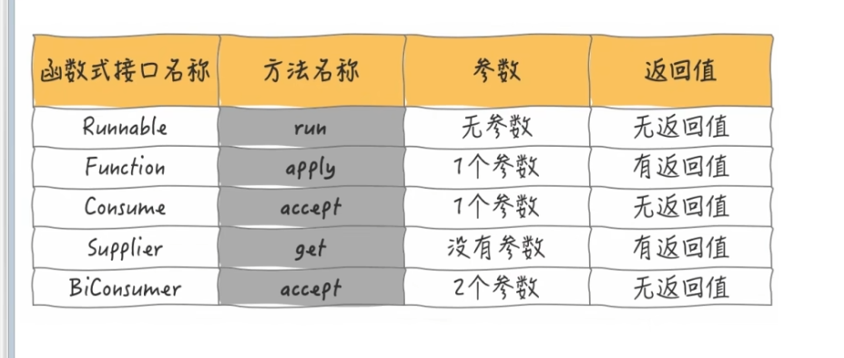
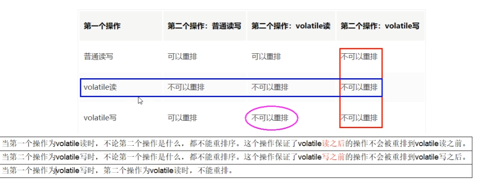
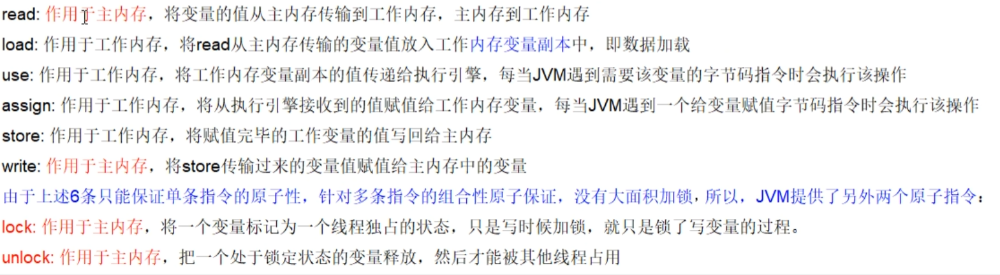
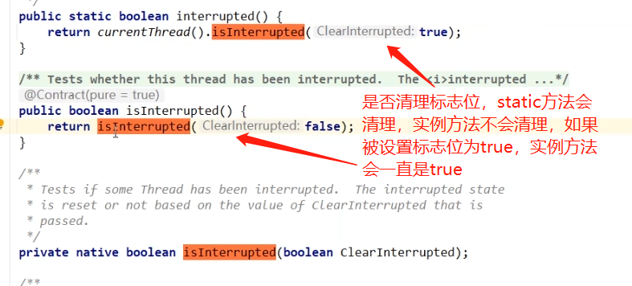

# JUC

> JUC就是java.util.concurrent工具包的简称，这是一个处理线程的工具包，JDK1.5开始出现的

## 基本概念

### 进程和线程

* 进程：

  进程是资源（CPU、内存等）分配的基本单位，它是程序执行时的一个实例。程序运行时系统就会创建一个进程，并为它分配资源，然后把该进程放入进程就绪队列，进程调度器选中它的时候就会为它分配CPU时间，程序开始真正运行。

* 线程：

  线程是程序执行时的最小单位，它是进程的一个执行流，是CPU调度和分派的基本单位，一个进程可以由很多个线程组成，线程间共享进程的所有资源，每个线程有自己的堆栈和局部变量。线程由CPU独立调度执行，在多CPU环境下就允许多个线程同时运行。同样多线程也可以实现并发操作，每个请求分配一个线程来处理。

### 二者的区别

1. 进程是资源分配的最小单位，线程是程序执行的最小单位
2. 进程有自己的独立地址空间，每启动一个进程，系统就会为它分配地址空间，建立数据表来维护代码段、堆栈段和数据段，这种操作非常昂贵。而线程是共享进程中的数据的，使用相同的地址空间，因此CPU切换一个线程的花费远比进程要小很多，同时创建一个线程的开销也比进程要小很多。
3. 线程之间的通信更方便，同一进程下的线程共享全局变量、静态变量等数据，而进程之间的通信需要以通信的方式（IPC)进行。不过如何处理好同步与互斥是编写多线程程序的难点。
4. 多进程程序更健壮，多线程程序只要有一个线程死掉，整个进程也死掉了，而一个进程死掉并不会对另外一个进程造成影响，因为进程有自己独立的地址空间。

### 线程的六种状态

```JAVA
NEW：新建
RUNNABLE：就绪
BLOCKED：阻塞
WAITING：等待
TIMED_WAITING：计时等待
TERMINATED：终结
```


### wait和sleep

wait方法是Object中的方法，任何对象实力都能调用

sleep不会释放锁，他也不需要占用锁。wait会释放锁，但调用它的前提是当前线程占有锁（即代码中用synchronized）

### 并发和并行

#### 并发

把任务在不同的时间点交给处理器进行处理。在同一时间点，任务并不会同时运行。

#### 并行

把每一个任务分配给每一个处理器独立完成。在同一时间点，任务一定是同时运行。

### 管程（Monitor/监视器）

管程在功能上和信号量及PV操作类似，属于一种进程同步互斥工具，但是具有与信号量及PV操作不同的属性。就是锁，java中是Monitor.

### 用户线程和守护线程

> setDaemon(true) // 设置线程为守护线程。

#### 用户线程

自定义线程，平时程序用到的线程。

主线程结束，用户线程还在运行，JVM存活

#### 守护线程(Daemon)

一种特殊的线程，比如垃圾回收。

没有用户线程，剩的都是守护线程，JVM会结束


---


## Future接口

>since jdk1.5
>
>异步任务接口，开一个分支任务子线程，专门处理耗时的复杂任务
>
>常见实现类FutureTask

### FutureTask

get方法容易造成阻塞。

isDone()：是否执行完成


---


## CompletableFuture接口

>since: jdk8
>
>implement Future，CompletionStage

#### 核心四个静态方法：

1. public static CompletableFuture<Void> runAsync(Runnable runnable)
   * 无返回值
2. public static CompletableFuture<Void> runAsync(Runnable runnable,Executor executor) 
   * 无返回值
3. public static <U> CompletableFuture<U> supplyAsync(Supplier<U> supplier)
   * 有返回值
4. public static <U> CompletableFuture<U> supplyAsync(Supplier<U> supplier,Executor executor)
   * 有返回值

#### Executor说明

* 如果没有Executor的方法，直接使用默认的ForkJoinPool.commonPool()作为它的线程池执行异步代码
* 如果指定线程池，则使用自定义的或者特别指定的线程池执行异步代码



#### get和join比较

```java
	CompletableFuture<String> supplyAsync = CompletableFuture.supplyAsync(() -> {
            return "hello async";
        });
        //get和join对比：get必须显式的抛出异常，join不用抛异常，如果执行过程中有一场会抛出
		//System.out.println(supplyAsync.get());
        System.out.println(supplyAsync.join());
```


---


## LockSupport

> LockSupport用来创建锁和其他同步类的基本线程阻塞原语。简而言之，当调用LockSupport.park时，表示当前线程将会等待，直至获得许可，当调用LockSupport.unpark时，必须把等待获得许可的线程作为参数进行传递，好让此线程继续运行。
>
> permit许可证，多次调用unpark()也只会发放一个许可证，执行过park()消耗掉之后，再次执行park()依然会阻塞。

park()：禁止当前线程进行线程调度，除非许可证可用。

unpark()：为给定的线程提供许可证（如果尚未提供）。


---


## JMM（java memory model）/java内存模型


### 三大特性

1. 原子性
2. 可见性
3. 有序性

### happen-before原则（先行发生原则）

* 如果一个操作happens-before另一个操作,那么第一个操作的执行结果对第二个操作可见,而且第一个操作的执行顺序排在第二个操作之前(可见性,有序性)

* 两个操作之间存在happens-before关系,并不意外着一定要按照happens-before原则制定的顺序来执行。如果重排序之后的执行结果与按照happens-before关系来执行的结果一致,那么这种重排序并不非法(可以指令重排)

  (值日:周一张三周二李四,假如有事情调换班可以的1+2+3=3+2+1)

### 八大原则

1. 次序规则

   一个线程内,按照代码顺序,写在前面的操作先行发生于写在后面的操作(强调的是一个线程)

   前一个操作的结果可以被后续的操作获取。将白点就是前面一个操作把变量X赋值为1,那后面一个操作肯定能知道X已经变成了1

2. 锁定规则

   一个unlock操作先行发生于后面((这里的"后面"是指时间上的先后))对同一个锁的lock操作(上一个线程unlock了,下一个线程才能获取到锁,进行lock)

3. volatile变量规则

   对一个volatile变量的写操作先行发生于后面对这个变量的读操作,前面的写对后面的读是可见的,这里的"后面"同样是指时间是的先后

4. 传递规则

   如果操作A先行发生于操作B,而操作B又先行发生于操作C,则可以得出A先行发生于操作C

5.  线程启动规则(Thread Start Rule)

   Thread对象的start( )方法先行发生于线程的每一个动作

6. 线程中断规则(Thread Interruption Rule)

   对线程interrupt( )方法的调用先发生于被中断线程的代码检测到中断事件的发生

   可以通过Thread.interrupted( )检测到是否发生中断

7.  线程终止规则(Thread Termination Rule)

   线程中的所有操作都先行发生于对此线程的终止检测

8. 对象终结规则(Finalizer Rule)

   对象没有完成初始化之前,是不能调用finalized( )方法的


---

## volatile关键字

> 缓存一致性协议：MESI
>
> 总线嗅探机制：总线锁

### 内存屏障

> 内存屏障是一种屏障指令，它使得CPU或编译器 对 屏障指令的 前和后 所发出的内存操作 执行一个排序的约束。也叫内存栅栏或栅栏指令。

内存屏障能干嘛：


* 读屏障（loadFence）

  在读指令之前插入读屏障，让工作内存或CPU告诉缓存当中的缓存数据失效，重新回到主内存中读取最新数据

* 写屏障（storeFence）

  在写指令之后插入写屏障，强制把写缓冲区的数据刷回到主内存中


java字节码层面，被volatile修饰的变量，会打上一个flag:ACC_VOLATILE，有这个标签会添加上内存屏障。

### 有序性



### 可见性





---


## synchronized关键字

> static sychronized ：类锁，所的是Class
>
> sychronized：对象所，锁的是new出来的实例对象

synchronized是java中的一个关键字，在中文中为同步，也被称之为’同步锁’,以此来达到多线程并发访问时候的并发安全问题，可以用来修饰代码块、非静态方法。静态方法等；

* 修饰代码块时:给当前指定的对象加锁
* 修饰非静态方法时:作用于当前实例加锁
* 修饰静态方法时:作用于当前类对象加锁

**synchronized在java内存模型中的主要作用**

* 原子性:通过monitorenter和monitorexit指令,保证被synchronized修饰的代码在同一时间只能被一个线程访问，在锁未释放之前，无法被其他线程访问到
* 可见性:保证共享变量的修改能够及时可见,对一个变量的unlock操作之前，必须把此变量同步回主内存中(store和write操作)
* 有序性:一个变量在同一时刻只允许一条线程对其执行lock操作，这条规则决定了持有同一个锁的两个同步块只能串行执行

```java
/**
 * 题目：谈谈你对多线程锁的理解,8锁案例说明
 * 口诀：线程   操作  资源类
 * 8锁案例说明：
 * 1 标准访问有ab两个线程，请问先打印邮件还是短信
 * 2 sendEmail方法中加入暂停3秒钟，请问先打印邮件还是短信
 * 3 添加一个普通的hello方法，请问先打印邮件还是hello
 * 4 有两部手机，请问先打印邮件还是短信
 * 5 有两个静态同步方法，有1部手机，请问先打印邮件还是短信
 * 6 有两个静态同步方法，有2部手机，请问先打印邮件还是短信
 * 7 有1个静态同步方法，有1个普通同步方法,有1部手机，请问先打印邮件还是短信
 * 8 有1个静态同步方法，有1个普通同步方法,有2部手机，请问先打印邮件还是短信
 *
 * 笔记总结：
 * 1-2
 *  *  *  一个对象里面如果有多个synchronized方法，某一个时刻内，只要一个线程去调用其中的一个synchronized方法了，
 *  *  *  其它的线程都只能等待，换句话说，某一个时刻内，只能有唯一的一个线程去访问这些synchronized方法
 *  *  *  锁的是当前对象this，被锁定后，其它的线程都不能进入到当前对象的其它的synchronized方法
 *  3-4
 *  *  加个普通方法后发现和同步锁无关
 *  *  换成两个对象后，不是同一把锁了，情况立刻变化。
 *
 *  5-6 都换成静态同步方法后，情况又变化
 *  三种 synchronized 锁的内容有一些差别:
 * 对于普通同步方法，锁的是当前实例对象，通常指this,具体的一部部手机,所有的普通同步方法用的都是同一把锁——>实例对象本身，
 * 对于静态同步方法，锁的是当前类的Class对象，如Phone.class唯一的一个模板
 * 对于同步方法块，锁的是 synchronized 括号内的对象
 *
 * *  7-8
 *  *    当一个线程试图访问同步代码时它首先必须得到锁，正常退出或抛出异常时必须释放锁。
 *  *  *
 *  *  *  所有的普通同步方法用的都是同一把锁——实例对象本身，就是new出来的具体实例对象本身,本类this
 *  *  *  也就是说如果一个实例对象的普通同步方法获取锁后，该实例对象的其他普通同步方法必须等待获取锁的方法释放锁后才能获取锁。
 *  *  *
 *  *  *  所有的静态同步方法用的也是同一把锁——类对象本身，就是我们说过的唯一模板Class
 *  *  *  具体实例对象this和唯一模板Class，这两把锁是两个不同的对象，所以静态同步方法与普通同步方法之间是不会有竞态条件的
 *  *  *  但是一旦一个静态同步方法获取锁后，其他的静态同步方法都必须等待该方法释放锁后才能获取锁。
 */
```


## 锁

### 乐观锁和悲观锁


### 公平锁和非公平锁


### 可重入锁（递归锁）

synchronized：隐式

Lock：显式


### 死锁


37  1

62  1

95  2

78  1

158  3

107  2

68  1

125  2

289  5


## 中断(中断协商机制)

### 三大方法

* interrupt()

  调用线程的终端方法，设置标志位为true，线程察觉到后自行处理结束线程

* isInterrupted()

  测试此线程是否已被设置为true标志位、

* static interrupted()

  如果执行interrupted()方法前被interrupt过。那么返回标志位true，并设置标志位为false，再次调用interrupted()时返回false

  测试当前线程是否被中断

  

#### 如何停止中断运行中的线程?

1. 通过一个volatile变量实现

   ```java
    	static volatile boolean isStop = false;
       public static void main(String[] args)
       {
           new Thread(() -> {
               while (true)
               {
                   if(isStop)
                   {
                       System.out.println(Thread.currentThread().getName()+"\t isStop被修改为true，程序停止");
                       break;
                   }
                   System.out.println("t1 -----hello volatile");
               }
           },"t1").start();
   
           //暂停毫秒
           try { TimeUnit.MILLISECONDS.sleep(20); } catch (InterruptedException e) { e.printStackTrace(); }
   
           new Thread(() -> {
               isStop = true;
           },"t2").start();
       }
   ```

2. 通过AtomicBoolean

   ```java
       static AtomicBoolean atomicBoolean = new AtomicBoolean(false);
       public static void main(String[] args)
       {
           new Thread(() -> {
               while (true)
               {
                   if(atomicBoolean.get())
                   {
                       System.out.println(Thread.currentThread().getName()+"\t atomicBoolean被修改为true，程序停止");
                       break;
                   }
                   System.out.println("t1 -----hello atomicBoolean");
               }
           },"t1").start();
   
           //暂停毫秒
           try { TimeUnit.MILLISECONDS.sleep(20); } catch (InterruptedException e) { e.printStackTrace(); }
   
           new Thread(() -> {
               atomicBoolean.set(true);
           },"t2").start();
       }
       }
   ```

   

3. 通过Thread类自带的中断API实例方法实现

   ```java
       static AtomicBoolean atomicBoolean = new AtomicBoolean(false);
       public static void main(String[] args)
       {
           Thread t1 = new Thread(() -> {
               while (true)
               {
                   if(Thread.currentThread().isInterrupted())
                   {
                       System.out.println(Thread.currentThread().getName()+"\t isInterrupted()被修改为true，程序停止");
                       break;
                   }
                   System.out.println("t1 -----hello interrupt api");
               }
           }, "t1");
           t1.start();
   
           System.out.println("-----t1的默认中断标志位："+t1.isInterrupted());
   
           //暂停毫秒
           try { TimeUnit.MILLISECONDS.sleep(20); } catch (InterruptedException e) { e.printStackTrace(); }
   
           //t2向t1发出协商，将t1的中断标志位设为true希望t1停下来
           new Thread(() -> {
               t1.interrupt();
           },"t2").start();
           //t1.interrupt();
   
       }
   ```

   

#### 当前线程的中断标识为true，是不是线程就立刻停止?

#### 静态方法Thread.interrupted()，谈谈你的理解?


## 创建线程的四种办法

1. 继承Thread类
   * 无返回值
2. 实现Runnable接口
   * 无返回值
   * 重写run方法
   * 无异常
3. 实现Callable接口
   * 有返回值
   * 重写call方法
   * 有可能抛异常
4. 使用线程池

## ThreadLocal

>多线程中创建线程私有局部变量的一个类，里面的方法有set、get、withInitial、remove

Thread中会维护一个ThreadLocalMap，是一个Entry数组，继承了一个弱引用接口WeakReference<ThreadLocal<?>>，ThreadLocal就是这个ThreadLocalMap的一个Entry。

### ThreadLocalMap的hash冲突

ThreadLocalMap是一个数组。没有链表和红黑树的数据结构，set的时候会首先进行hash，然后看当前hash对应的数组位置上是有Entry如果有的话对比key是否一致，一直的话更新value值，不一致的话会在数组+1的位置进行插入，如果数组+1的唯一也不为空就往后+1，知道找到空的数组位置把Entry放进去。get的方法也是一样，hash完之后对比key，如果不一致去+1位get。

### 应用场景

像spring中通过ThreadLocal来保证当个数据库操作使用的是同一个连接。通过事物的传播级别，在多个事务之间做一些个巧妙的切换。

### 内存泄露的问题

内存泄漏就是说内存中有一些个无法被释放那么就无法被回收，ThreadLocal使用的是弱引用，Thread强引用了ThreadLocalMap，ThreadLocal在ThreadLocalMap中。解决的办法就是我们使用完ThreadLocal后调用一下remove方法将Entry移除，就能通过手动的方式避免内存泄漏。


## CAS与原子类

### CAS

> 乐观锁的一种实现


### 原子类

#### 基本类型原子类

* **AtomicInteger**
* **AtomicBoolean**
* **AtomicLong**
* **常用API**

#### 数组类型原子类


#### 引用类型原子类


#### 对象的属性修改原子类


#### 原子操作增强类原理

> since： jdk 1.8

LongAdder？？？？？？？？？？？？？？？？？？？？？？看源码


