[toc]

## Spring

### 循环依赖

#### 什么是循环依赖

就是A类依赖B类的同时，B类也依赖A类。在代码中就是在A类的代码中注入了B类，在B类的代码中注入了A类，或者在A类的代码中注入了A类自己。

#### 什么情况下循环依赖可能被处理

不是只有在setter方法注入的情况下循环依赖才能被解决，即使存在构造器注入的场景下，循环依赖也可能被正常处理掉。

#### 怎么解决循环依赖

三级缓存：

1.  singletonObjects:一级缓存：实例化好的对象
2. earlySingletonObjects:二级缓存：AOP动态代理后的对象，然后做依赖注入
3. singletonFactories:三级缓存：拿到beandefination定义初始化对象

---

---

## SpringMVC

#### SpringMVC的执行流程

1. 用户的请求到达DispatcherServlet前端控制器，DispatcherServlet根据请求url调用HandlerMapping，查找对应的Method方法然后返回给DispatcherServlet。

2. DispatcherServlet调用HandlerAdaptor处理器适配器（此处应用的是适配器模式），来执行具体的业务方法，将结果封装在ModleAndView返回给DispatcherServlet。

3. DispatcherServlet调用ViewRelsover视图解析器，ViewRelsover返回给DispatcherServlet具体的view对象。

4. DispatcherServlet对view对象进行渲染后返回给用户。

#### @RequestMapping和@PostMapping、@GetMapping、@DeleteMapping、@PutMapping、@PatchMapping的区别

@PostMapping 等价于 @RequestMapping(method = RequestMethod.POST)

@GetMapping 等价于 @RequestMapping(method = RequestMethod.GET)

@PutMapping 等价于 @RequestMapping(method = RequestMethod.PUT)

@DeleteMapping 等价于 @RequestMapping(method = RequestMethod.DELETE)

@PatchMapping 等价于 @RequestMapping(method = RequestMethod.PATCH)

用RequrestMapping可以实现@PostMapping、@GetMapping、@DeleteMapping、@PutMapping、@PatchMapping， 反之不行。

---

---

## Mybatis

#### 基础

##### MyBatis是什么？

MyBatis 是一款优秀的持久层框架，一个半 ORM（对象关系映射）框架，它支持定制化 SQL、存储过程以及高级映射。MyBatis 避免了几乎所有的 JDBC 代码和手动设置参数以及获取结果集。MyBatis 可以使用简单的 XML 或注解来配置和映射原生类型、接口和 Java 的 POJO（Plain Old Java Objects，普通老式 Java 对象）为数据库中的记录。

##### ORM是什么

ORM（Object Relational Mapping），对象关系映射，是一种为了解决关系型数据库数据与简单Java对象（POJO）的映射关系的技术。简单的说，ORM是通过使用描述对象和数据库之间映射的元数据，将程序中的对象自动持久化到关系型数据库中。

##### 为什么说Mybatis是半自动ORM映射工具？它与全自动的区别在哪里？

Hibernate属于全自动ORM映射工具，使用Hibernate查询关联对象或者关联集合对象时，可以根据对象关系模型直接获取，所以它是全自动的。

而Mybatis在查询关联对象或关联集合对象时，需要手动编写sql来完成，所以，称之为半自动ORM映射工具。

##### 传统JDBC开发存在的问题

- 频繁创建数据库连接对象、释放，容易造成系统资源浪费，影响系统性能。可以使用连接池解决这个问题。但是使用jdbc需要自己实现连接池。

- sql语句定义、参数设置、结果集处理存在硬编码。实际项目中sql语句变化的可能性较大，一旦发生变化，需要修改java代码，系统需要重新编译，重新发布。不好维护。

- 使用preparedStatement向占有位符号传参数存在硬编码，因为sql语句的where条件不一定，可能多也可能少，修改sql还要修改代码，系统不易维护。

- 结果集处理存在重复代码，处理麻烦。如果可以映射成Java对象会比较方便。

##### JDBC编程有哪些不足之处，MyBatis是如何解决这些问题的？

1、数据库链接创建、释放频繁造成系统资源浪费从而影响系统性能，如果使用数据库连接池可解决此问题。

解决：在mybatis-config.xml中配置数据链接池，使用连接池管理数据库连接。

2、Sql语句写在代码中造成代码不易维护，实际应用sql变化的可能较大，sql变动需要改变java代码。

解决：将Sql语句配置在XXXXmapper.xml文件中与java代码分离。

3、向sql语句传参数麻烦，因为sql语句的where条件不一定，可能多也可能少，占位符需要和参数一一对应。

解决： Mybatis自动将java对象映射至sql语句。

4、对结果集解析麻烦，sql变化导致解析代码变化，且解析前需要遍历，如果能将数据库记录封装成pojo对象解析比较方便。

解决：Mybatis自动将sql执行结果映射至java对象。

##### Mybatis优缺点

**优点**

与传统的数据库访问技术相比，ORM有以下优点：

- 基于SQL语句编程，相当灵活，不会对应用程序或者数据库的现有设计造成任何影响，SQL写在XML里，解除sql与程序代码的耦合，便于统一管理；提供XML标签，支持编写动态SQL语句，并可重用

- 与JDBC相比，减少了50%以上的代码量，消除了JDBC大量冗余的代码，不需要手动开关连接

- 很好的与各种数据库兼容（因为MyBatis使用JDBC来连接数据库，所以只要JDBC支持的数据库MyBatis都支持）

- 提供映射标签，支持对象与数据库的ORM字段关系映射；提供对象关系映射标签，支持对象关系组件维护

- 能够与Spring很好的集成

**缺点**

- SQL语句的编写工作量较大，尤其当字段多、关联表多时，对开发人员编写SQL语句的功底有一定要求
- SQL语句依赖于数据库，导致数据库移植性差，不能随意更换数据库

##### MyBatis框架适用场景

- MyBatis专注于SQL本身，是一个足够灵活的DAO层解决方案。
- 对性能的要求很高，或者需求变化较多的项目，如互联网项目，MyBatis将是不错的选择。

##### Hibernate 和 MyBatis 的区别

**相同点**

都是对jdbc的封装，都是持久层的框架，都用于dao层的开发。

**不同点**

映射关系

- MyBatis 是一个半自动映射的框架，配置Java对象与sql语句执行结果的对应关系，多表关联关系配置简单
- Hibernate 是一个全表映射的框架，配置Java对象与数据库表的对应关系，多表关联关系配置复杂

SQL优化和移植性

- Hibernate 对SQL语句封装，提供了日志、缓存、级联（级联比 MyBatis 强大）等特性，此外还提供 HQL（Hibernate Query Language）操作数据库，数据库无关性支持好，但会多消耗性能。如果项目需要支持多种数据库，代码开发量少，但SQL语句优化困难。
- MyBatis 需要手动编写 SQL，支持动态 SQL、处理列表、动态生成表名、支持存储过程。开发工作量相对大些。直接使用SQL语句操作数据库，不支持数据库无关性，但sql语句优化容易。

开发难易程度和学习成本

- Hibernate 是重量级框架，学习使用门槛高，适合于需求相对稳定，中小型的项目，比如：办公自动化系统
- MyBatis 是轻量级框架，学习使用门槛低，适合于需求变化频繁，大型的项目，比如：互联网电子商务系统

**总结**

MyBatis 是一个小巧、方便、高效、简单、直接、半自动化的持久层框架，

Hibernate 是一个强大、方便、高效、复杂、间接、全自动化的持久层框架。

#### MyBatis的解析和运行原理

##### MyBatis编程步骤是什么样的？

1、 创建SqlSessionFactory

2、 通过SqlSessionFactory创建SqlSession

3、 通过sqlsession执行数据库操作

4、 调用session.commit()提交事务

5、 调用session.close()关闭会话

##### 请说说MyBatis的工作原理

在学习 MyBatis 程序之前，需要了解一下 MyBatis 工作原理，以便于理解程序。MyBatis 的工作原理如下图


1）读取 MyBatis 配置文件：mybatis-config.xml 为 MyBatis 的全局配置文件，配置了 MyBatis 的运行环境等信息，例如数据库连接信息。

2）加载映射文件。映射文件即 SQL 映射文件，该文件中配置了操作数据库的 SQL 语句，需要在 MyBatis 配置文件 mybatis-config.xml 中加载。mybatis-config.xml 文件可以加载多个映射文件，每个文件对应数据库中的一张表。

3）构造会话工厂：通过 MyBatis 的环境等配置信息构建会话工厂 SqlSessionFactory。

4）创建会话对象：由会话工厂创建 SqlSession 对象，该对象中包含了执行 SQL 语句的所有方法。

5）Executor 执行器：MyBatis 底层定义了一个 Executor 接口来操作数据库，它将根据 SqlSession 传递的参数动态地生成需要执行的 SQL 语句，同时负责查询缓存的维护。

6）MappedStatement 对象：在 Executor 接口的执行方法中有一个 MappedStatement 类型的参数，该参数是对映射信息的封装，用于存储要映射的 SQL 语句的 id、参数等信息。

7）输入参数映射：输入参数类型可以是 Map、List 等集合类型，也可以是基本数据类型和 POJO 类型。输入参数映射过程类似于 JDBC 对 preparedStatement 对象设置参数的过程。

8）输出结果映射：输出结果类型可以是 Map、 List 等集合类型，也可以是基本数据类型和 POJO 类型。输出结果映射过程类似于 JDBC 对结果集的解析过程。

##### MyBatis的功能架构


我们把Mybatis的功能架构分为三层：

- API接口层：提供给外部使用的接口API，开发人员通过这些本地API来操纵数据库。接口层一接收到调用请求就会调用数据处理层来完成具体的数据处理。
- 数据处理层：负责具体的SQL查找、SQL解析、SQL执行和执行结果映射处理等。它主要的目的是根据调用的请求完成一次数据库操作。
- 基础支撑层：负责最基础的功能支撑，包括连接管理、事务管理、配置加载和缓存处理，这些都是共用的东西，将他们抽取出来作为最基础的组件。为上层的数据处理层提供最基础的支撑。

##### MyBatis的框架架构设计是怎么样的


这张图从上往下看。MyBatis的初始化，会从mybatis-config.xml配置文件，解析构造成Configuration这个类，就是图中的红框。

(1)加载配置：配置来源于两个地方，一处是配置文件，一处是Java代码的注解，将SQL的配置信息加载成为一个个MappedStatement对象（包括了传入参数映射配置、执行的SQL语句、结果映射配置），存储在内存中。

(2)SQL解析：当API接口层接收到调用请求时，会接收到传入SQL的ID和传入对象（可以是Map、JavaBean或者基本数据类型），Mybatis会根据SQL的ID找到对应的MappedStatement，然后根据传入参数对象对MappedStatement进行解析，解析后可以得到最终要执行的SQL语句和参数。

(3)SQL执行：将最终得到的SQL和参数拿到数据库进行执行，得到操作数据库的结果。

(4)结果映射：将操作数据库的结果按照映射的配置进行转换，可以转换成HashMap、JavaBean或者基本数据类型，并将最终结果返回。

##### 为什么需要预编译

1. 定义：  
   SQL 预编译指的是数据库驱动在发送 SQL 语句和参数给 DBMS 之前对 SQL 语句进行编译，这样 DBMS 执行 SQL 时，就不需要重新编译。
2. 为什么需要预编译  
   JDBC 中使用对象 PreparedStatement 来抽象预编译语句，使用预编译。预编译阶段可以优化 SQL 的执行。预编译之后的 SQL 多数情况下可以直接执行，DBMS 不需要再次编译，越复杂的SQL，编译的复杂度将越大，预编译阶段可以合并多次操作为一个操作。同时预编译语句对象可以重复利用。把一个 SQL 预编译后产生的 PreparedStatement 对象缓存下来，下次对于同一个SQL，可以直接使用这个缓存的 PreparedState 对象。Mybatis默认情况下，将对所有的 SQL 进行预编译。

##### Mybatis都有哪些Executor执行器？它们之间的区别是什么？

Mybatis有三种基本的Executor执行器，SimpleExecutor、ReuseExecutor、BatchExecutor。

**SimpleExecutor**：每执行一次update或select，就开启一个Statement对象，用完立刻关闭Statement对象。

**ReuseExecutor**：执行update或select，以sql作为key查找Statement对象，存在就使用，不存在就创建，用完后，不关闭Statement对象，而是放置于Map<String, Statement>内，供下一次使用。简言之，就是重复使用Statement对象。

**BatchExecutor**：执行update（没有select，JDBC批处理不支持select），将所有sql都添加到批处理中（addBatch()），等待统一执行（executeBatch()），它缓存了多个Statement对象，每个Statement对象都是addBatch()完毕后，等待逐一执行executeBatch()批处理。与JDBC批处理相同。

作用范围：Executor的这些特点，都严格限制在SqlSession生命周期范围内。

##### Mybatis中如何指定使用哪一种Executor执行器？

在Mybatis配置文件中，在设置（settings）可以指定默认的ExecutorType执行器类型，也可以手动给DefaultSqlSessionFactory的创建SqlSession的方法传递ExecutorType类型参数，如SqlSession openSession(ExecutorType execType)。

配置默认的执行器。SIMPLE 就是普通的执行器；REUSE 执行器会重用预处理语句（prepared statements）； BATCH 执行器将重用语句并执行批量更新。

##### Mybatis是否支持延迟加载？如果支持，它的实现原理是什么？

Mybatis仅支持association关联对象和collection关联集合对象的延迟加载，association指的就是一对一，collection指的就是一对多查询。在Mybatis配置文件中，可以配置是否启用延迟加载lazyLoadingEnabled=true|false。

它的原理是，使用CGLIB创建目标对象的代理对象，当调用目标方法时，进入拦截器方法，比如调用a.getB().getName()，拦截器invoke()方法发现a.getB()是null值，那么就会单独发送事先保存好的查询关联B对象的sql，把B查询上来，然后调用a.setB(b)，于是a的对象b属性就有值了，接着完成a.getB().getName()方法的调用。这就是延迟加载的基本原理。

当然了，不光是Mybatis，几乎所有的包括Hibernate，支持延迟加载的原理都是一样的。

#### 映射器

##### #{}和${}的区别

- #{}是占位符，预编译处理；${}是拼接符，字符串替换，没有预编译处理。

- Mybatis在处理#{}时，#{}传入参数是以字符串传入，会将SQL中的#{}替换为?号，调用PreparedStatement的set方法来赋值。

- Mybatis在处理时，是原值传入，就是把{}时，是原值传入，就是把时，是原值传入，就是把{}替换成变量的值，相当于JDBC中的Statement编译

- 变量替换后，#{} 对应的变量自动加上单引号 ‘’；变量替换后，${} 对应的变量不会加上单引号 ‘’

- #{} 可以有效的防止SQL注入，提高系统安全性；${} 不能防止SQL 注入

- #{} 的变量替换是在DBMS 中；${} 的变量替换是在 DBMS 外

##### 模糊查询like语句该怎么写

（1）’%${question}%’ 可能引起SQL注入，不推荐

（2）”%”#{question}”%” 注意：因为#{…}解析成sql语句时候，会在变量外侧自动加单引号’ ‘，所以这里 % 需要使用双引号” “，不能使用单引号 ’ ‘，不然会查不到任何结果。

（3）CONCAT(’%’,#{question},’%’) 使用CONCAT()函数，推荐

（4）使用bind标签

```xml
<select id="listUserLikeUsername" resultType="com.jourwon.pojo.User">
　　<bind name="pattern" value="'%' + username + '%'" />
　　select id,sex,age,username,password from person where username LIKE #{pattern}
</select>
```

##### 在mapper中如何传递多个参数

**方法1：顺序传参法**

```xml
public User selectUser(String name, int deptId);

<select id="selectUser" resultMap="UserResultMap">
    select * from user
    where user_name = #{0} and dept_id = #{1}
</select>
```

#{}里面的数字代表传入参数的顺序。

这种方法不建议使用，sql层表达不直观，且一旦顺序调整容易出错。

**方法2：@Param注解传参法**

```xml
public User selectUser(@Param("userName") String name, int @Param("deptId") deptId);

<select id="selectUser" resultMap="UserResultMap">
    select * from user
    where user_name = #{userName} and dept_id = #{deptId}
</select>
```

#{}里面的名称对应的是注解@Param括号里面修饰的名称。

这种方法在参数不多的情况还是比较直观的，推荐使用。

**方法3：Map传参法**

```xml
public User selectUser(Map<String, Object> params);

<select id="selectUser" parameterType="java.util.Map" resultMap="UserResultMap">
    select * from user
    where user_name = #{userName} and dept_id = #{deptId}
</select>
```

#{}里面的名称对应的是Map里面的key名称。

这种方法适合传递多个参数，且参数易变能灵活传递的情况。

**方法4：Java Bean传参法**

```xml
public User selectUser(User user);

<select id="selectUser" parameterType="com.jourwon.pojo.User" resultMap="UserResultMap">
    select * from user
    where user_name = #{userName} and dept_id = #{deptId}
</select>
```

#{}里面的名称对应的是User类里面的成员属性。

这种方法直观，需要建一个实体类，扩展不容易，需要加属性，但代码可读性强，业务逻辑处理方便，推荐使用。

##### Mybatis如何执行批量操作

**使用foreach标签**

foreach的主要用在构建in条件中，它可以在SQL语句中进行迭代一个集合。foreach标签的属性主要有item，index，collection，open，separator，close。

- item　　表示集合中每一个元素进行迭代时的别名，随便起的变量名；

- index　　指定一个名字，用于表示在迭代过程中，每次迭代到的位置，不常用；

- open　　表示该语句以什么开始，常用“(”；

- separator表示在每次进行迭代之间以什么符号作为分隔符，常用“,”；

- close　　表示以什么结束，常用“)”。

在使用foreach的时候最关键的也是最容易出错的就是collection属性，该属性是必须指定的，但是在不同情况下，该属性的值是不一样的，主要有一下3种情况：

1. 如果传入的是单参数且参数类型是一个List的时候，collection属性值为list
2. 如果传入的是单参数且参数类型是一个array数组的时候，collection的属性值为array
3. 如果传入的参数是多个的时候，我们就需要把它们封装成一个Map了，当然单参数也可以封装成map，实际上如果你在传入参数的时候，在MyBatis里面也是会把它封装成一个Map的，  
   map的key就是参数名，所以这个时候collection属性值就是传入的List或array对象在自己封装的map里面的key

具体用法如下：

```xml
<!-- 批量保存(foreach插入多条数据两种方法)
       int addEmpsBatch(@Param("emps") List<Employee> emps); -->
<!-- MySQL下批量保存，可以foreach遍历 mysql支持values(),(),()语法 --> //推荐使用
<insert id="addEmpsBatch">
    INSERT INTO emp(ename,gender,email,did)
    VALUES
    <foreach collection="emps" item="emp" separator=",">
        (#{emp.eName},#{emp.gender},#{emp.email},#{emp.dept.id})
    </foreach>
</insert>
```

```xml
<!-- 这种方式需要数据库连接属性allowMutiQueries=true的支持
 如jdbc.url=jdbc:mysql://localhost:3306/mybatis?allowMultiQueries=true -->  
<insert id="addEmpsBatch">
    <foreach collection="emps" item="emp" separator=";">                                 
        INSERT INTO emp(ename,gender,email,did)
        VALUES(#{emp.eName},#{emp.gender},#{emp.email},#{emp.dept.id})
    </foreach>
</insert>
```

Mybatis内置的ExecutorType有3种，默认为simple,该模式下它为每个语句的执行创建一个新的预处理语句，单条提交sql；而batch模式重复使用已经预处理的语句，并且批量执行所有更新语句，显然batch性能将更优； 但batch模式也有自己的问题，比如在Insert操作时，在事务没有提交之前，是没有办法获取到自增的id，这在某型情形下是不符合业务要求的

具体用法如下

```java
//批量保存方法测试
@Test  
public void testBatch() throws IOException{
    SqlSessionFactory sqlSessionFactory = getSqlSessionFactory();
    //可以执行批量操作的sqlSession
    SqlSession openSession = sqlSessionFactory.openSession(ExecutorType.BATCH);

    //批量保存执行前时间
    long start = System.currentTimeMillis();
    try {
        EmployeeMapper mapper = openSession.getMapper(EmployeeMapper.class);
        for (int i = 0; i < 1000; i++) {
            mapper.addEmp(new Employee(UUID.randomUUID().toString().substring(0, 5), "b", "1"));
        }

        openSession.commit();
        long end = System.currentTimeMillis();
        //批量保存执行后的时间
        System.out.println("执行时长" + (end - start));
        //批量 预编译sql一次==》设置参数==》10000次==》执行1次   677
        //非批量  （预编译=设置参数=执行 ）==》10000次   1121

    } finally {
        openSession.close();
    }
}
```

**mapper和mapper.xml如下**

```java
public interface EmployeeMapper {   
    //批量保存员工
    Long addEmp(Employee employee);
}
```

```xml
<mapper namespace="com.jourwon.mapper.EmployeeMapper"
     <!--批量保存员工 -->
    <insert id="addEmp">
        insert into employee(lastName,email,gender)
        values(#{lastName},#{email},#{gender})
    </insert>
</mapper>
```

##### 如何获取生成的主键

**对于支持主键自增的数据库（MySQL）**

```xml
<insert id="insertUser" useGeneratedKeys="true" keyProperty="userId" >
    insert into user( 
    user_name, user_password, create_time) 
    values(#{userName}, #{userPassword} , #{createTime, jdbcType= TIMESTAMP})
</insert>
```

parameterType 可以不写，Mybatis可以推断出传入的数据类型。如果想要访问主键，那么应当parameterType 应当是java实体或者Map。这样数据在插入之后 可以通过ava实体或者Map 来获取主键值。通过 getUserId获取主键

**不支持主键自增的数据库（Oracle）**

对于像Oracle这样的数据，没有提供主键自增的功能，而是使用序列的方式获取自增主键。

可以使用＜selectKey＞标签来获取主键的值，这种方式不仅适用于不提供主键自增功能的数据库，也适用于提供主键自增功能的数据库

＜selectKey＞一般的用法

```xml
<selectKey keyColumn="id" resultType="long" keyProperty="id" order="BEFORE">
</selectKey> 
```


```xml
<insert id="insertUser" >
    <selectKey keyColumn="id" resultType="long" keyProperty="userId" order="BEFORE">
        SELECT USER_ID.nextval as id from dual 
    </selectKey> 
    insert into user( 
    user_id,user_name, user_password, create_time) 
    values(#{userId},#{userName}, #{userPassword} , #{createTime, jdbcType= TIMESTAMP})
</insert>
```

此时会将Oracle生成的主键值赋予userId变量。这个userId 就是USER对象的属性，这样就可以将生成的主键值返回了。如果仅仅是在insert语句中使用但是不返回，此时keyProperty=“任意自定义变量名”，resultType 可以不写。

Oracle 数据库中的值要设置为 BEFORE ，这是因为 Oracle中需要先从序列获取值，然后将值作为主键插入到数据库中。

**扩展**

如果Mysql 使用selectKey的方式获取主键，需要注意下面两点：

order ： AFTER

获取递增主键值 ：SELECT LAST_INSERT_ID()

##### 当实体类中的属性名和表中的字段名不一样 ，怎么办

第1种： 通过在查询的SQL语句中定义字段名的别名，让字段名的别名和实体类的属性名一致。

```xml
<select id="getOrder" parameterType="int" resultType="com.jourwon.pojo.Order">
       select order_id id, order_no orderno ,order_price price form orders where order_id=#{id};
</select>
```

第2种： 通过<resultMap>来映射字段名和实体类属性名的一一对应的关系。

```xml
<select id="getOrder" parameterType="int" resultMap="orderResultMap">
    select * from orders where order_id=#{id}
</select>
<resultMap type="com.jourwon.pojo.Order" id="orderResultMap">
    <!–用id属性来映射主键字段–>
    <id property="id" column="order_id">
    <!–用result属性来映射非主键字段，property为实体类属性名，column为数据库表中的属性–>
    <result property ="orderno" column ="order_no"/>
    <result property="price" column="order_price" />
</reslutMap>
```

##### Mapper 编写有哪几种方式？

第一种：接口实现类继承 SqlSessionDaoSupport：使用此种方法需要编写mapper 接口，mapper 接口实现类、mapper.xml 文件。

（1）在 sqlMapConfig.xml 中配置 mapper.xml 的位置

```xml
<mappers>
    <mapper resource="mapper.xml 文件的地址" />
</mappers>
```

2）定义 mapper 接口

（3）实现类集成 SqlSessionDaoSupport

mapper 方法中可以 this.getSqlSession()进行数据增删改查。

（4）spring 配置

```xml
<bean id=" " class="mapper 接口的实现">
    <property name="sqlSessionFactory"
    ref="sqlSessionFactory"></property>
</bean>
```

第二种：使用 org.mybatis.spring.mapper.MapperFactoryBean：

（1）在 sqlMapConfig.xml 中配置 mapper.xml 的位置，如果 mapper.xml 和mappre 接口的名称相同且在同一个目录，这里可以不用配置

```xml
<mappers>
    <mapper resource="mapper.xml 文件的地址" />
</mappers>
```

2）定义 mapper 接口：

（3）mapper.xml 中的 namespace 为 mapper 接口的地址

（4）mapper 接口中的方法名和 mapper.xml 中的定义的 statement 的 id 保持一致

（5）Spring 中定义

```xml
<bean id="" class="org.mybatis.spring.mapper.MapperFactoryBean">
    <property name="mapperInterface" value="mapper 接口地址" />
    <property name="sqlSessionFactory" ref="sqlSessionFactory" />
</bean>
```

第三种：使用 mapper 扫描器：

（1）mapper.xml 文件编写：

mapper.xml 中的 namespace 为 mapper 接口的地址；

mapper 接口中的方法名和 mapper.xml 中的定义的 statement 的 id 保持一致；

如果将 mapper.xml 和 mapper 接口的名称保持一致则不用在 sqlMapConfig.xml中进行配置。

（2）定义 mapper 接口：

注意 mapper.xml 的文件名和 mapper 的接口名称保持一致，且放在同一个目录

（3）配置 mapper 扫描器：

```xml
<bean class="org.mybatis.spring.mapper.MapperScannerConfigurer">
    <property name="basePackage" value="mapper 接口包地址
    "></property>
    <property name="sqlSessionFactoryBeanName"
    value="sqlSessionFactory"/>
</bean>
```

(4）使用扫描器后从 spring 容器中获取 mapper 的实现对象。

##### 什么是MyBatis的接口绑定？有哪些实现方式？

接口绑定，就是在MyBatis中任意定义接口，然后把接口里面的方法和SQL语句绑定，我们直接调用接口方法就可以，这样比起原来了SqlSession提供的方法我们可以有更加灵活的选择和设置。

接口绑定有两种实现方式

通过注解绑定，就是在接口的方法上面加上 @Select、@Update等注解，里面包含Sql语句来绑定；

通过xml里面写SQL来绑定， 在这种情况下，要指定xml映射文件里面的namespace必须为接口的全路径名。当Sql语句比较简单时候，用注解绑定， 当SQL语句比较复杂时候，用xml绑定，一般用xml绑定的比较多。

##### 使用MyBatis的mapper接口调用时有哪些要求？

1、Mapper接口方法名和mapper.xml中定义的每个sql的id相同。

2、Mapper接口方法的输入参数类型和mapper.xml中定义的每个sql 的parameterType的类型相同。

3、Mapper接口方法的输出参数类型和mapper.xml中定义的每个sql的resultType的类型相同。

4、Mapper.xml文件中的namespace即是mapper接口的类路径。

##### 最佳实践中，通常一个Xml映射文件，都会写一个Dao接口与之对应，请问，这个Dao接口的工作原理是什么？Dao接口里的方法，参数不同时，方法能重载吗

Dao接口，就是人们常说的Mapper接口，接口的全限名，就是映射文件中的namespace的值，接口的方法名，就是映射文件中MappedStatement的id值，接口方法内的参数，就是传递给sql的参数。Mapper接口是没有实现类的，当调用接口方法时，接口全限名+方法名拼接字符串作为key值，可唯一定位一个MappedStatement，举例：com.mybatis3.mappers.StudentDao.findStudentById，可以唯一找到namespace为com.mybatis3.mappers.StudentDao下面id = findStudentById的MappedStatement。在Mybatis中，每一个<select>、<insert>、<update>、<delete>标签，都会被解析为一个MappedStatement对象。

Dao接口里的方法，是不能重载的，因为是全限名+方法名的保存和寻找策略。

Dao接口的工作原理是JDK动态代理，Mybatis运行时会使用JDK动态代理为Dao接口生成代理proxy对象，代理对象proxy会拦截接口方法，转而执行MappedStatement所代表的sql，然后将sql执行结果返回。

##### Mybatis的Xml映射文件中，不同的Xml映射文件，id是否可以重复？

不同的Xml映射文件，如果配置了namespace，那么id可以重复；如果没有配置namespace，那么id不能重复；毕竟namespace不是必须的，只是最佳实践而已。

原因就是namespace+id是作为Map<String, MappedStatement>的key使用的，如果没有namespace，就剩下id，那么，id重复会导致数据互相覆盖。有了namespace，自然id就可以重复，namespace不同，namespace+id自然也就不同。

##### 简述Mybatis的Xml映射文件和Mybatis内部数据结构之间的映射关系？

答：Mybatis将所有Xml配置信息都封装到All-In-One重量级对象Configuration内部。在Xml映射文件中，<parameterMap>标签会被解析为ParameterMap对象，其每个子元素会被解析为ParameterMapping对象。<resultMap>标签会被解析为ResultMap对象，其每个子元素会被解析为ResultMapping对象。每一个<select>、<insert>、<update>、<delete>标签均会被解析为MappedStatement对象，标签内的sql会被解析为BoundSql对象。

##### Mybatis是如何将sql执行结果封装为目标对象并返回的？都有哪些映射形式？

第一种是使用<resultMap>标签，逐一定义列名和对象属性名之间的映射关系。

第二种是使用sql列的别名功能，将列别名书写为对象属性名，比如T_NAME AS NAME，对象属性名一般是name，小写，但是列名不区分大小写，Mybatis会忽略列名大小写，智能找到与之对应对象属性名，你甚至可以写成T_NAME AS NaMe，Mybatis一样可以正常工作。

有了列名与属性名的映射关系后，Mybatis通过反射创建对象，同时使用反射给对象的属性逐一赋值并返回，那些找不到映射关系的属性，是无法完成赋值的。

##### Xml映射文件中，除了常见的select|insert|updae|delete标签之外，还有哪些标签？

还有很多其他的标签，<resultMap>、<parameterMap>、<sql>、<include>、<selectKey>，加上动态sql的9个标签，trim|where|set|foreach|if|choose|when|otherwise|bind等，其中<sql>为sql片段标签，通过<include>标签引入sql片段，<selectKey>为不支持自增的主键生成策略标签。

##### Mybatis映射文件中，如果A标签通过include引用了B标签的内容，请问，B标签能否定义在A标签的后面，还是说必须定义在A标签的前面？

虽然Mybatis解析Xml映射文件是按照顺序解析的，但是，被引用的B标签依然可以定义在任何地方，Mybatis都可以正确识别。

原理是，Mybatis解析A标签，发现A标签引用了B标签，但是B标签尚未解析到，尚不存在，此时，Mybatis会将A标签标记为未解析状态，然后继续解析余下的标签，包含B标签，待所有标签解析完毕，Mybatis会重新解析那些被标记为未解析的标签，此时再解析A标签时，B标签已经存在，A标签也就可以正常解析完成了。

#### 高级查询

##### MyBatis实现一对一，一对多有几种方式，怎么操作的？

有联合查询和嵌套查询。联合查询是几个表联合查询，只查询一次，通过在resultMap里面的association，collection节点配置一对一，一对多的类就可以完成

嵌套查询是先查一个表，根据这个表里面的结果的外键id，去再另外一个表里面查询数据，也是通过配置association，collection，但另外一个表的查询通过select节点配置。

##### Mybatis是否可以映射Enum枚举类？

Mybatis可以映射枚举类，不单可以映射枚举类，Mybatis可以映射任何对象到表的一列上。映射方式为自定义一个TypeHandler，实现TypeHandler的setParameter()和getResult()接口方法。

TypeHandler有两个作用，一是完成从javaType至jdbcType的转换，二是完成jdbcType至javaType的转换，体现为setParameter()和getResult()两个方法，分别代表设置sql问号占位符参数和获取列查询结果。

#### 动态SQL

##### Mybatis动态sql是做什么的？都有哪些动态sql？能简述一下动态sql的执行原理不？

Mybatis动态sql可以让我们在Xml映射文件内，以标签的形式编写动态sql，完成逻辑判断和动态拼接sql的功能，Mybatis提供了9种动态sql标签trim|where|set|foreach|if|choose|when|otherwise|bind。

其执行原理为，使用OGNL从sql参数对象中计算表达式的值，根据表达式的值动态拼接sql，以此来完成动态sql的功能。

#### 插件模块

##### Mybatis是如何进行分页的？分页插件的原理是什么？

Mybatis使用RowBounds对象进行分页，它是针对ResultSet结果集执行的内存分页，而非物理分页，可以在sql内直接书写带有物理分页的参数来完成物理分页功能，也可以使用分页插件来完成物理分页。

分页插件的基本原理是使用Mybatis提供的插件接口，实现自定义插件，在插件的拦截方法内拦截待执行的sql，然后重写sql，根据dialect方言，添加对应的物理分页语句和物理分页参数。

举例：select * from student，拦截sql后重写为：select t.* from (select * from student) t limit 0, 10

##### 简述Mybatis的插件运行原理，以及如何编写一个插件。

Mybatis仅可以编写针对ParameterHandler、ResultSetHandler、StatementHandler、Executor这4种接口的插件，Mybatis使用JDK的动态代理，为需要拦截的接口生成代理对象以实现接口方法拦截功能，每当执行这4种接口对象的方法时，就会进入拦截方法，具体就是InvocationHandler的invoke()方法，当然，只会拦截那些你指定需要拦截的方法。

实现Mybatis的Interceptor接口并复写intercept()方法，然后在给插件编写注解，指定要拦截哪一个接口的哪些方法即可，记住，别忘了在配置文件中配置你编写的插件。

#### 缓存

##### Mybatis的一级、二级缓存

1）一级缓存: 基于 PerpetualCache 的 HashMap 本地缓存，其存储作用域为 Session，当 Session flush 或 close 之后，该 Session 中的所有 Cache 就将清空，默认打开一级缓存。

2）二级缓存与一级缓存其机制相同，默认也是采用 PerpetualCache，HashMap 存储，不同在于其存储作用域为 Mapper(Namespace)，并且可自定义存储源，如 Ehcache。默认不打开二级缓存，要开启二级缓存，使用二级缓存属性类需要实现Serializable序列化接口(可用来保存对象的状态),可在它的映射文件中配置<cache/>；

3）对于缓存数据更新机制，当某一个作用域(一级缓存 Session/二级缓存Namespaces)的进行了C/U/D 操作后，默认该作用域下所有 select 中的缓存将被 clear。

---

---

## MySQL

#### 数据库基础知识

##### 为什么要使用数据库

**数据保存在内存**

优点： 存取速度快

缺点： 数据不能永久保存

**数据保存在文件**

优点： 数据永久保存

缺点：1）速度比内存操作慢，频繁的IO操作。2）查询数据不方便

**数据保存在数据库**

1）数据永久保存

2）使用SQL语句，查询方便效率高。

3）管理数据方便

##### 什么是SQL？

结构化查询语言(Structured Query Language)简称SQL，是一种数据库查询语言。

作用：用于存取数据、查询、更新和管理关系数据库系统。

##### 什么是MySQL?

MySQL是一个关系型数据库管理系统，由瑞典MySQL AB 公司开发，属于 Oracle 旗下产品。MySQL 是最流行的关系型数据库管理系统之一，在 WEB 应用方面，MySQL是最好的 RDBMS (Relational Database Management System，关系数据库管理系统) 应用软件之一。在Java企业级开发中非常常用，因为 MySQL 是开源免费的，并且方便扩展。

##### 数据库三范式

第一范式:

确保每列的原子性(强调的是列的原子性，即列不能够再分成其他几列).**如果每列(或者每个属性)都是不可再分的最小数据单元(也称为最小的原子单元)**,则满足第一范式.

例如:顾客表(姓名、编号、地址、……)其中”地址”列还可以细分为国家、省、市、区等。

第二范式:

在第一范式的基础上更进一层,目标是确保表中的每列都和主键相关(一是表必须有一个主键；二是没有包含在主键中的列必须完全依赖于主键，而不能只依赖于主键的部分)**如果一个关系满足第一范式,并且除了主键以外的其它列,都依赖于该主键**,则满足第二范式.

例如:订单表(订单编号、产品编号、定购日期、价格、……)，”订单编号”为主键，”产品编号”和主键列没有直接的关系，即”产品编号”列不依赖于主键列，应删除该列。

第三范式:

在第二范式的基础上更进一层,目标是确保每列都和主键列直接相关,而不是间接相关(另外非主键列必须直接依赖于主键，不能存在传递依赖).**如果一个关系满足第二范式,并且不依赖于除了主键以外的其它列**,则满足第三范式.

为了理解第三范式，需要根据Armstrong公里之一定义传递依赖。假设A、B和C是关系R的三个属性，如果A-〉B且B-〉C，则从这些函数依赖中，可以得出A-〉C，如上所述，

依赖A-〉C是传递依赖。

例如:订单表(订单编号，定购日期，顾客编号，顾客姓名，……)，初看该表没有问题，满足第二范式，每列都和主键列”订单编号”相关，再细看你会发现”顾客姓名”和”顾客

编号”相关，”顾客编号”和”订单编号”又相关，最后经过传递依赖，”顾客姓名”也和”订单编号”相关。为了满足第三范式，应去掉”顾客姓名”列，放入客户表中。

##### 三范式总结

第一范式:需要满足列字段的原子性(不能再分)

第二范式:在满足第一范式的基础上列字段需要跟主键有直接关联关系(列字段依赖于主键,可以通过主键所代表的表对象,定义关联字段)

第三范式:在满足第一,第二范式的基础上,列字段不能冗余(可以通过表关联展示的字段,应放到关联表中)

##### mysql有关权限的表都有哪几个

MySQL服务器通过权限表来控制用户对数据库的访问，权限表存放在mysql数据库里，由mysql_install_db脚本初始化。这些权限表分别user，db，table_priv，columns_priv和host。下面分别介绍一下这些表的结构和内容：

- user权限表：记录允许连接到服务器的用户帐号信息，里面的权限是全局级的。

- db权限表：记录各个帐号在各个数据库上的操作权限。

- table_priv权限表：记录数据表级的操作权限。

- columns_priv权限表：记录数据列级的操作权限。

- host权限表：配合db权限表对给定主机上数据库级操作权限作更细致的控制。这个权限表不受GRANT和REVOKE语句的影响。

##### MySQL的binlog有有几种录入格式？分别有什么区别？

有三种格式，statement，row和mixed。

- statement模式下，每一条会修改数据的sql都会记录在binlog中。不需要记录每一行的变化，减少了binlog日志量，节约了IO，提高性能。由于sql的执行是有上下文的，因此在保存的时候需要保存相关的信息，同时还有一些使用了函数之类的语句无法被记录复制。
- row级别下，不记录sql语句上下文相关信息，仅保存哪条记录被修改。记录单元为每一行的改动，基本是可以全部记下来但是由于很多操作，会导致大量行的改动(比如alter table)，因此这种模式的文件保存的信息太多，日志量太大。
- mixed，一种折中的方案，普通操作使用statement记录，当无法使用statement的时候使用row。

此外，新版的MySQL中对row级别也做了一些优化，当表结构发生变化的时候，会记录语句而不是逐行记录。

#### 数据类型

##### mysql有哪些数据类型

- 1、整数类型，包括TINYINT、SMALLINT、MEDIUMINT、INT、BIGINT，分别表示1字节、2字节、3字节、4字节、8字节整数。任何整数类型都可以加上UNSIGNED属性，表示数据是无符号的，即非负整数。  
  长度：整数类型可以被指定长度，例如：INT(11)表示长度为11的INT类型。长度在大多数场景是没有意义的，它不会限制值的合法范围，只会影响显示字符的个数，而且需要和UNSIGNED ZEROFILL属性配合使用才有意义。  
  例子，假定类型设定为INT(5)，属性为UNSIGNED ZEROFILL，如果用户插入的数据为12的话，那么数据库实际存储数据为00012。

- 2、实数类型，包括FLOAT、DOUBLE、DECIMAL。  
  DECIMAL可以用于存储比BIGINT还大的整型，能存储精确的小数。  
  而FLOAT和DOUBLE是有取值范围的，并支持使用标准的浮点进行近似计算。  
  计算时FLOAT和DOUBLE相比DECIMAL效率更高一些，DECIMAL你可以理解成是用字符串进行处理。

- 3、字符串类型，包括VARCHAR、CHAR、TEXT、BLOB  
  VARCHAR用于存储可变长字符串，它比定长类型更节省空间。  
  VARCHAR使用额外1或2个字节存储字符串长度。列长度小于255字节时，使用1字节表示，否则使用2字节表示。  
  VARCHAR存储的内容超出设置的长度时，内容会被截断。  
  CHAR是定长的，根据定义的字符串长度分配足够的空间。  
  CHAR会根据需要使用空格进行填充方便比较。  
  CHAR适合存储很短的字符串，或者所有值都接近同一个长度。  
  CHAR存储的内容超出设置的长度时，内容同样会被截断。  
  **使用策略：**  
  对于经常变更的数据来说，CHAR比VARCHAR更好，因为CHAR不容易产生碎片。  
  对于非常短的列，CHAR比VARCHAR在存储空间上更有效率。  
  使用时要注意只分配需要的空间，更长的列排序时会消耗更多内存。  
  尽量避免使用TEXT/BLOB类型，查询时会使用临时表，导致严重的性能开销。

- 4、枚举类型（ENUM），把不重复的数据存储为一个预定义的集合。  
  有时可以使用ENUM代替常用的字符串类型。  
  ENUM存储非常紧凑，会把列表值压缩到一个或两个字节。  
  ENUM在内部存储时，其实存的是整数。  
  尽量避免使用数字作为ENUM枚举的常量，因为容易混乱。  
  排序是按照内部存储的整数

- 5、日期和时间类型，尽量使用timestamp，空间效率高于datetime，  
  用整数保存时间戳通常不方便处理。  
  如果需要存储微妙，可以使用bigint存储。  
  看到这里，这道真题是不是就比较容易回答了。

#### 引擎

##### MySQL存储引擎MyISAM与InnoDB区别

存储引擎Storage engine：MySQL中的数据、索引以及其他对象是如何存储的，是一套文件系统的实现。

常用的存储引擎有以下：

- **Innodb引擎**：Innodb引擎提供了对数据库ACID事务的支持。并且还提供了行级锁和外键的约束。它的设计的目标就是处理大数据容量的数据库系统。
- **MyIASM引擎**(原本Mysql的默认引擎)：不提供事务的支持，也不支持行级锁和外键。
- **MEMORY引擎**：所有的数据都在内存中，数据的处理速度快，但是安全性不高。

**MyISAM与InnoDB区别**


##### MyISAM索引与InnoDB索引的区别？

- InnoDB索引是聚簇索引，MyISAM索引是非聚簇索引。

- InnoDB的主键索引的叶子节点存储着行数据，因此主键索引非常高效。

- MyISAM索引的叶子节点存储的是行数据地址，需要再寻址一次才能得到数据。

- InnoDB非主键索引的叶子节点存储的是主键和其他带索引的列数据，因此查询时做到覆盖索引会非常高效。

##### InnoDB引擎的4大特性

- 插入缓冲（insert buffer)

- 二次写(double write)

- 自适应哈希索引(ahi)

- 预读(read ahead)

##### 存储引擎选择

如果没有特别的需求，使用默认的Innodb即可。

MyISAM：以读写插入为主的应用程序，比如博客系统、新闻门户网站。

Innodb：更新（删除）操作频率也高，或者要保证数据的完整性；并发量高，支持事务和外键。比如OA自动化办公系统。

#### 索引

##### 什么是索引？

索引是一种特殊的文件(InnoDB数据表上的索引是表空间的一个组成部分)，它们包含着对数据表里所有记录的引用指针。

索引是一种数据结构。数据库索引，是数据库管理系统中一个排序的数据结构，以协助快速查询、更新数据库表中数据。索引的实现通常使用B树及其变种B+树。

更通俗的说，索引就相当于目录。为了方便查找书中的内容，通过对内容建立索引形成目录。索引是一个文件，它是要占据物理空间的。

##### 索引有哪些优缺点？

索引的优点

- 可以大大加快数据的检索速度，这也是创建索引的最主要的原因。
- 通过使用索引，可以在查询的过程中，使用优化隐藏器，提高系统的性能。

索引的缺点

- 时间方面：创建索引和维护索引要耗费时间，具体地，当对表中的数据进行增加、删除和修改的时候，索引也要动态的维护，会降低增/改/删的执行效率；
- 空间方面：索引需要占物理空间。

##### 索引使用场景


上图中，根据id查询记录，因为id字段仅建立了主键索引，因此此SQL执行可选的索引只有主键索引，如果有多个，最终会选一个较优的作为检索的依据。  
Java复制代码

```sql
-- 增加一个没有建立索引的字段
alter table innodb1 add sex char(1);
-- 按sex检索时可选的索引为null
EXPLAIN SELECT * from innodb1 where sex='男';
```


order by

当我们使用order by将查询结果按照某个字段排序时，如果该字段没有建立索引，那么执行计划会将查询出的所有数据使用外部排序（将数据从硬盘分批读取到内存使用内部排序，最后合并排序结果），这个操作是很影响性能的，因为需要将查询涉及到的所有数据从磁盘中读到内存（如果单条数据过大或者数据量过多都会降低效率），更无论读到内存之后的排序了。

但是如果我们对该字段建立索引**`alter table 表名 add index(字段名)`**，**那么由于索引本身是有序的，因此直接按照索引的顺序和映射关系逐条取出数据即可。而且如果分页的，那么只用**取出索引表某个范围内的索引对应的数据**，而不用像上述那**取出所有数据**进行排序再返回某个范围内的数据。（从磁盘取数据是最影响性能的）

join


索引覆盖

如果要查询的字段都建立过索引，那么引擎会直接在索引表中查询而不会访问原始数据（否则只要有一个字段没有建立索引就会做全表扫描），这叫索引覆盖。因此我们需要尽可能的在select后只写必要的查询字段，以增加索引覆盖的几率。

这里值得注意的是不要想着为每个字段建立索引，因为优先使用索引的优势就在于其体积小。

##### 索引有哪几种类型？

**主键索引:** 数据列不允许重复，不允许为NULL，一个表只能有一个主键。

**唯一索引:** 数据列不允许重复，允许为NULL值，一个表允许多个列创建唯一索引。

- 可以通过`ALTER TABLE table_name ADD UNIQUE (column);`创建唯一索引
- 可以通过`ALTER TABLE table_name ADD UNIQUE (column1,column2);`创建唯一组合索引

**普通索引:** 基本的索引类型，没有唯一性的限制，允许为NULL值。

- 可以通过`ALTER TABLE table_name ADD INDEX index_name (column);`创建普通索引
- 可以通过`ALTER TABLE table_name ADD INDEX index_name(column1, column2, column3);`创建组合索引

**全文索引：** 是目前搜索引擎使用的一种关键技术。

- 可以通过`ALTER TABLE table_name ADD FULLTEXT (column);`创建全文索引

##### 索引的数据结构（b树，hash）

索引的数据结构和具体存储引擎的实现有关，在MySQL中使用较多的索引有**Hash索引**，**B+树索引**等，而我们经常使用的InnoDB存储引擎的默认索引实现为：B+树索引。对于哈希索引来说，底层的数据结构就是哈希表，因此在绝大多数需求为单条记录查询的时候，可以选择哈希索引，查询性能最快；其余大部分场景，建议选择BTree索引。

1）B树索引

mysql通过存储引擎取数据，基本上90%的人用的就是InnoDB了，按照实现方式分，InnoDB的索引类型目前只有两种：BTREE（B树）索引和HASH索引。B树索引是Mysql数据库中使用最频繁的索引类型，基本所有存储引擎都支持BTree索引。通常我们说的索引不出意外指的就是（B树）索引（实际是用B+树实现的，因为在查看表索引时，mysql一律打印BTREE，所以简称为B树索引）


查询方式：

主键索引区:PI(关联保存的时数据的地址)按主键查询,

普通索引区:si(关联的id的地址,然后再到达上面的地址)。所以按主键查询,速度最快

B+tree性质：

1.）n棵子tree的节点包含n个关键字，不用来保存数据而是保存数据的索引。

2.）所有的叶子结点中包含了全部关键字的信息，及指向含这些关键字记录的指针，且叶子结点本身依关键字的大小自小而大顺序链接。

3.）所有的非终端结点可以看成是索引部分，结点中仅含其子树中的最大（或最小）关键字。

4.）B+ 树中，数据对象的插入和删除仅在叶节点上进行。

5.）B+树有2个头指针，一个是树的根节点，一个是最小关键码的叶节点。

2）哈希索引

简要说下，类似于数据结构中简单实现的HASH表（散列表）一样，当我们在mysql中用哈希索引时，主要就是通过Hash算法（常见的Hash算法有直接定址法、平方取中法、折叠法、除数取余法、随机数法），将数据库字段数据转换成定长的Hash值，与这条数据的行指针一并存入Hash表的对应位置；如果发生Hash碰撞（两个不同关键字的Hash值相同），则在对应Hash键下以链表形式存储。当然这只是简略模拟图。


##### 索引的基本原理

索引用来快速地寻找那些具有特定值的记录。如果没有索引，一般来说执行查询时遍历整张表。

索引的原理很简单，就是把无序的数据变成有序的查询

1. 把创建了索引的列的内容进行排序

2. 对排序结果生成倒排表

3. 在倒排表内容上拼上数据地址链

4. 在查询的时候，先拿到倒排表内容，再取出数据地址链，从而拿到具体数据

##### 索引算法有哪些？

索引算法有 BTree算法和Hash算法

**BTree算法**

BTree是最常用的mysql数据库索引算法，也是mysql默认的算法。因为它不仅可以被用在=,>,>=,<,<=和between这些比较操作符上，而且还可以用于like操作符，只要它的查询条件是一个不以通配符开头的常量， 例如：

```sql
-- 只要它的查询条件是一个不以通配符开头的常量
select * from user where name like 'jack%'; 
-- 如果一通配符开头，或者没有使用常量，则不会使用索引，例如： 
select * from user where name like '%jack';
```

**Hash算法**

Hash Hash索引只能用于对等比较，例如=,<=>（相当于=）操作符。由于是一次定位数据，不像BTree索引需要从根节点到枝节点，最后才能访问到页节点这样多次IO访问，所以检索效率远高于BTree索引。

##### 索引设计的原则？

1. 适合索引的列是出现在where子句中的列，或者连接子句中指定的列

2. 基数较小的类，索引效果较差，没有必要在此列建立索引

3. 使用短索引，如果对长字符串列进行索引，应该指定一个前缀长度，这样能够节省大量索引空间

4. 不要过度索引。索引需要额外的磁盘空间，并降低写操作的性能。在修改表内容的时候，索引会进行更新甚至重构，索引列越多，这个时间就会越长。所以只保持需要的索引有利于查询即可。

##### 创建索引的原则（重中之重）

索引虽好，但也不是无限制的使用，最好符合一下几个原则

1） 最左前缀匹配原则，组合索引非常重要的原则，mysql会一直向右匹配直到遇到范围查询(>、<、between、like)就停止匹配，比如a = 1 and b = 2 and c > 3 and d = 4 如果建立(a,b,c,d)顺序的索引，d是用不到索引的，如果建立(a,b,d,c)的索引则都可以用到，a,b,d的顺序可以任意调整。

2）较频繁作为查询条件的字段才去创建索引

3）更新频繁字段不适合创建索引

4）若是不能有效区分数据的列不适合做索引列(如性别，男女未知，最多也就三种，区分度实在太低)

5）尽量的扩展索引，不要新建索引。比如表中已经有a的索引，现在要加(a,b)的索引，那么只需要修改原来的索引即可。

6）定义有外键的数据列一定要建立索引。

7）对于那些查询中很少涉及的列，重复值比较多的列不要建立索引。

8）对于定义为text、image和bit的数据类型的列不要建立索引。

##### 创建索引的三种方式，删除索引

第一种方式：在执行CREATE TABLE时创建索引

```sql
CREATE TABLE user_index2 (
 id INT auto_increment PRIMARY KEY,
 first_name VARCHAR (16),
 last_name VARCHAR (16),
 id_card VARCHAR (18),
 information text,
 KEY name (first_name, last_name),
 FULLTEXT KEY (information),
 UNIQUE KEY (id_card)
);
```

第二种方式：使用ALTER TABLE命令去增加索引

```sql
ALTER TABLE table_name ADD INDEX index_name (column_list);
```

ALTER TABLE用来创建普通索引、UNIQUE索引或PRIMARY KEY索引。

其中table_name是要增加索引的表名，column_list指出对哪些列进行索引，多列时各列之间用逗号分隔。

索引名index_name可自己命名，缺省时，MySQL将根据第一个索引列赋一个名称。另外，ALTER TABLE允许在单个语句中更改多个表，因此可以在同时创建多个索引。

第三种方式：使用CREATE INDEX命令创建

```sql
CREATE INDEX index_name ON table_name (column_list);
```

CREATE INDEX可对表增加普通索引或UNIQUE索引。（但是，不能创建PRIMARY KEY索引）

删除索引

根据索引名删除普通索引、唯一索引、全文索引：

```sql
alter table 表名 drop KEY 索引名

alter table user_index drop KEY name;
alter table user_index drop KEY id_card;
alter table user_index drop KEY information;
```

删除主键索引：`alter table 表名 drop primary key`（因为主键只有一个）。这里值得注意的是，如果主键自增长，那么不能直接执行此操作（自增长依赖于主键索引）：


需要取消自增长再行删除：

```sql
alter table user_index
-- 重新定义字段
MODIFY id int,
drop PRIMARY KEY
```

但通常不会删除主键，因为设计主键一定与业务逻辑无关。

##### 创建索引时需要注意什么？

- 非空字段：应该指定列为NOT NULL，除非你想存储NULL。在mysql中，含有空值的列很难进行查询优化，因为它们使得索引、索引的统计信息以及比较运算更加复杂。你应该用0、一个特殊的值或者一个空串代替空值；
- 取值离散大的字段：（变量各个取值之间的差异程度）的列放到联合索引的前面，可以通过count()函数查看字段的差异值，返回值越大说明字段的唯一值越多字段的离散程度高；
- 索引字段越小越好：数据库的数据存储以页为单位一页存储的数据越多一次IO操作获取的数据越大效率越高。

##### 使用索引查询一定能提高查询的性能吗？为什么

通常，通过索引查询数据比全表扫描要快。但是我们也必须注意到它的代价。

- 索引需要空间来存储，也需要定期维护， 每当有记录在表中增减或索引列被修改时，索引本身也会被修改。 这意味着每条记录的INSERT，DELETE，UPDATE将为此多付出4，5 次的磁盘I/O。 因为索引需要额外的存储空间和处理，那些不必要的索引反而会使查询反应时间变慢。使用索引查询不一定能提高查询性能，索引范围查询(INDEX RANGE SCAN)适用于两种情况:
- 基于一个范围的检索，一般查询返回结果集小于表中记录数的30%
- 基于非唯一性索引的检索

##### 百万级别或以上的数据如何删除

关于索引：由于索引需要额外的维护成本，因为索引文件是单独存在的文件,所以当我们对数据的增加,修改,删除,都会产生额外的对索引文件的操作,这些操作需要消耗额外的IO,会降低增/改/删的执行效率。所以，在我们删除数据库百万级别数据的时候，查询MySQL官方手册得知删除数据的速度和创建的索引数量是成正比的。

1. 所以我们想要删除百万数据的时候可以先删除索引（此时大概耗时三分多钟）

2. 然后删除其中无用数据（此过程需要不到两分钟）

3. 删除完成后重新创建索引(此时数据较少了)创建索引也非常快，约十分钟左右。

4. 与之前的直接删除绝对是要快速很多，更别说万一删除中断,一切删除会回滚。那更是坑了。

##### 前缀索引

语法：`index(field(10))`，使用字段值的前10个字符建立索引，默认是使用字段的全部内容建立索引。

前提：前缀的标识度高。比如密码就适合建立前缀索引，因为密码几乎各不相同。

实操的难度：在于前缀截取的长度。

我们可以利用`select count(*)/count(distinct left(password,prefixLen));`，通过从调整prefixLen的值（从1自增）查看不同前缀长度的一个平均匹配度，接近1时就可以了（表示一个密码的前prefixLen个字符几乎能确定唯一一条记录）

##### 什么是最左前缀原则？什么是最左匹配原则

- 顾名思义，就是最左优先，在创建多列索引时，要根据业务需求，where子句中使用最频繁的一列放在最左边。
- 最左前缀匹配原则，非常重要的原则，mysql会一直向右匹配直到遇到范围查询(>、<、between、like)就停止匹配，比如a = 1 and b = 2 and c > 3 and d = 4 如果建立(a,b,c,d)顺序的索引，d是用不到索引的，如果建立(a,b,d,c)的索引则都可以用到，a,b,d的顺序可以任意调整。
- =和in可以乱序，比如a = 1 and b = 2 and c = 3 建立(a,b,c)索引可以任意顺序，mysql的查询优化器会帮你优化成索引可以识别的形式

##### B树和B+树的区别

- 在B树中，你可以将键和值存放在内部节点和叶子节点；但在B+树中，内部节点都是键，没有值，叶子节点同时存放键和值。
- B+树的叶子节点有一条链相连，而B树的叶子节点各自独立。


##### 使用B树的好处

B树可以在内部节点同时存储键和值，因此，把频繁访问的数据放在靠近根节点的地方将会大大提高热点数据的查询效率。这种特性使得B树在特定数据重复多次查询的场景中更加高效。

##### 使用B+树的好处

由于B+树的内部节点只存放键，不存放值，因此，一次读取，可以在内存页中获取更多的键，有利于更快地缩小查找范围。 B+树的叶节点由一条链相连，因此，当需要进行一次全数据遍历的时候，B+树只需要使用O(logN)时间找到最小的一个节点，然后通过链进行O(N)的顺序遍历即可。而B树则需要对树的每一层进行遍历，这会需要更多的内存置换次数，因此也就需要花费更多的时间

##### Hash索引和B+树所有有什么区别或者说优劣呢?

首先要知道Hash索引和B+树索引的底层实现原理：

hash索引底层就是hash表，进行查找时，调用一次hash函数就可以获取到相应的键值，之后进行回表查询获得实际数据。B+树底层实现是多路平衡查找树。对于每一次的查询都是从根节点出发，查找到叶子节点方可以获得所查键值，然后根据查询判断是否需要回表查询数据。

那么可以看出他们有以下的不同：

- hash索引进行等值查询更快(一般情况下)，但是却无法进行范围查询。

因为在hash索引中经过hash函数建立索引之后，索引的顺序与原顺序无法保持一致，不能支持范围查询。而B+树的的所有节点皆遵循(左节点小于父节点，右节点大于父节点，多叉树也类似)，天然支持范围。

- hash索引不支持使用索引进行排序，原理同上。

- hash索引不支持模糊查询以及多列索引的最左前缀匹配。原理也是因为hash函数的不可预测。AAAA和AAAAB的索引没有相关性。

- hash索引任何时候都避免不了回表查询数据，而B+树在符合某些条件(聚簇索引，覆盖索引等)的时候可以只通过索引完成查询。

- hash索引虽然在等值查询上较快，但是不稳定。性能不可预测，当某个键值存在大量重复的时候，发生hash碰撞，此时效率可能极差。而B+树的查询效率比较稳定，对于所有的查询都是从根节点到叶子节点，且树的高度较低。

因此，在大多数情况下，直接选择B+树索引可以获得稳定且较好的查询速度。而不需要使用hash索引。

##### 数据库为什么使用B+树而不是B树

- B树只适合随机检索，而B+树同时支持随机检索和顺序检索；

- B+树空间利用率更高，可减少I/O次数，磁盘读写代价更低。一般来说，索引本身也很大，不可能全部存储在内存中，因此索引往往以索引文件的形式存储的磁盘上。这样的话，索引查找过程中就要产生磁盘I/O消耗。B+树的内部结点并没有指向关键字具体信息的指针，只是作为索引使用，其内部结点比B树小，盘块能容纳的结点中关键字数量更多，一次性读入内存中可以查找的关键字也就越多，相对的，IO读写次数也就降低了。而IO读写次数是影响索引检索效率的最大因素；

- B+树的查询效率更加稳定。B树搜索有可能会在非叶子结点结束，越靠近根节点的记录查找时间越短，只要找到关键字即可确定记录的存在，其性能等价于在关键字全集内做一次二分查找。而在B+树中，顺序检索比较明显，随机检索时，任何关键字的查找都必须走一条从根节点到叶节点的路，所有关键字的查找路径长度相同，导致每一个关键字的查询效率相当。

- B-树在提高了磁盘IO性能的同时并没有解决元素遍历的效率低下的问题。B+树的叶子节点使用指针顺序连接在一起，只要遍历叶子节点就可以实现整棵树的遍历。而且在数据库中基于范围的查询是非常频繁的，而B树不支持这样的操作。

- 增删文件（节点）时，效率更高。因为B+树的叶子节点包含所有关键字，并以有序的链表结构存储，这样可很好提高增删效率。

##### B+树在满足聚簇索引和覆盖索引的时候不需要回表查询数据，

在B+树的索引中，叶子节点可能存储了当前的key值，也可能存储了当前的key值以及整行的数据，这就是聚簇索引和非聚簇索引。 在InnoDB中，只有主键索引是聚簇索引，如果没有主键，则挑选一个唯一键建立聚簇索引。如果没有唯一键，则隐式的生成一个键来建立聚簇索引。

当查询使用聚簇索引时，在对应的叶子节点，可以获取到整行数据，因此不用再次进行回表查询。

##### 什么是聚簇索引？何时使用聚簇索引与非聚簇索引

- 聚簇索引：将数据存储与索引放到了一块，找到索引也就找到了数据
- 非聚簇索引：将数据存储于索引分开结构，索引结构的叶子节点指向了数据的对应行，myisam通过key_buffer把索引先缓存到内存中，当需要访问数据时（通过索引访问数据），在内存中直接搜索索引，然后通过索引找到磁盘相应数据，这也就是为什么索引不在key buffer命中时，速度慢的原因

澄清一个概念：innodb中，在聚簇索引之上创建的索引称之为辅助索引，辅助索引访问数据总是需要二次查找，非聚簇索引都是辅助索引，像复合索引、前缀索引、唯一索引，辅助索引叶子节点存储的不再是行的物理位置，而是主键值

何时使用聚簇索引与非聚簇索引


##### 非聚簇索引一定会回表查询吗？

不一定，这涉及到查询语句所要求的字段是否全部命中了索引，如果全部命中了索引，那么就不必再进行回表查询。

举个简单的例子，假设我们在员工表的年龄上建立了索引，那么当进行

```sql
sql select age from employee where age < 20
```

的查询时，在索引的叶子节点上，已经包含了age信息，不会再次进行回表查询。

##### 联合索引是什么？为什么需要注意联合索引中的顺序？

MySQL可以使用多个字段同时建立一个索引，叫做联合索引。在联合索引中，如果想要命中索引，需要按照建立索引时的字段顺序挨个使用，否则无法命中索引。

具体原因为:

MySQL使用索引时需要索引有序，假设现在建立了”name，age，school”的联合索引，那么索引的排序为: 先按照name排序，如果name相同，则按照age排序，如果age的值也相等，则按照school进行排序。

当进行查询时，此时索引仅仅按照name严格有序，因此必须首先使用name字段进行等值查询，之后对于匹配到的列而言，其按照age字段严格有序，此时可以使用age字段用做索引查找，以此类推。因此在建立联合索引的时候应该注意索引列的顺序，一般情况下，将查询需求频繁或者字段选择性高的列放在前面。此外可以根据特例的查询或者表结构进行单独的调整。

#### 事务

##### 什么是数据库事务？

事务是一个不可分割的数据库操作序列，也是数据库并发控制的基本单位，其执行的结果必须使数据库从一种一致性状态变到另一种一致性状态。事务是逻辑上的一组操作，要么都执行，要么都不执行。

事务最经典也经常被拿出来说例子就是转账了。

假如小明要给小红转账1000元，这个转账会涉及到两个关键操作就是：将小明的余额减少1000元，将小红的余额增加1000元。万一在这两个操作之间突然出现错误比如银行系统崩溃，导致小明余额减少而小红的余额没有增加，这样就不对了。事务就是保证这两个关键操作要么都成功，要么都要失败。

##### 事物的四大特性(ACID)介绍一下?

关系性数据库需要遵循ACID规则，具体内容如下：


1. **原子性：** 事务是最小的执行单位，不允许分割。事务的原子性确保动作要么全部完成，要么完全不起作用；

2. **一致性：** 执行事务前后，数据保持一致，多个事务对同一个数据读取的结果是相同的；

3. **隔离性：** 并发访问数据库时，一个用户的事务不被其他事务所干扰，各并发事务之间数据库是独立的；

4. **持久性：** 一个事务被提交之后。它对数据库中数据的改变是持久的，即使数据库发生故障也不应该对其有任何影响。

##### 什么是脏读？幻读？不可重复读？

- 脏读(Drity Read)：某个事务已更新一份数据，另一个事务在此时读取了同一份数据，由于某些原因，前一个RollBack了操作，则后一个事务所读取的数据就会是不正确的。

- 例子:小明读取到小红提交的100数据.但是小红异常回滚了数据,100变成了90,这个时候小明还是100,但实际是90(脏读)

- 不可重复读(Non-repeatable read):在一个事务的两次查询之中数据不一致，这可能是两次查询过程中间插入了一个事务更新的原有的数据。

- 例子:小明多次读取A数据,小红在小明读取数据时,每次读取都修改了数据并提交,小明多次读到的数据不一致

- 幻读(Phantom Read):在一个事务的两次查询中数据笔数不一致，例如有一个事务查询了几列(Row)数据，而另一个事务却在此时插入了新的几列数据，先前的事务在接下来的查询中，就会发现有几列数据是它先前所没有的。

例子:小明修改了A,B数据,小红同时又插入了一条C数据,小明会感觉自己明明数据都改了,突然多出来一条,以为

出现了幻觉自己漏了一条

##### 什么是事务的隔离级别？MySQL的默认隔离级别是什么？

为了达到事务的四大特性，数据库定义了4种不同的事务隔离级别，由低到高依次为Read uncommitted、Read committed、Repeatable read、Serializable，这四个级别可以逐个解决脏读、不可重复读、幻读这几类问题。


**SQL 标准定义了四个隔离级别：**

- **READ-UNCOMMITTED(读取未提交)：** 最低的隔离级别，允许读取尚未提交的数据变更，**可能会导致脏读、幻读或不可重复读**。

- **READ-COMMITTED(读取已提交)：** 允许读取并发事务已经提交的数据，**可以阻止脏读，但是幻读或不可重复读仍有可能发生**。

- **REPEATABLE-READ(可重复读)：** 对同一字段的多次读取结果都是一致的，除非数据是被本身事务自己所修改，**可以阻止脏读和不可重复读，但幻读仍有可能发生**。

- **SERIALIZABLE(可串行化)：** 最高的隔离级别，完全服从ACID的隔离级别。所有的事务依次逐个执行，这样事务之间就完全不可能产生干扰，也就是说，**该级别可以防止脏读、不可重复读以及幻读**。

这里需要注意的是：Mysql 默认采用的 REPEATABLE_READ隔离级别 Oracle 默认采用的 READ_COMMITTED隔离级别

事务隔离机制的实现基于锁机制和并发调度。其中并发调度使用的是MVVC（多版本并发控制），通过保存修改的旧版本信息来支持并发一致性读和回滚等特性。

因为隔离级别越低，事务请求的锁越少，所以大部分数据库系统的隔离级别都是**READ-COMMITTED(读取提交内容):**，但是你要知道的是InnoDB 存储引擎默认使用 **REPEATABLE-READ（可重读）**并不会有任何性能损失。

InnoDB 存储引擎在 **分布式事务** 的情况下一般会用到**SERIALIZABLE(可串行化)**隔离级别。

#### 锁

##### 对MySQL的锁了解吗

当数据库有并发事务的时候，可能会产生数据的不一致，这时候需要一些机制来保证访问的次序，锁机制就是这样的一个机制。

就像酒店的房间，如果大家随意进出，就会出现多人抢夺同一个房间的情况，而在房间上装上锁，申请到钥匙的人才可以入住并且将房间锁起来，其他人只有等他使用完毕才可以再次使用。

##### 隔离级别与锁的关系

在Read Uncommitted级别下，读取数据不需要加共享锁，这样就不会跟被修改的数据上的排他锁冲突

在Read Committed级别下，读操作需要加共享锁，但是在语句执行完以后释放共享锁；

在Repeatable Read级别下，读操作需要加共享锁，但是在事务提交之前并不释放共享锁，也就是必须等待事务执行完毕以后才释放共享锁。

SERIALIZABLE 是限制性最强的隔离级别，因为该级别**锁定整个范围的键**，并一直持有锁，直到事务完成。

##### 按照锁的粒度分数据库锁有哪些？锁机制与InnoDB锁算法

在关系型数据库中，可以**按照锁的粒度把数据库锁分**为行级锁(INNODB引擎)、表级锁(MYISAM引擎)和页级锁(BDB引擎 )。

**MyISAM和InnoDB存储引擎使用的锁：**

- MyISAM采用表级锁(table-level locking)。
- InnoDB支持行级锁(row-level locking)和表级锁，默认为行级锁

行级锁，表级锁和页级锁对比

**行级锁** 行级锁是Mysql中锁定粒度最细的一种锁，表示只针对当前操作的行进行加锁。行级锁能大大减少数据库操作的冲突。其加锁粒度最小，但加锁的开销也最大。行级锁分为共享锁 和 排他锁。

特点：开销大，加锁慢；会出现死锁；锁定粒度最小，发生锁冲突的概率最低，并发度也最高。

**表级锁** 表级锁是MySQL中锁定粒度最大的一种锁，表示对当前操作的整张表加锁，它实现简单，资源消耗较少，被大部分MySQL引擎支持。最常使用的MYISAM与INNODB都支持表级锁定。表级锁定分为表共享读锁（共享锁）与表独占写锁（排他锁）。

特点：开销小，加锁快；不会出现死锁；锁定粒度大，发出锁冲突的概率最高，并发度最低。

**页级锁** 页级锁是MySQL中锁定粒度介于行级锁和表级锁中间的一种锁。表级锁速度快，但冲突多，行级冲突少，但速度慢。所以取了折衷的页级，一次锁定相邻的一组记录。

特点：开销和加锁时间界于表锁和行锁之间；会出现死锁；锁定粒度界于表锁和行锁之间，并发度一般

##### 从锁的类别上分MySQL都有哪些锁呢？像上面那样子进行锁定岂不是有点阻碍并发效率了

**从锁的类别上来讲**，有共享锁和排他锁。

共享锁: 又叫做读锁。 当用户要进行数据的读取时，对数据加上共享锁。共享锁可以同时加上多个。

排他锁: 又叫做写锁。 当用户要进行数据的写入时，对数据加上排他锁。排他锁只可以加一个，他和其他的排他锁，共享锁都相斥。

用上面的例子来说就是用户的行为有两种，一种是来看房，多个用户一起看房是可以接受的。 一种是真正的入住一晚，在这期间，无论是想入住的还是想看房的都不可以。

锁的粒度取决于具体的存储引擎，InnoDB实现了行级锁，页级锁，表级锁。

他们的加锁开销从大到小，并发能力也是从大到小。

##### MySQL中InnoDB引擎的行锁是怎么实现的？

答：InnoDB是基于索引来完成行锁

例: select * from tab_with_index where id = 1 for update;

for update 可以根据条件来完成行锁锁定，并且 id 是有索引键的列，如果 id 不是索引键那么InnoDB将完成表锁，并发将无从谈起

##### InnoDB存储引擎的锁的算法有三种

- Record lock：单个行记录上的锁
- Gap lock：间隙锁，锁定一个范围，不包括记录本身
- Next-key lock：record+gap 锁定一个范围，包含记录本身

**相关知识点：**

1. innodb对于行的查询使用next-key lock

2. Next-locking keying为了解决Phantom Problem幻读问题

3. 当查询的索引含有唯一属性时，将next-key lock降级为record key

4. Gap锁设计的目的是为了阻止多个事务将记录插入到同一范围内，而这会导致幻读问题的产生

5. 有两种方式显式关闭gap锁：（除了外键约束和唯一性检查外，其余情况仅使用record lock） A. 将事务隔离级别设置为RC B. 将参数innodb_locks_unsafe_for_binlog设置为1

##### 什么是死锁？怎么解决？

死锁是指两个或多个事务在同一资源上相互占用，并请求锁定对方的资源，从而导致恶性循环的现象。

常见的解决死锁的方法

1、如果不同程序会并发存取多个表，尽量约定以相同的顺序访问表，可以大大降低死锁机会。

2、在同一个事务中，尽可能做到一次锁定所需要的所有资源，减少死锁产生概率；

3、对于非常容易产生死锁的业务部分，可以尝试使用升级锁定颗粒度，通过表级锁定来减少死锁产生的概率；

如果业务处理不好可以用分布式事务锁或者使用乐观锁

##### 数据库的乐观锁和悲观锁是什么？怎么实现的？

数据库管理系统（DBMS）中的并发控制的任务是确保在多个事务同时存取数据库中同一数据时不破坏事务的隔离性和统一性以及数据库的统一性。乐观并发控制（乐观锁）和悲观并发控制（悲观锁）是并发控制主要采用的技术手段。

**悲观锁**：假定会发生并发冲突，屏蔽一切可能违反数据完整性的操作。在查询完数据的时候就把事务锁起来，直到提交事务。实现方式：使用数据库中的锁机制

**乐观锁**：假设不会发生并发冲突，只在提交操作时检查是否违反数据完整性。在修改数据的时候把事务锁起来，通过version的方式来进行锁定。实现方式：乐一般会使用版本号机制或CAS算法实现。

**两种锁的使用场景**

从上面对两种锁的介绍，我们知道两种锁各有优缺点，不可认为一种好于另一种，像**乐观锁适用于写比较少的情况下（多读场景）**，即冲突真的很少发生的时候，这样可以省去了锁的开销，加大了系统的整个吞吐量。

但如果是多写的情况，一般会经常产生冲突，这就会导致上层应用会不断的进行retry，这样反倒是降低了性能，所以**一般多写的场景下用悲观锁就比较合适。**

#### 视图

##### 为什么要使用视图？什么是视图？

为了提高复杂SQL语句的复用性和表操作的安全性，MySQL数据库管理系统提供了视图特性。所谓视图，本质上是一种虚拟表，在物理上是不存在的，其内容与真实的表相似，包含一系列带有名称的列和行数据。但是，视图并不在数据库中以储存的数据值形式存在。行和列数据来自定义视图的查询所引用基本表，并且在具体引用视图时动态生成。

视图使开发者只关心感兴趣的某些特定数据和所负责的特定任务，只能看到视图中所定义的数据，而不是视图所引用表中的数据，从而提高了数据库中数据的安全性。

##### 视图有哪些特点？

视图的特点如下:

- 视图的列可以来自不同的表，是表的抽象和在逻辑意义上建立的新关系。

- 视图是由基本表(实表)产生的表(虚表)。

- 视图的建立和删除不影响基本表。

- 对视图内容的更新(添加，删除和修改)直接影响基本表。

- 当视图来自多个基本表时，不允许添加和删除数据。

视图的操作包括创建视图，查看视图，删除视图和修改视图。

##### 视图的使用场景有哪些？

视图根本用途：简化sql查询，提高开发效率。如果说还有另外一个用途那就是兼容老的表结构。

下面是视图的常见使用场景：

- 重用SQL语句；

- 简化复杂的SQL操作。在编写查询后，可以方便的重用它而不必知道它的基本查询细节；

- 使用表的组成部分而不是整个表；

- 保护数据。可以给用户授予表的特定部分的访问权限而不是整个表的访问权限；

- 更改数据格式和表示。视图可返回与底层表的表示和格式不同的数据。

##### 视图的优点

1. 查询简单化。视图能简化用户的操作
2. 数据安全性。视图使用户能以多种角度看待同一数据，能够对机密数据提供安全保护
3. 逻辑数据独立性。视图对重构数据库提供了一定程度的逻辑独立性

##### 视图的缺点

1. 性能。数据库必须把视图的查询转化成对基本表的查询，如果这个视图是由一个复杂的多表查询所定义，那么，即使是视图的一个简单查询，数据库也把它变成一个复杂的结合体，需要花费一定的时间。
2. 修改限制。当用户试图修改视图的某些行时，数据库必须把它转化为对基本表的某些行的修改。事实上，当从视图中插入或者删除时，情况也是这样。对于简单视图来说，这是很方便的，但是，对于比较复杂的视图，可能是不可修改的  
   这些视图有如下特征：1.有UNIQUE等集合操作符的视图。2.有GROUP BY子句的视图。3.有诸如AVG\SUM\MAX等聚合函数的视图。 4.使用DISTINCT关键字的视图。5.连接表的视图（其中有些例外）

##### 什么是游标？

游标是系统为用户开设的一个数据缓冲区，存放SQL语句的执行结果，每个游标区都有一个名字。用户可以通过游标逐一获取记录并赋给主变量，交由主语言进一步处理。

#### 存储过程与函数

##### 什么是存储过程？有哪些优缺点？

存储过程是一个预编译的SQL语句，优点是允许模块化的设计，就是说只需要创建一次，以后在该程序中就可以调用多次。如果某次操作需要执行多次SQL，使用存储过程比单纯SQL语句执行要快。

**优点**

1）存储过程是预编译过的，执行效率高。

2）存储过程的代码直接存放于数据库中，通过存储过程名直接调用，减少网络通讯。

3）安全性高，执行存储过程需要有一定权限的用户。

4）存储过程可以重复使用，减少数据库开发人员的工作量。

**缺点**

1）调试麻烦，但是用 PL/SQL Developer 调试很方便！弥补这个缺点。

2）移植问题，数据库端代码当然是与数据库相关的。但是如果是做工程型项目，基本不存在移植问题。

3）重新编译问题，因为后端代码是运行前编译的，如果带有引用关系的对象发生改变时，受影响的存储过程、包将需要重新编译（不过也可以设置成运行时刻自动编译）。

4）如果在一个程序系统中大量的使用存储过程，到程序交付使用的时候随着用户需求的增加会导致数据结构的变化，接着就是系统的相关问题了，最后如果用户想维护该系统可以说是很难很难、而且代价是空前的，维护起来更麻烦。

#### 触发器

##### 什么是触发器？触发器的使用场景有哪些？

触发器是用户定义在关系表上的一类由事件驱动的特殊的存储过程。触发器是指一段代码，当触发某个事件时，自动执行这些代码。

使用场景

- 可以通过数据库中的相关表实现级联更改。

- 实时监控某张表中的某个字段的更改而需要做出相应的处理。

- 例如可以生成某些业务的编号。

- 注意不要滥用，否则会造成数据库及应用程序的维护困难。

- 大家需要牢记以上基础知识点，重点是理解数据类型CHAR和VARCHAR的差异，表存储引擎InnoDB和MyISAM的区别。

##### MySQL中都有哪些触发器？

在MySQL数据库中有如下六种触发器：

- Before Insert

- After Insert

- Before Update

- After Update

- Before Delete

- After Delete

#### 常用SQL语句

##### SQL语句主要分为哪几类

数据定义语言DDL（Data Ddefinition Language）CREATE，DROP，ALTER

主要为以上操作 即对逻辑结构等有操作的，其中包括表结构，视图和索引。

数据查询语言DQL（Data Query Language）SELECT

这个较为好理解 即查询操作，以select关键字。各种简单查询，连接查询等 都属于DQL。

数据操纵语言DML（Data Manipulation Language）INSERT，UPDATE，DELETE

主要为以上操作 即对数据进行操作的，对应上面所说的查询操作 DQL与DML共同构建了多数初级程序员常用的增删改查操作。而查询是较为特殊的一种 被划分到DQL中。

数据控制功能DCL（Data Control Language）GRANT，REVOKE，COMMIT，ROLLBACK

主要为以上操作 即对数据库安全性完整性等有操作的，可以简单的理解为权限控制等。

##### 超键、候选键、主键、外键分别是什么？

- 超键：在关系中能唯一标识元组的属性集称为关系模式的超键。一个属性可以为作为一个超键，多个属性组合在一起也可以作为一个超键。超键包含候选键和主键。

- 候选键：是最小超键，即没有冗余元素的超键。

- 主键：数据库表中对储存数据对象予以唯一和完整标识的数据列或属性的组合。一个数据列只能有一个主键，且主键的取值不能缺失，即不能为空值（Null）。

- 外键：在一个表中存在的另一个表的主键称此表的外键。

##### SQL 约束有哪几种？

- NOT NULL: 用于控制字段的内容一定不能为空（NULL）。

- UNIQUE: 控件字段内容不能重复，一个表允许有多个 Unique 约束。

- PRIMARY KEY: 也是用于控件字段内容不能重复，但它在一个表只允许出现一个。

- FOREIGN KEY: 用于预防破坏表之间连接的动作，也能防止非法数据插入外键列，因为它必须是它指向的那个表中的值之一。

- CHECK: 用于控制字段的值范围。

##### 六种关联查询

- 交叉连接（CROSS JOIN）

- 内连接（INNER JOIN）

- 外连接（LEFT JOIN/RIGHT JOIN）

- 联合查询（UNION与UNION ALL）

- 全连接（FULL JOIN）

- 交叉连接（CROSS JOIN）

SELECT * FROM A,B(,C)或者SELECT * FROM A CROSS JOIN B (CROSS JOIN C)#没有任何关联条件，结果是笛卡尔积，结果集会很大，没有意义，很少使用内连接（INNER JOIN）SELECT * FROM A,B WHERE A.id=B.id或者SELECT * FROM A INNER JOIN B ON A.id=B.id多表中同时符合某种条件的数据记录的集合，INNER JOIN可以缩写为JOIN

内连接分为三类

- 等值连接：ON A.id=B.id
- 不等值连接：ON A.id > B.id
- 自连接：SELECT * FROM A T1 INNER JOIN A T2 ON T1.id=T2.pid

外连接（LEFT JOIN/RIGHT JOIN）

- 左外连接：LEFT OUTER JOIN, 以左表为主，先查询出左表，按照ON后的关联条件匹配右表，没有匹配到的用NULL填充，可以简写成LEFT JOIN
- 右外连接：RIGHT OUTER JOIN, 以右表为主，先查询出右表，按照ON后的关联条件匹配左表，没有匹配到的用NULL填充，可以简写成RIGHT JOIN

联合查询（UNION与UNION ALL）

```sql
SELECT * FROM A UNION SELECT * FROM B UNION ...
```

* 就是把多个结果集集中在一起，UNION前的结果为基准，需要注意的是联合查询的列数要相等，相同的记录行会合并

* 如果使用UNION ALL，不会合并重复的记录行

* 效率 UNION 高于 UNION ALL

全连接（FULL JOIN）

* MySQL不支持全连接

* 可以使用LEFT JOIN 和UNION和RIGHT JOIN联合使用

```sql
SELECT * FROM A LEFT JOIN B ON A.id=B.id UNIONSELECT * FROM A RIGHT JOIN B ON A.id=B.id
```

表连接面试题

有2张表，1张R、1张S，R表有ABC三列，S表有CD两列，表中各有三条记录。

R表


S表


1.交叉连接(笛卡尔积):

```sql
select r.*,s.* from r,s
```


2.内连接结果：  

```sql
select r.*,s.* from r inner join s on r.c=s.c
```


3.左连接结果：

```sql
select r.*,s.* from r left join s on r.c=s.c
```


4.右连接结果：

```sql
select r.*,s.* from r right join s on r.c=s.c
```


5.全表连接的结果（MySql不支持，Oracle支持）：

```sql
select r.*,s.* from r full join s on r.c=s.c
```


##### 什么是子查询

1. 条件：一条SQL语句的查询结果做为另一条查询语句的条件或查询结果
2. 嵌套：多条SQL语句嵌套使用，内部的SQL查询语句称为子查询。

##### 子查询的三种情况

1. 子查询是单行单列的情况：结果集是一个值，父查询使用：=、 <、 > 等运算符

```sql
-- 查询工资最高的员工是谁？ 
select * from employee where salary=(select max(salary) from employee);
```

2. 子查询是多行单列的情况：结果集类似于一个数组，父查询使用：in 运算符

```sql
-- 查询工资最高的员工是谁？ 
select * from employee where salary=(select max(salary) from employee);
```

3. 子查询是多行多列的情况：结果集类似于一张虚拟表，不能用于where条件，用于select子句中做为子表

```sql
-- 1) 查询出2011年以后入职的员工信息
-- 2) 查询所有的部门信息，与上面的虚拟表中的信息比对，找出所有部门ID相等的员工。
select * from dept d, (select * from employee 
where join_date > '2011-1-1') e where e.dept_id = d.id;  
-- 使用表连接：
select d.*, e.* from dept d inner join employee e on d.id = e.dept_id 
where e.join_date > '2011-1-1'
```

##### mysql中 in 和 exists 区别

mysql中的in语句是把外表和内表作hash 连接，而exists语句是对外表作loop循环，每次loop循环再对内表进行查询。一直大家都认为exists比in语句的效率要高，这种说法其实是不准确的。这个是要区分环境的。

1. 如果查询的两个表大小相当，那么用in和exists差别不大。
2. 如果两个表中一个较小，一个是大表，则子查询表大的用exists，子查询表小的用in。
3. not in 和not exists：如果查询语句使用了not in，那么内外表都进行全表扫描，没有用到索引；而not extsts的子查询依然能用到表上的索引。所以无论那个表大，用not exists都比not in要快。

##### varchar与char的区别

**char的特点**

- char表示定长字符串，长度是固定的；

- 如果插入数据的长度小于char的固定长度时，则用空格填充；

- 因为长度固定，所以存取速度要比varchar快很多，甚至能快50%，但正因为其长度固定，所以会占据多余的空间，是空间换时间的做法；

- 对于char来说，最多能存放的字符个数为255，和编码无关

**varchar的特点**

- varchar表示可变长字符串，长度是可变的；

- 插入的数据是多长，就按照多长来存储；

- varchar在存取方面与char相反，它存取慢，因为长度不固定，但正因如此，不占据多余的空间，是时间换空间的做法；

- 对于varchar来说，最多能存放的字符个数为65532

总之，结合性能角度（char更快）和节省磁盘空间角度（varchar更小），具体情况还需具体来设计数据库才是妥当的做法。

##### varchar(50)中50的涵义

最多存放50个字符，varchar(50)和(200)存储hello所占空间一样，但后者在排序时会消耗更多内存，因为order by col采用fixed_length计算col长度(memory引擎也一样)。在早期 MySQL 版本中， 50 代表字节数，现在代表字符数。

##### int(20)中20的涵义

是指显示字符的长度。20表示最大显示宽度为20，但仍占4字节存储，存储范围不变；

不影响内部存储，只是影响带 zerofill 定义的 int 时，前面补多少个 0，易于报表展示

##### mysql为什么这么设计

对大多数应用没有意义，只是规定一些工具用来显示字符的个数；int(1)和int(20)存储和计算均一样；

##### mysql中int(10)和char(10)以及varchar(10)的区别

- int(10)的10表示显示的数据的长度，不是存储数据的大小；chart(10)和varchar(10)的10表示存储数据的大小，即表示存储多少个字符。  
  int(10) 10位的数据长度 9999999999，占32个字节，int型4位  
  char(10) 10位固定字符串，不足补空格 最多10个字符  
  varchar(10) 10位可变字符串，不足补空格 最多10个字符
- char(10)表示存储定长的10个字符，不足10个就用空格补齐，占用更多的存储空间
- varchar(10)表示存储10个变长的字符，存储多少个就是多少个，空格也按一个字符存储，这一点是和char(10)的空格不同的，char(10)的空格表示占位不算一个字符

##### FLOAT和DOUBLE的区别是什么？

- FLOAT类型数据可以存储至多8位十进制数，并在内存中占4字节。
- DOUBLE类型数据可以存储至多18位十进制数，并在内存中占8字节。

##### drop、delete与truncate的区别

三者都表示删除，但是三者有一些差别：


因此，在不再需要一张表的时候，用drop；在想删除部分数据行时候，用delete；在保留表而删除所有数据的时候用truncate。

##### UNION与UNION ALL的区别？

- 如果使用UNION ALL，不会合并重复的记录行
- 效率 UNION 高于 UNION ALL

#### SQL优化

##### 如何定位及优化SQL语句的性能问题？创建的索引有没有被使用到?或者说怎么才可以知道这条语句运行很慢的原因？

对于低性能的SQL语句的定位，最重要也是最有效的方法就是使用执行计划，MySQL提供了explain命令来查看语句的执行计划。 我们知道，不管是哪种数据库，或者是哪种数据库引擎，在对一条SQL语句进行执行的过程中都会做很多相关的优化，**对于查询语句，最重要的优化方式就是使用索引**。 而**执行计划，就是显示数据库引擎对于SQL语句的执行的详细情况，其中包含了是否使用索引，使用什么索引，使用的索引的相关信息等**。


执行计划包含的信息 **id** 有一组数字组成。表示一个查询中各个子查询的执行顺序;

- id相同执行顺序由上至下。
- id不同，id值越大优先级越高，越先被执行。
- id为null时表示一个结果集，不需要使用它查询，常出现在包含union等查询语句中。

**select_type** 每个子查询的查询类型，一些常见的查询类型。


**table** 查询的数据表，当从衍生表中查数据时会显示 x 表示对应的执行计划id **partitions** 表分区、表创建的时候可以指定通过那个列进行表分区。 举个例子：

```sql
create table tmp (
 id int unsigned not null AUTO_INCREMENT,
 name varchar(255),
 PRIMARY KEY (id)
) engine = innodb
partition by key (id) partitions 5;
```

**type**(非常重要，可以看到有没有走索引) 访问类型

- ALL 扫描全表数据

- index 遍历索引

- range 索引范围查找

- index_subquery 在子查询中使用 ref

- unique_subquery 在子查询中使用 eq_ref

- ref_or_null 对Null进行索引的优化的 ref

- fulltext 使用全文索引

- ref 使用非唯一索引查找数据

- eq_ref 在join查询中使用PRIMARY KEYorUNIQUE NOT NULL索引关联。

**possible_keys** 可能使用的索引，注意不一定会使用。查询涉及到的字段上若存在索引，则该索引将被列出来。当该列为 NULL时就要考虑当前的SQL是否需要优化了。

**key** 显示MySQL在查询中实际使用的索引，若没有使用索引，显示为NULL。

**TIPS**:查询中若使用了覆盖索引(覆盖索引：索引的数据覆盖了需要查询的所有数据)，则该索引仅出现在key列表中

**key_length** 索引长度

**ref** 表示上述表的连接匹配条件，即哪些列或常量被用于查找索引列上的值

**rows** 返回估算的结果集数目，并不是一个准确的值。

**extra** 的信息非常丰富，常见的有：

1. Using index 使用覆盖索引

2. Using where 使用了用where子句来过滤结果集

3. Using filesort 使用文件排序，使用非索引列进行排序时出现，非常消耗性能，尽量优化。

4. Using temporary 使用了临时表 sql优化的目标可以参考阿里开发手册

SQL性能优化的目标：至少要达到 range 级别，要求是ref级别，如果可以是consts最好。 说明： 1） consts 单表中最多只有一个匹配行（主键或者唯一索引），在优化阶段即可读取到数据。 2） ref 指的是使用普通的索引（normal index）。 3） range 对索引进行范围检索。 反例：explain表的结果，type=index，索引物理文件全扫描，速度非常慢，这个index级别比较range还低，与全表扫描是小巫见大巫

##### SQL的生命周期？

1. 应用服务器与数据库服务器建立一个连接

2. 数据库进程拿到请求sql

3. 解析并生成执行计划，执行

4. 读取数据到内存并进行逻辑处理

5. 通过步骤一的连接，发送结果到客户端

6. 关掉连接，释放资源

##### 大表数据查询，怎么优化

1. 优化shema、sql语句+索引；

2. 第二加缓存，memcached, redis；

3. 主从复制，读写分离；

4. 垂直拆分，根据你模块的耦合度，将一个大的系统分为多个小的系统，也就是分布式系统；

5. 水平切分，针对数据量大的表，这一步最麻烦，最能考验技术水平，要选择一个合理的sharding key, 为了有好的查询效率，表结构也要改动，做一定的冗余，应用也要改，sql中尽量带sharding key，将数据定位到限定的表上去查，而不是扫描全部的表；

##### 超大分页怎么处理？

超大的分页一般从两个方向上来解决.

- 数据库层面,这也是我们主要集中关注的(虽然收效没那么大),类似于

  ```sql
  select * from table where age > 20 limit 1000000,10
  ```

- 这种查询其实也是有可以优化的余地的. 这条语句需要load1000000数据然后基本上全部丢弃,只取10条当然比较慢. 当时我们可以修改

  ```sql
  select * from table where id in (
  select id from table 
  where age > 20 limit 1000000,10)
  ```

- 这样虽然也load了一百万的数据,但是由于索引覆盖,要查询的所有字段都在索引中,所以速度会很快. 同时如果ID连续的好,我们还可以`select * from table where id > 1000000 limit 10`,效率也是不错的,优化的可能性有许多种,但是核心思想都一样,就是减少load的数据.

- 从需求的角度减少这种请求…主要是不做类似的需求(直接跳转到几百万页之后的具体某一页.只允许逐页查看或者按照给定的路线走,这样可预测,可缓存)以及防止ID泄漏且连续被人恶意攻击.

解决超大分页,其实主要是靠缓存,可预测性的提前查到内容,缓存至redis等k-V数据库中,直接返回即可.

在阿里巴巴《Java开发手册》中,对超大分页的解决办法是类似于上面提到的第一种.

【推荐】利用延迟关联或者子查询优化超多分页场景。 说明：MySQL并不是跳过offset行，而是取offset+N行，然后返回放弃前offset行，返回N行，那当offset特别大的时候，效率就非常的低下，要么控制返回的总页数，要么对超过特定阈值的页数进行SQL改写。 正例：先快速定位需要获取的id段，然后再关联： SELECT a.* FROM 表1 a, (select id from 表1 where 条件 LIMIT 100000,20 ) b where a.id=b.id

##### mysql 分页

LIMIT 子句可以被用于强制 SELECT 语句返回指定的记录数。LIMIT 接受一个或两个数字参数。参数必须是一个整数常量。如果给定两个参数，第一个参数指定第一个返回记录行的偏移量，第二个参数指定返回记录行的最大数目。初始记录行的偏移量是 0(而不是 1)

```sql
mysql> SELECT * FROM table LIMIT 5,10; // 检索记录行 6-15
```

为了检索从某一个偏移量到记录集的结束所有的记录行，可以指定第二个参数为 -1：

```sql
mysql> SELECT * FROM table LIMIT 95,-1; // 检索记录行 96-last.
```

如果只给定一个参数，它表示返回最大的记录行数目:

```sql
mysql> SELECT * FROM table LIMIT 5; //检索前 5 个记录行
```

换句话说，LIMIT n 等价于 LIMIT 0,n。

##### 慢查询日志

用于记录执行时间超过某个临界值的SQL日志，用于快速定位慢查询，为优化做参考。

开启慢查询日志

配置项：slow_query_log

可以使用show variables like ‘slov_query_log’查看是否开启，如果状态值为OFF，可以使用

set GLOBAL slow_query_log = on来开启，它会在datadir下产生一个xxx-slow.lo的文件。

设置临界时间

配置项：long_query_time

查看：show VARIABLES like ‘long_query_time’，单位秒

设置：set long_query_time=0.5

实操时应该从长时间设置到短的时间，即将最慢的SQL优化掉

查看日志，一旦SQL超过了我们设置的临界时间就会被记录到xxx-slow.log中

##### 关心过业务系统里面的sql耗时吗？统计过慢查询吗？对慢查询都怎么优化过？

在业务系统中，除了使用主键进行的查询，其他的我都会在测试库上测试其耗时，慢查询的统计主要由运维在做，会定期将业务中的慢查询反馈给我们。

慢查询的优化首先要搞明白慢的原因是什么？ 是查询条件没有命中索引？是load了不需要的数据列？还是数据量太大？

所以优化也是针对这三个方向来的，

- 首先分析语句，看看是否load了额外的数据，可能是查询了多余的行并且抛弃掉了，可能是加载了许多结果中并不需要的列，对语句进行分析以及重写。
- 分析语句的执行计划，然后获得其使用索引的情况，之后修改语句或者修改索引，使得语句可以尽可能的命中索引。
- 如果对语句的优化已经无法进行，可以考虑表中的数据量是否太大，如果是的话可以进行横向或者纵向的分表。

##### 为什么要尽量设定一个主键？

主键是数据库确保数据行在整张表唯一性的保障，即使业务上本张表没有主键，也建议添加一个自增长的ID列作为主键。设定了主键之后，在后续的删改查的时候可能更加快速以及确保操作数据范围安全。

##### 主键使用自增ID还是UUID？

推荐使用自增ID，不要使用UUID。

因为在InnoDB存储引擎中，主键索引是作为聚簇索引存在的，也就是说，主键索引的B+树叶子节点上存储了主键索引以及全部的数据(按照顺序)，如果主键索引是自增ID，那么只需要不断向后排列即可，如果是UUID，由于到来的ID与原来的大小不确定，会造成非常多的数据插入，数据移动，然后导致产生很多的内存碎片，进而造成插入性能的下降。

总之，在数据量大一些的情况下，用自增主键性能会好一些。

关于主键是聚簇索引，如果没有主键，InnoDB会选择一个唯一键来作为聚簇索引，如果没有唯一键，会生成一个隐式的主键。

##### 字段为什么要求定义为not null？

null值会占用更多的字节，且会在程序中造成很多与预期不符的情况。

##### 如果要存储用户的密码散列，应该使用什么字段进行存储？

密码散列，盐，用户身份证号等固定长度的字符串应该使用char而不是varchar来存储，这样可以节省空间且提高检索效率。

##### 优化查询过程中的数据访问

- 访问数据太多导致查询性能下降

- 确定应用程序是否在检索大量超过需要的数据，可能是太多行或列

- 确认MySQL服务器是否在分析大量不必要的数据行

- 避免犯如下SQL语句错误

- 查询不需要的数据。解决办法：使用limit解决

- 多表关联返回全部列。解决办法：指定列名

- 总是返回全部列。解决办法：避免使用SELECT *

- 重复查询相同的数据。解决办法：可以缓存数据，下次直接读取缓存

- 是否在扫描额外的记录。解决办法：

- 使用explain进行分析，如果发现查询需要扫描大量的数据，但只返回少数的行，可以通过如下技巧去优化：

- 使用索引覆盖扫描，把所有的列都放到索引中，这样存储引擎不需要回表获取对应行就可以返回结果。

- 改变数据库和表的结构，修改数据表范式

- 重写SQL语句，让优化器可以以更优的方式执行查询。

##### 优化长难的查询语句

- 一个复杂查询还是多个简单查询

- MySQL内部每秒能扫描内存中上百万行数据，相比之下，响应数据给客户端就要慢得多

- 使用尽可能小的查询是好的，但是有时将一个大的查询分解为多个小的查询是很有必要的。

- 切分查询

- 将一个大的查询分为多个小的相同的查询

- 一次性删除1000万的数据要比一次删除1万，暂停一会的方案更加损耗服务器开销。

- 分解关联查询，让缓存的效率更高。

- 执行单个查询可以减少锁的竞争。

- 在应用层做关联更容易对数据库进行拆分。

- 查询效率会有大幅提升。

- 较少冗余记录的查询。

##### 优化特定类型的查询语句

- count(*)会忽略所有的列，直接统计所有列数，不要使用count(列名)

- MyISAM中，没有任何where条件的count(*)非常快。

- 当有where条件时，MyISAM的count统计不一定比其它引擎快。

- 可以使用explain查询近似值，用近似值替代count(*)

- 增加汇总表

- 使用缓存

##### 优化关联查询

- 确定ON或者USING子句中是否有索引。
- 确保GROUP BY和ORDER BY只有一个表中的列，这样MySQL才有可能使用索引。

##### 优化子查询

- 用关联查询替代

- 优化GROUP BY和DISTINCT

- 这两种查询据可以使用索引来优化，是最有效的优化方法

- 关联查询中，使用标识列分组的效率更高

- 如果不需要ORDER BY，进行GROUP BY时加ORDER BY NULL，MySQL不会再进行文件排序。

- WITH ROLLUP超级聚合，可以挪到应用程序处理

##### 优化LIMIT分页

- LIMIT偏移量大的时候，查询效率较低
- 可以记录上次查询的最大ID，下次查询时直接根据该ID来查询

##### 优化UNION查询

- UNION ALL的效率高于UNION

##### 优化WHERE子句

解题方法

对于此类考题，先说明如何定位低效SQL语句，然后根据SQL语句可能低效的原因做排查，先从索引着手，如果索引没有问题，考虑以上几个方面，数据访问的问题，长难查询句的问题还是一些特定类型优化的问题，逐一回答。

SQL语句优化的一些方法？

- 1.对查询进行优化，应尽量避免全表扫描，首先应考虑在 where 及 order by 涉及的列上建立索引。
- 2.应尽量避免在 where 子句中对字段进行 null 值判断，否则将导致引擎放弃使用索引而进行全表扫描，如：

```sql
select id from t where num is null
-- 可以在num上设置默认值0，确保表中num列没有null值，然后这样查询：
select id from t where num=
```

- 3.应尽量避免在 where 子句中使用!=或<>操作符，否则引擎将放弃使用索引而进行全表扫描。

- 4.应尽量避免在 where 子句中使用or 来连接条件，否则将导致引擎放弃使用索引而进行全表扫描，如：

  ```sql
  select id from t where num=10 or num=20
  -- 可以这样查询：
  select id from t where num=10 union all select id from t where num=20
  ```

- 5.in 和 not in 也要慎用，否则会导致全表扫描，如：

  ```sql
  select id from t where num in(1,2,3) 
  -- 对于连续的数值，能用 between 就不要用 in 了：
  select id from t where num between 1 and 3
  ```

- 6.下面的查询也将导致全表扫描：select id from t where name like ‘%李%’若要提高效率，可以考虑全文检索。

- 7.如果在 where 子句中使用参数，也会导致全表扫描。因为SQL只有在运行时才会解析局部变量，但优化程序不能将访问计划的选择推迟到运行时；它必须在编译时进行选择。然 而，如果在编译时建立访问计划，变量的值还是未知的，因而无法作为索引选择的输入项。如下面语句将进行全表扫描：

  ```sql
  select id from t where num=@num
  -- 可以改为强制查询使用索引：
  select id from t with(index(索引名)) where num=@num
  ```

- 8.应尽量避免在 where 子句中对字段进行表达式操作，这将导致引擎放弃使用索引而进行全表扫描。如：

  ```sql
  select id from t where num/2=100
  -- 应改为:
  select id from t where num=100*2
  ```

- 9.应尽量避免在where子句中对字段进行函数操作，这将导致引擎放弃使用索引而进行全表扫描。如：

  ```sql
  select id from t where substring(name,1,3)=’abc’
  -- name以abc开头的id应改为:
  select id from t where name like ‘abc%’
  ```

- 10.不要在 where 子句中的“=”左边进行函数、算术运算或其他表达式运算，否则系统将可能无法正确使用索引。

#### 数据库优化

##### 为什么要优化

- 系统的吞吐量瓶颈往往出现在数据库的访问速度上
- 随着应用程序的运行，数据库的中的数据会越来越多，处理时间会相应变慢
- 数据是存放在磁盘上的，读写速度无法和内存相比

优化原则：减少系统瓶颈，减少资源占用，增加系统的反应速度。

##### 数据库结构优化

一个好的数据库设计方案对于数据库的性能往往会起到事半功倍的效果。

需要考虑数据冗余、查询和更新的速度、字段的数据类型是否合理等多方面的内容。

**将字段很多的表分解成多个表**

对于字段较多的表，如果有些字段的使用频率很低，可以将这些字段分离出来形成新表。

因为当一个表的数据量很大时，会由于使用频率低的字段的存在而变慢。

**增加中间表**

对于需要经常联合查询的表，可以建立中间表以提高查询效率。

通过建立中间表，将需要通过联合查询的数据插入到中间表中，然后将原来的联合查询改为对中间表的查询。

**增加冗余字段**

设计数据表时应尽量遵循范式理论的规约，尽可能的减少冗余字段，让数据库设计看起来精致、优雅。但是，合理的加入冗余字段可以提高查询速度。

表的规范化程度越高，表和表之间的关系越多，需要连接查询的情况也就越多，性能也就越差。

**注意：**

**冗余字段的值在一个表中修改了，就要想办法在其他表中更新，否则就会导致数据不一致的问题。**

##### MySQL数据库cpu飙升到500%的话他怎么处理？

当 cpu 飙升到 500%时，先用操作系统命令 top 命令观察是不是 mysqld 占用导致的，如果不是，找出占用高的进程，并进行相关处理。

如果是 mysqld 造成的， show processlist，看看里面跑的 session 情况，是不是有消耗资源的 sql 在运行。找出消耗高的 sql，看看执行计划是否准确， index 是否缺失，或者实在是数据量太大造成。

一般来说，肯定要 kill 掉这些线程(同时观察 cpu 使用率是否下降)，等进行相应的调整(比如说加索引、改 sql、改内存参数)之后，再重新跑这些 SQL。

也有可能是每个 sql 消耗资源并不多，但是突然之间，有大量的 session 连进来导致 cpu 飙升，这种情况就需要跟应用一起来分析为何连接数会激增，再做出相应的调整，比如说限制连接数等

##### 大表怎么优化？某个表有近千万数据，CRUD比较慢，如何优化？分库分表了是怎么做的？分表分库了有什么问题？有用到中间件么？他们的原理知道么？

当MySQL单表记录数过大时，数据库的CRUD性能会明显下降，一些常见的优化措施如下：

1. **限定数据的范围：** 务必禁止不带任何限制数据范围条件的查询语句。比如：我们当用户在查询订单历史的时候，我们可以控制在一个月的范围内。；
2. **读/写分离：** 经典的数据库拆分方案，主库负责写，从库负责读；
3. **缓存：** 使用MySQL的缓存，另外对重量级、更新少的数据可以考虑使用应用级别的缓存；

还有就是通过分库分表的方式进行优化，主要有垂直分表和水平分表

1. **垂直分区：**  
   **根据数据库里面数据表的相关性进行拆分。** 例如，用户表中既有用户的登录信息又有用户的基本信息，可以将用户表拆分成两个单独的表，甚至放到单独的库做分库。  
   **简单来说垂直拆分是指数据表列的拆分，把一张列比较多的表拆分为多张表。** 如下图所示，这样来说大家应该就更容易理解了。


**垂直拆分的优点：** 可以使得行数据变小，在查询时减少读取的Block数，减少I/O次数。此外，垂直分区可以简化表的结构，易于维护。

**垂直拆分的缺点：** 主键会出现冗余，需要管理冗余列，并会引起Join操作，可以通过在应用层进行Join来解决。此外，垂直分区会让事务变得更加复杂；

###### 垂直分表

把主键和一些列放在一个表，然后把主键和另外的列放在另一个表中


1. 适用场景

- 1、如果一个表中某些列常用，另外一些列不常用

- 2、可以使数据行变小，一个数据页能存储更多数据，查询时减少I/O次数

2. 缺点

- 有些分表的策略基于应用层的逻辑算法，一旦逻辑算法改变，整个分表逻辑都会改变，扩展性较差

- 对于应用层来说，逻辑算法增加开发成本

- 管理冗余列，查询所有数据需要join操作

3. **水平分区：**  
   **保持数据表结构不变，通过某种策略存储数据分片。这样每一片数据分散到不同的表或者库中，达到了分布式的目的。 水平拆分可以支撑非常大的数据量。**  
   水平拆分是指数据表行的拆分，表的行数超过200万行时，就会变慢，这时可以把一张的表的数据拆成多张表来存放。举个例子：我们可以将用户信息表拆分成多个用户信息表，这样就可以避免单一表数据量过大对性能造成影响。


水平分区可以支持非常大的数据量。需要注意的一点是:分表仅仅是解决了单一表数据过大的问题，但由于表的数据还是在同一台机器上，其实对于提升MySQL并发能力没有什么意义，所以 **水平拆分最好分库** 。

水平拆分能够 **支持非常大的数据量存储，应用端改造也少**，但 **分片事务难以解决** ，跨界点Join性能较差，逻辑复杂。

《Java工程师修炼之道》的作者推荐 **尽量不要对数据进行分片，因为拆分会带来逻辑、部署、运维的各种复杂度** ，一般的数据表在优化得当的情况下支撑千万以下的数据量是没有太大问题的。如果实在要分片，尽量选择客户端分片架构，这样可以减少一次和中间件的网络I/O。

###### 水平分表

表很大，分割后可以降低在查询时需要读的数据和索引的页数，同时也降低了索引的层数，提高查询次数


1. 适用场景

- 1、表中的数据本身就有独立性，例如表中分表记录各个地区的数据或者不同时期的数据，特别是有些数据常用，有些不常用。
- 2、需要把数据存放在多个介质上。

2. 水平切分的缺点

- 1、给应用增加复杂度，通常查询时需要多个表名，查询所有数据都需UNION操作
- 2、在许多数据库应用中，这种复杂度会超过它带来的优点，查询时会增加读一个索引层的磁盘次数

3. **下面补充一下数据库分片的两种常见方案：**

- **客户端代理：** **分片逻辑在应用端，封装在jar包中，通过修改或者封装JDBC层来实现。** 当当网的 **Sharding-JDBC** 、阿里的TDDL是两种比较常用的实现。
- **中间件代理：** **在应用和数据中间加了一个代理层。分片逻辑统一维护在中间件服务中。** 我们现在谈的 **Mycat** 、360的Atlas、网易的DDB等等都是这种架构的实现。

**分库分表后面临的问题**

- **事务支持** 分库分表后，就成了分布式事务了。如果依赖数据库本身的分布式事务管理功能去执行事务，将付出高昂的性能代价； 如果由应用程序去协助控制，形成程序逻辑上的事务，又会造成编程方面的负担。

- **跨库join**  
  只要是进行切分，跨节点Join的问题是不可避免的。但是良好的设计和切分却可以减少此类情况的发生。解决这一问题的普遍做法是分两次查询实现。在第一次查询的结果集中找出关联数据的id,根据这些id发起第二次请求得到关联数据。 分库分表方案产品

- **跨节点的count,order by,group by以及聚合函数问题** 这些是一类问题，因为它们都需要基于全部数据集合进行计算。多数的代理都不会自动处理合并工作。解决方案：与解决跨节点join问题的类似，分别在各个节点上得到结果后在应用程序端进行合并。和join不同的是每个结点的查询可以并行执行，因此很多时候它的速度要比单一大表快很多。但如果结果集很大，对应用程序内存的消耗是一个问题。

- **数据迁移，容量规划，扩容等问题** 来自淘宝综合业务平台团队，它利用对2的倍数取余具有向前兼容的特性（如对4取余得1的数对2取余也是1）来分配数据，避免了行级别的数据迁移，但是依然需要进行表级别的迁移，同时对扩容规模和分表数量都有限制。总得来说，这些方案都不是十分的理想，多多少少都存在一些缺点，这也从一个侧面反映出了Sharding扩容的难度。

- **ID问题**

- 一旦数据库被切分到多个物理结点上，我们将不能再依赖数据库自身的主键生成机制。一方面，某个分区数据库自生成的ID无法保证在全局上是唯一的；另一方面，应用程序在插入数据之前需要先获得ID,以便进行SQL路由. 一些常见的主键生成策略

**UUID** 使用UUID作主键是最简单的方案，但是缺点也是非常明显的。由于UUID非常的长，除占用大量存储空间外，最主要的问题是在索引上，在建立索引和基于索引进行查询时都存在性能问题。 **Twitter的分布式自增ID算法Snowflake** 在分布式系统中，需要生成全局UID的场合还是比较多的，twitter的snowflake解决了这种需求，实现也还是很简单的，除去配置信息，核心代码就是毫秒级时间41位 机器ID 10位 毫秒内序列12位。

- 跨分片的排序分页  
  般来讲，分页时需要按照指定字段进行排序。当排序字段就是分片字段的时候，我们通过分片规则可以比较容易定位到指定的分片，而当排序字段非分片字段的时候，情况就会变得比较复杂了。为了最终结果的准确性，我们需要在不同的分片节点中将数据进行排序并返回，并将不同分片返回的结果集进行汇总和再次排序，最后再返回给用户。如下图所示：


##### MySQL的复制原理以及流程

主从复制：将主数据库中的DDL和DML操作通过二进制日志（BINLOG）传输到从数据库上，然后将这些日志重新执行（重做）；从而使得从数据库的数据与主数据库保持一致。

**主从复制的作用**

1. 主数据库出现问题，可以切换到从数据库。
2. 可以进行数据库层面的读写分离。
3. 可以在从数据库上进行日常备份。

**MySQL主从复制解决的问题**

- 数据分布：随意开始或停止复制，并在不同地理位置分布数据备份

- 负载均衡：降低单个服务器的压力

- 高可用和故障切换：帮助应用程序避免单点失败

- 升级测试：可以用更高版本的MySQL作为从库

**MySQL主从复制工作原理**

- 在主库上把数据更高记录到二进制日志
- 从库将主库的日志复制到自己的中继日志
- 从库读取中继日志的事件，将其重放到从库数据中

**基本原理流程，3个线程以及之间的关联**

**主**：binlog线程——记录下所有改变了数据库数据的语句，放进master上的binlog中；

**从**：io线程——在使用start slave 之后，负责从master上拉取 binlog 内容，放进自己的relay log中；

**从**：sql执行线程——执行relay log中的语句；

**复制过程**


Binary log：主数据库的二进制日志

Relay log：从服务器的中继日志

第一步：master在每个事务更新数据完成之前，将该操作记录串行地写入到binlog文件中。

第二步：salve开启一个I/O Thread，该线程在master打开一个普通连接，主要工作是binlog dump process。如果读取的进度已经跟上了master，就进入睡眠状态并等待master产生新的事件。I/O线程最终的目的是将这些事件写入到中继日志中。

第三步：SQL Thread会读取中继日志，并顺序执行该日志中的SQL事件，从而与主数据库中的数据保持一致。

##### 读写分离有哪些解决方案？

读写分离是依赖于主从复制，而主从复制又是为读写分离服务的。因为主从复制要求slave不能写只能读（如果对slave执行写操作，那么show slave status将会呈现Slave_SQL_Running=NO，此时你需要按照前面提到的手动同步一下slave）。

**方案一**

使用mysql-proxy代理

优点：直接实现读写分离和负载均衡，不用修改代码，master和slave用一样的帐号，mysql官方不建议实际生产中使用

缺点：降低性能， 不支持事务

**方案二**

使用AbstractRoutingDataSource+aop+annotation在dao层决定数据源。

如果采用了mybatis， 可以将读写分离放在ORM层，比如mybatis可以通过mybatis plugin拦截sql语句，所有的insert/update/delete都访问master库，所有的select 都访问salve库，这样对于dao层都是透明。 plugin实现时可以通过注解或者分析语句是读写方法来选定主从库。不过这样依然有一个问题， 也就是不支持事务， 所以我们还需要重写一下DataSourceTransactionManager， 将read-only的事务扔进读库， 其余的有读有写的扔进写库。

**方案三**

使用AbstractRoutingDataSource+aop+annotation在service层决定数据源，可以支持事务.

缺点：类内部方法通过this.xx()方式相互调用时，aop不会进行拦截，需进行特殊处理。

##### 备份计划，mysqldump以及xtranbackup的实现原理

**(1)备份计划**

视库的大小来定，一般来说 100G 内的库，可以考虑使用 mysqldump 来做，因为 mysqldump更加轻巧灵活，备份时间选在业务低峰期，可以每天进行都进行全量备份(mysqldump 备份出来的文件比较小，压缩之后更小)。

100G 以上的库，可以考虑用 xtranbackup 来做，备份速度明显要比 mysqldump 要快。一般是选择一周一个全备，其余每天进行增量备份，备份时间为业务低峰期。

**(2)备份恢复时间**

物理备份恢复快，逻辑备份恢复慢

这里跟机器，尤其是硬盘的速率有关系，以下列举几个仅供参考

20G的2分钟（mysqldump）

80G的30分钟(mysqldump)

111G的30分钟（mysqldump)

288G的3小时（xtra)

3T的4小时（xtra)

逻辑导入时间一般是备份时间的5倍以上

**(3)备份恢复失败如何处理**

首先在恢复之前就应该做足准备工作，避免恢复的时候出错。比如说备份之后的有效性检查、权限检查、空间检查等。如果万一报错，再根据报错的提示来进行相应的调整。

**(4)mysqldump和xtrabackup实现原理**

mysqldump

mysqldump 属于逻辑备份。加入–single-transaction 选项可以进行一致性备份。后台进程会先设置 session 的事务隔离级别为 RR(SET SESSION TRANSACTION ISOLATION LEVELREPEATABLE READ)，之后显式开启一个事务(START TRANSACTION /*!40100 WITH CONSISTENTSNAPSHOT */)，这样就保证了该事务里读到的数据都是事务事务时候的快照。之后再把表的数据读取出来。如果加上–master-data=1 的话，在刚开始的时候还会加一个数据库的读锁(FLUSH TABLES WITH READ LOCK),等开启事务后，再记录下数据库此时 binlog 的位置(showmaster status)，马上解锁，再读取表的数据。等所有的数据都已经导完，就可以结束事务

Xtrabackup:

xtrabackup 属于物理备份，直接拷贝表空间文件，同时不断扫描产生的 redo 日志并保存下来。最后完成 innodb 的备份后，会做一个 flush engine logs 的操作(老版本在有 bug，在5.6 上不做此操作会丢数据)，确保所有的 redo log 都已经落盘(涉及到事务的两阶段提交

概念，因为 xtrabackup 并不拷贝 binlog，所以必须保证所有的 redo log 都落盘，否则可能会丢最后一组提交事务的数据)。这个时间点就是 innodb 完成备份的时间点，数据文件虽然不是一致性的，但是有这段时间的 redo 就可以让数据文件达到一致性(恢复的时候做的事

情)。然后还需要 flush tables with read lock，把 myisam 等其他引擎的表给备份出来，备份完后解锁。这样就做到了完美的热备。

##### 数据表损坏的修复方式有哪些？

使用 myisamchk 来修复，具体步骤：

- 1）修复前将mysql服务停止。
- 2）打开命令行方式，然后进入到mysql的/bin目录。
- 3）执行myisamchk –recover 数据库所在路径/*.MYI

使用repair table 或者 OPTIMIZE table命令来修复，REPAIR TABLE table_name 修复表 OPTIMIZE TABLE table_name 优化表 REPAIR TABLE 用于修复被破坏的表。 OPTIMIZE TABLE 用于回收闲置的数据库空间，当表上的数据行被删除时，所占据的磁盘空间并没有立即被回收，使用了OPTIMIZE TABLE命令后这些空间将被回收，并且对磁盘上的数据行进行重排（注意：是磁盘上，而非数据库）

## Eureka

>  Eureka是[Netflix](https://baike.baidu.com/item/Netflix/662557)开发的服务发现框架，本身是一个基于[REST](https://baike.baidu.com/item/REST/6330506)的服务，主要用于定位运行在AWS域中的中间层服务，以达到负载均衡和中间层服务故障转移的目的。
>
>  SpringCloud将它集成在其子项目spring-cloud-netflix中，以实现SpringCloud的服务发现功能
>
>  Eureka包含两个组件：Eureka Server和Eureka Client。
>
>  Eureka Server提供服务注册服务，各个节点启动后，会在Eureka Server中进行注册，这样EurekaServer中的服务注册表中将会存储所有可用服务节点的信息，服务节点的信息可以在界面中直观的看到。
>
>  Eureka Client是一个[java](https://baike.baidu.com/item/java/85979)客户端，用于简化与Eureka Server的交互，客户端同时也就是一个内置的、使用轮询(round-robin)负载算法的[负载均衡器](https://baike.baidu.com/item/负载均衡器/8852239)。
>
>  在应用启动后，将会向Eureka Server发送心跳,默认周期为30秒，如果Eureka Server在多个心跳周期内没有接收到某个节点的心跳，Eureka Server将会从服务注册表中把这个服务节点移除(默认90秒)。
>
>  Eureka Server之间通过复制的方式完成数据的同步，Eureka还提供了客户端缓存机制，即使所有的Eureka Server都挂掉，客户端依然可以利用缓存中的信息消费其他服务的API。综上，Eureka通过心跳检查、[客户端缓存](https://baike.baidu.com/item/客户端缓存/10237000)等机制，确保了系统的高可用性、灵活性和可伸缩性。

依赖包

```java
<!-- eureka服务端 -->
<dependency>
    <groupId>org.springframework.cloud</groupId>
    <artifactId>spring-cloud-starter-netflix-eureka-server</artifactId>
</dependency>
<!-- eureka客户端 -->  
<dependency>
    <groupId>org.springframework.cloud</groupId>
    <artifactId>spring-cloud-starter-netflix-eureka-client</artifactId>
</dependency>
```

#### eureka配置

```yaml
# 服务端配置
server:
  port: 10086  #配置eureka服务的端口
spring:
  application:
    name: eurekaserver #配置服务名称
eureka:
  client:
    service-url:
      defaultZone: http://127.0.0.1:10086/eureka  # 注册到eureka注册中心（服务端也作为一个服务注册进去）
      
# 客户端配置
eureka:
  client:
    service-url:
      defaultZone: http://127.0.0.1:10086/eureka   # 注册到eureka注册中心
```

#### 相关面试题

1. **客户端启动时如何注册到服务端？**

   Eureka客户端在启动时，首先会创建一个心跳的定时任务，定时向服务端发送心跳信息，服务端会对客户端心跳做出响应，如果响应状态码为404时，表示服务端没有该客户端的服务信息，那么客户端则会向服务端发送注册请求，注册信息包括服务名、ip、端口、唯一实例ID等信息。

2. **服务端如何保存客户端服务信息？**

   客户端通过Jersey框架（亚马逊的一个http框架）将服务实例信息发送到服务端，服务端将客户端信息放在一个ConcurrentHashMap对象中。

3. **客户端如何拉取服务端已保存的服务信息（是需要使用的时候再去拉取，还是先拉取保存本地，使用的时候直接从本地获取）？**

   客户端拉取服务端服务信息是通过一个定时任务定时拉取的，每次拉取后刷新本地已保存的信息，需要使用时直接从本地直接获取。

4. **什么是服务续约?**

   在注册服务完成以后,服务提供者会维持一个心跳(每30s定时向EurekaServer 分发起请求)告诉EurekaServer "我还活着"。

5. **什么是失效剔除?**

   有时候,我们的服务提供方并不一定是正常下线,可能是内存溢出,网络故障等原因导致服务无法正常工作.EurekaServer会将这些失效的服务剔除服务列表.因此它会开启一个定时任务.每隔60秒会对失效的服务进行一次剔除。

6. **什么是自我保护?**

   当服务未按时进行心跳续约时,在生产环境下,因为网络原因,此时就把服务从服务列表中剔除并不妥当发,因为服务也有可能未宕机.Eureka就会把当前实例的注册信息保护起来,不允剔除.这种方式在生产环境下很有效,保证了大多数服务依然可用。

7. **简述什么是CAP,并说明Eureka包含CAP中的哪些?**

   CAP理论:一个分布式系统不可能同时满足C (一致性),A(可用性),P(分区容错性).由于分区容错性P在分布式系统中是必须要保证的,因此我们只能从A和C中进行权衡.

   Eureka 遵守 AP

   Eureka各个节点都是平等的,几个节点挂掉不会影响正常节点的工作,神域的节点依然可以提供注册和查询服务.

   而Eureka的客户端在向某个Eureka 注册或查询是如果发现连接失败,则会自动切换至其他节点

   只要有一台Eureka还在,就能保证注册服务可用(保证可用性),只不过查的信息可能不最新的不保证强一致性).

   ​    在分布式系统的CAP理论中，Eureka采用的AP，也就是Eureak保证了服务的可用性（A），而舍弃了数据的一致性（C）。当网络发生分区时，客户端和服务端的通讯将会终止，那么服务端在一定的时间内将收不到大部分的客户端的一个心跳，如果这个时候将这些收不到心跳的服务剔除，那可能会将可用的客户端剔除了，这就不符合AP理论。

8. Eureka默认的负载均衡策略

9. 默认为轮询

   （1）随机策略 RandomRule
   就像是抽签，闭眼睛随便抓一个。
   （2）轮询策略 RoundRobinRule
   按顺序循环选择每个实例。
   （3）重试策略 RetryRule
   在轮询策略的基础上增加了重试机制，如果当前选择的实例不可用，就继续按照轮询策略选择下一个实例，直到找到可用的实例。
   但注意重试是有时间限制的，不能不停的重试。
   （4）最低并发策略 BestAvailableRule
   选择并发最小的那个实例，也就是看谁清闲就找谁，哈哈。
   （5）可用过滤策略 AvailabilityFilteringRule
   过滤掉那些故障率高、压力大的实例。
   （6）加权轮询策略 WeightedResponseTimeRule
   加权就是为每个实例打个分，处理性能好的分值就越高，然后按照分值从高到低的顺序来轮询。
   （7）区域权衡策略 ZoneAvoidanceRule

   在大型系统中，可能会在多个区域进行部署，那么就可以根据各个区域的服务处理能力来选择实例。


---

---

## Ribbon

> Ribbon 是 NetFlix 公司推出的开源软件，是基于 HTTP 和 TCP 协议的，其主要功能是实现客户端的负载均衡算法。
> Spring Cloud 中Ribbon是基于NetFlix公司的 Ribbon实现的。它不需要单独部署，但是却存在于整个微服务中。OpenFegin 也是基础Ribbon实现的。

``` java
   @Bean
    @LoadBalanced/*public class LoadBalancerInterceptor implements ClientHttpRequestInterceptor */
    public RestTemplate restTemplate(){
        return new RestTemplate();
    }
```

LoadBalancerInterceptor: 负载均衡拦截器，拦截http请求，通过拉去的注册服务列表根据负载均衡的规则进行服务的调用。

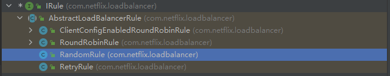

#### 相关面试题

1. **Nginx和Ribbon的区别**

   Nginx是反向代理同时实现，是服务端的负载均衡，同时做转发；Ribbon只是客户端的负载均衡。


---

---

## Nacos

> Nacos 致力于帮助您发现、配置和管理微服务。Nacos 提供了一组简单易用的特性集，帮助您快速实现动态服务发现、服务配置、服务元数据及流量管理。

#### 安装与启动

**windows安装与启动**

下载nacos压缩包，解压到没有中文、空格的一个目录

```shell
# 进入到bin目录打开cmd，输入启动命令
startup.cmd -m standalone
# 浏览器打开http://192.168.110.216:8848/nacos 用户名和密码都是nacos
```

**linux安装与启动**

解压到目录中

```shell
## 启动命令
sh startup.sh -m standalone
# 浏览器打开http://192.168.110.216:8848/nacos 用户名和密码都是nacos
```

#### pom文件配置nacos依赖包：

```java
<!--父工程-->
<!--SpringCloud-阿里巴巴-->
<dependency>
    <groupId>com.alibaba.cloud</groupId>
    <artifactId>spring-cloud-alibaba-dependencies</artifactId>
    <version>2.2.5.RELEASE</version>
    <type>pom</type>
    <scope>import</scope>
</dependency>

<!--子工程nacos依赖包-->
<!-- nacos客户端依赖包 -->
<dependency>
    <groupId>com.alibaba.cloud</groupId>
    <artifactId>spring-cloud-starter-alibaba-nacos-discovery</artifactId>
</dependency>
```

#### nacos服务分级存储模型：

1. 一级是服务：例如userservice
2. 二级是集群：例如上海集群（SH）、杭州集群（HZ）
3. 三级是实例：例如杭州机房的某台服务器部署了userservice服务

#### 环境隔离：

1. namespace用来做环境隔离
2. 每个namespace都有唯一id
3. 不同namespace的服务实例不能进行访问。

#### yml文件配置nacos服务地址：

```yaml
spring:
  cloud:
    nacos:
      server-addr: 127.0.0.1:8848 #nacos服务地址
      discovery:
        cluster-name: SH  #集群名称，这里SH代指上海
        namespace:  # 环境隔离，命名空间，填写命名空间的id
userservice:
  ribbon:
    NFLoadBalancerRuleClassName: com.alibaba.cloud.nacos.ribbon.NacosRule  # 配置有限访问本地集群（都是SH的），本地集群无健康集群，进行跨集群访问（日志会有警告信息）。负载均衡规则是随机的
```

#### 配置中心

```yaml
#添加依赖
#nacos配置中信依赖
<dependency>
	<groupId>com.alibaba.cloud</groupId>
	<artifactId>spring-cloud-starter-alibaba-nacos-config</artifactId>
</dependency>

#spring项目启动顺序为：项目启动->读取本地配置文件appication.yml->创建spring容器->加载bean
#增加nacos配置中新后：项目启动->读取nacos配置文件->读取本地配置文件appication.yml->创建spring容器->加载bean
#bootstrap.yml配置文件在项目一启动最先加载，所以需要把一些最基本信息添加进去
#bootStrap.yml  
spring:
  application:
    name: userservice    #服务名称
  profiles:
    active: dev   # 当前环境
  cloud:
    nacos:
      server-addr: 127.0.0.1:8848 #nacos服务地址
      config:
        file-extension: yaml    #配置文件后缀名
```

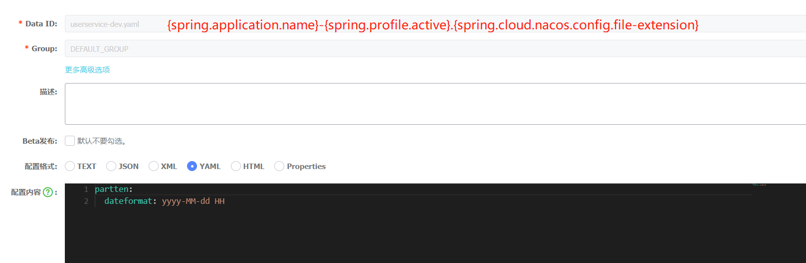

#### 配置热更新

**方式一：**

在@Value注入的变量所在的类上添加注解@RefreshScope

**方式二：**

```java
// 添加配置类
@Data
@ConfigurationProperties(prefix = "partten")
@Component
public class ParttenConfig {
    private String dateformat;
}
// 使用注入
	@Autowired
    private ParttenConfig parttenConfig;

    @GetMapping("now")
    private String getNow(){
        return LocalDateTime.now().format(DateTimeFormatter.ofPattern(parttenConfig.getDateformat()));
    }
```

#### 多环境配置共享

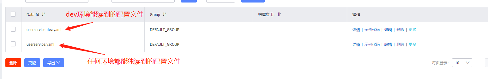

**配置文件优先级**

环境配置文件属性>共享配置文件属性>本地配置文件属性

#### 相关面试题

1. 


---

---

## OpenFeign

#### 依赖包

```java
<dependency>
    <groupId>org.springframework.cloud</groupId>
    <artifactId>spring-cloud-starter-openfeign</artifactId>
</dependency>
```

#### 常用注解

```java
// 定义在启动类上，开启Feign，basePackages扫描feign服务定义包路径
//@EnableFeignClients(basePackages = "com.jikaigg.note.feign")
// 定义在启动类上，开启Feign，clients定义加载到项目中要调用的feign定义的具体服务（推荐使用，用什么服务加载什么服务）
@EnableFeignClients(clients = UserClient.class)
// 定义提供访问的服务接口
@FeignClient(value = "userservice")
public interface UserClient {
    @GetMapping("/user/{id}")
    User queryById(@PathVariable("id") Long id);
}
```

#### 日志配置

```java
import feign.Logger;
import org.springframework.context.annotation.Bean;
import org.springframework.context.annotation.Configuration;

@Configuration
public class OpenFeignConfig {
    @Bean
    Logger.Level feignLogLevel(){
        return Logger.Level.FULL;
    }
}

NONE：默认，不显示任何日志；
BASIC: 仅记录请求方法、URL、响应状态码及执行时间；
HEADERS：除了BASIC中定义的信息之外，还有请求头和响应头信息；
FULL：除了HEADERS中定义的信息之外，还有请求的正文和响应数据。
```


---

---

## SpringCloud-gateway

#### 依赖包

```java
<dependency>
    <groupId>org.springframework.cloud</groupId>
    <artifactId>spring-cloud-starter-gateway</artifactId>
</dependency>
```

#### Predicate断言工厂

读取配置的断言规则，判断是否允许请求

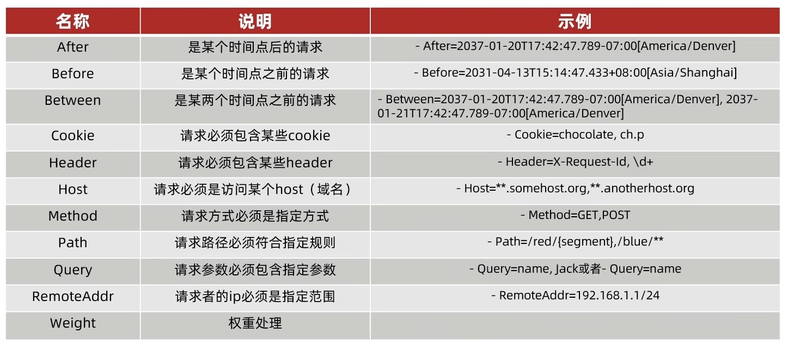

#### 路由过滤器 GatewayFilter

队进入网关的请求和微服务返回的响应做处理

#### 全局过滤器

实现GlobalFilter接口，添加@Order注解

```java
//@Order(-1)  //定义过滤器的执行顺序，数越小执行越早
@Component
public class AuthorizeFilter implements GlobalFilter, Ordered {
    @Override
    public Mono<Void> filter(ServerWebExchange exchange, GatewayFilterChain chain) {
        // 1. 获取请求参数
        ServerHttpRequest request = exchange.getRequest();
        // 2.获取参数中的AuthorizeFile
        MultiValueMap<String, String> params = request.getQueryParams();
        // 3.判断参数之是否等于admin
        String first = params.getFirst("authorization");
        // 4.是，放行
        if ("admin".equals(first)) {
            return chain.filter(exchange);
        } else {
            // 5.1 设置状态码
            exchange.getResponse().setStatusCode(HttpStatus.UNAUTHORIZED);
            // 5.否，拦截
            return exchange.getResponse().setComplete();
        }
    }
    //事项Ordered接口重写方法，和@Order注解效果一样
    @Override
    public int getOrder() {
        return -1;
    }
}
```

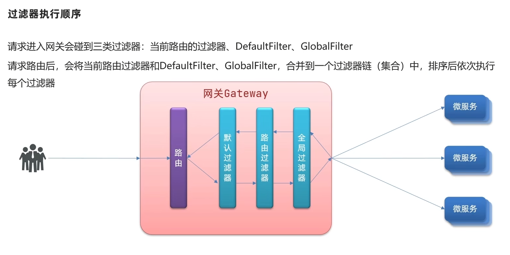

**过滤器执行顺序：路由过滤器和detaultFilter有spring管理，按照顺序由1递增；defaultFilter>路由过滤器>GloblaFilter**

#### 跨域问题

> 域名不一致就是跨域
>
> * 域名不同：www.taobao.com和www.taobao.org ; www.jd.com和www.miaosha.jd.com
>
> * 域名相同端口不通:：localhost:8080和localhost:8081
>
>   浏览器禁止请求的发起者与服务端发生跨域ajax请求，请求被浏览器拦截的问题
>
> 解决方案：CORS

#### 配置文件

```java
server:
  port: 8085
spring:
  application:
    name: gateway
  cloud:
    nacos:
      server-addr: 192.168.56.104:8848 #nacos服务地址
      #      discovery:
      #        cluster-name: HZ   # 集群名称，SH代指上海
      config:
        file-extension: yaml
    gateway:
      routes: #网关路由配置
        - id: userservice #路由id，自定义，只要唯一即可
          #          uri: http://192.168.56.104:8848/userservice #路由的目标地址http就是固定地址
          uri: lb://userservice #路由的目标地址是lb就是负载均衡，后面跟服务名称
          predicates: #路由断言，也就是判断请求是否符合路由规则的条件
            - Path=/user/** #这个是按照路径匹配，只要是/user/开头就符合要求
#          filters:
#            - AddRequestHeader=yao,jikai
        - id: orderservice
          uri: lb://orderservice
          predicates:
            - Path=/order/**
#            - After=2031-04-13T11:11:11.010+08:00[Asia/Shanghai]  #这个时间点之后允许访问
            - Before=2031-04-13T11:11:11.010+08:00[Asia/Shanghai]  #这个时间点之前允许访问
      default-filters: #默认过滤器，全局的
        - AddRequestHeader=yao,jikai111
      globalcors: # 全局的跨域处理
        add-to-simple-url-handler-mapping: true # 解决options请求被拦截问题
        corsConfigurations:
          '[/**]':
            allowedOrigins: # 允许哪些网站的跨域请求
              - "http://localhost:8090"
              - "http://www.leyou.com"
            allowedMethods: # 允许的跨域ajax的请求方式
              - "GET"
              - "POST"
              - "DELETE"
              - "PUT"
              - "OPTIONS"
            allowedHeaders: "*" # 允许在请求中携带的头信息
            allowCredentials: true # 是否允许携带cookie
            maxAge: 360000 # 这次跨域检测的有效期
```

#### 相关面试题

1. 过滤器和网关的对比

   过滤式是对单个请求进行拦截控制处理；网关是对所有请求进行拦截控制处理

2. zuul和spring cloud gateway的对比

   * zuul：是Netflix的，是基于servlet实现的，阻塞式的api，不支持长连接。

   * gateway：是springcloud自己研制的微服务网关，是基于Spring5构建，能够实现响应式非阻塞式的Api，支持长连接

3. gateway的组成

   路由 : 网关的基本模块，有ID，目标URI，一组断言和一组过滤器组成
   断言：就是访问该旅游的访问规则，可以用来匹配来自http请求的任何内容，例如headers或者参数
   过滤器：这个就是我们平时说的过滤器，用来过滤一些请求的，gateway有自己默认的过滤器，具体请参考官网，我们也可以自定义过滤器，但是要实现两个接口，ordered和globalfilter

4. 


---

---

## Docker

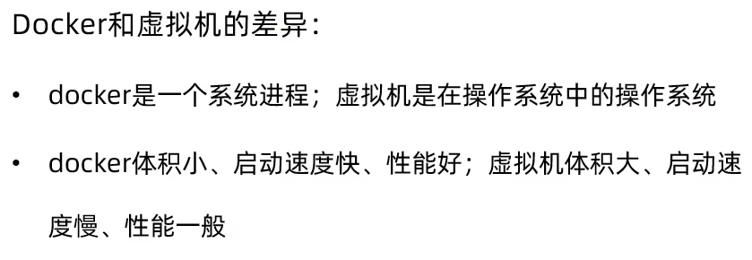

#### Docker安装

```shell
# 更新现有的软件包列表
sudo apt update
# 安装一些必备软件包，让 apt 通过 HTTPS 使用软件包
sudo apt install apt-transport-https ca-certificates curl software-properties-common
# 将官方 Docker 版本库的 GPG 密钥添加到系统中
curl -fsSL https://download.docker.com/linux/ubuntu/gpg | sudo apt-key add -
# 将 Docker 版本库添加到APT源
sudo add-apt-repository "deb [arch=amd64] https://download.docker.com/linux/ubuntu focal stable"
# 用新添加的 Docker 软件包来进行升级更新
sudo apt update
# 安装docker
sudo apt install docker-ce
# 启动docker
sudo systemctl status docker
#配置镜像加速器
sudo mkdir -p /etc/docker
sudo tee /etc/docker/daemon.json <<-'EOF'
{
  "registry-mirrors": ["https://79i2k8vr.mirror.aliyuncs.com"]
}
EOF
sudo systemctl daemon-reload
sudo systemctl restart docker
```


#### Docker镜像命令

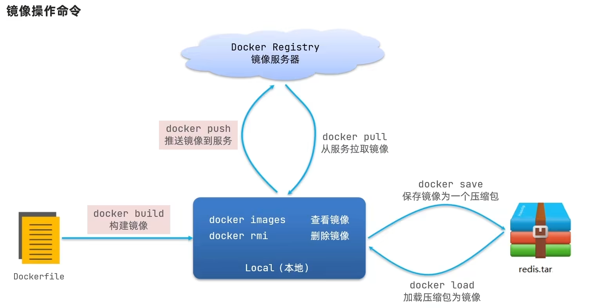

```shell
# 查看docker镜像
docker images
# 从dockerhub拉取redis最新版本的镜像
docker pull redis:latest
# 查看docker镜像
docker images
# 保存docker镜像中redis为redis.tar压缩包到本地
docker save -o redis.tar redis:latest
# 查看本地文件，多了一个redis.tar文件
ls
# 删除docker中redis镜像
docker rmi redis
# 查看docker镜像
docker images
# 导入本地目录redis.tar文件到docker镜像
docker load -i redis.tar
# 查看docker镜像
docker images
```

#### Docker容器命令

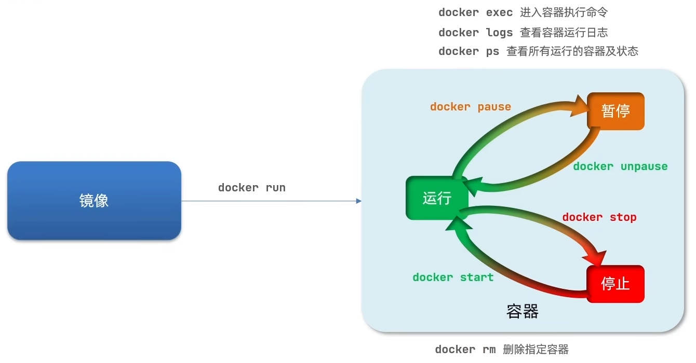

```shell
# 创建运行一个Nginx容器
docker run --name some-nginx -d -p 8080:80 some-content-nginx
# 查看mynginx容器的日志
docker logs mynginx
# 跟踪查看mynginx容器的日志，相当于linux的tail -f
docker logs -f mynginx
# 查看当前运行的容器
docker ps
#容器id  运行镜像  不知道   创建时长   状态   端口映射  容器名称
CONTAINER ID   IMAGE     COMMAND                  CREATED          STATUS          PORTS                               NAMES
9eabe07f4808   nginx     "/docker-entrypoint.…"   11 minutes ago   Up 11 minutes   0.0.0.0:80->80/tcp, :::80->80/tcp   mynginx
#展示所有容器，包括暂停和停止的容器
docker ps -a
# 删除容器 -f 强制删除
docker rm -f mynginx
```

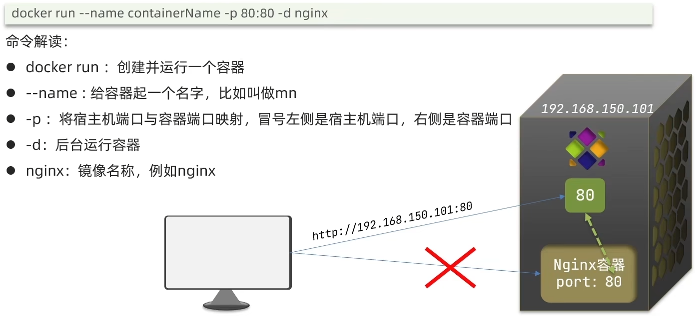

```shell
# docker exec：进入容器内部，执行一个命令
# -it 给大哥前进入的容器创建一个标准输入输出终端，允许我们与容器交互
# mynginx 要进入的容器名称
# bash 进入容器后执行的命令，bash是一个linux终端交互命令
docker exec -it mynginx bash
```

#### 数据卷

```shell
docker volume [COMMAND]
create 创建一个volume
inspect 显示一个或多个volume的详细信息
ls 列出所有的volume
prune  删除未使用的volume
rm  删除一个或多个指定的volume
```

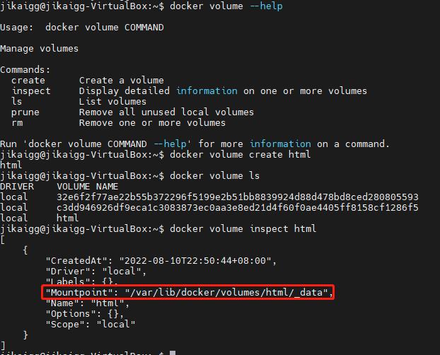

```shell
# 数据卷挂载
docker run --name mynginx -d -p 80:80 -v html:/usr/share/nginx/html nginx
```

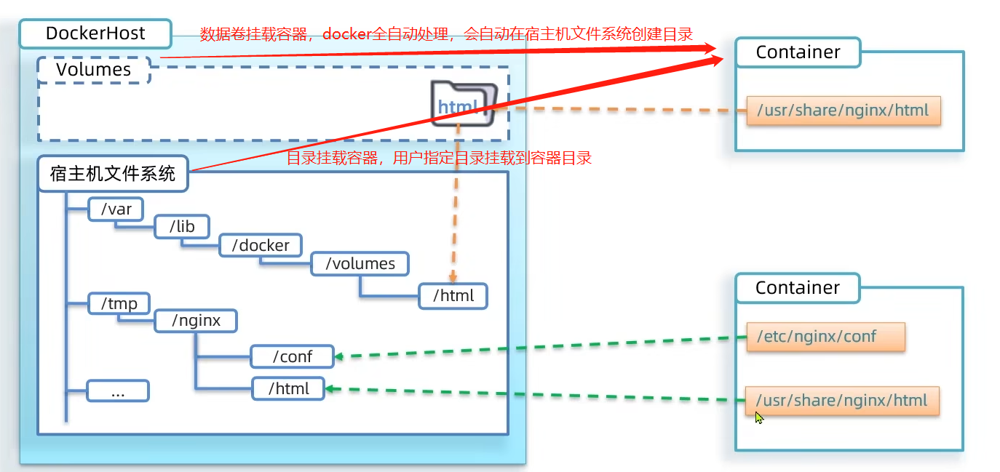

#### 自定义镜像

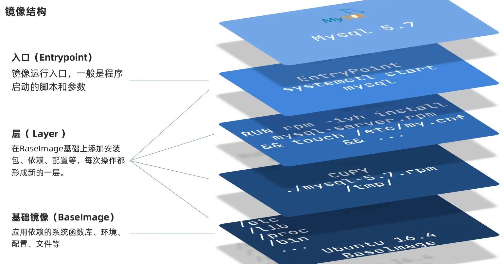

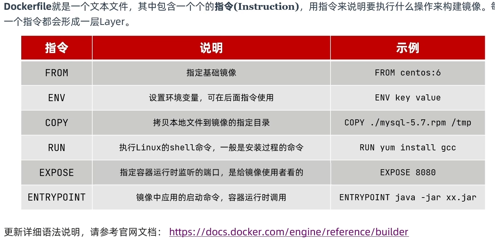

#### Dockerfile镜像构建文件

```shell
# 指定基础镜像
FROM ubuntu:16.04
# 配置环境变量，JDK的安装目录
ENV JAVA_DIR=/usr/local

# 拷贝jdk和java项目的包
COPY ./jdk8.tar.gz $JAVA_DIR/
COPY ./docker-demo.jar /tmp/app.jar

# 安装JDK
RUN cd $JAVA_DIR \
 && tar -xf ./jdk8.tar.gz \
 && mv ./jdk1.8.0_144 ./java8

# 配置环境变量
ENV JAVA_HOME=$JAVA_DIR/java8
ENV PATH=$PATH:$JAVA_HOME/bin

# 暴露端口
EXPOSE 8090
# 入口，java项目的启动命令
ENTRYPOINT java -jar /tmp/app.jar
```

---

---

## MQ

#### RabbitMQ

**下载安装**

```shell
# docker安装
docker pull rabbitmq
# 启动,因为最新版本的rabbitmq不带管理页面插件，需要下载启动management
docker run \
-e RABBITMQ_DEFAULT_USER= jikaigg \
-e RABBITMQ_DEFAULT_PASS= yaojikai \
--name mq \
-p 15672:15672 \
-p 5672:5672 \
-d \
rabbitmq:3-management
```

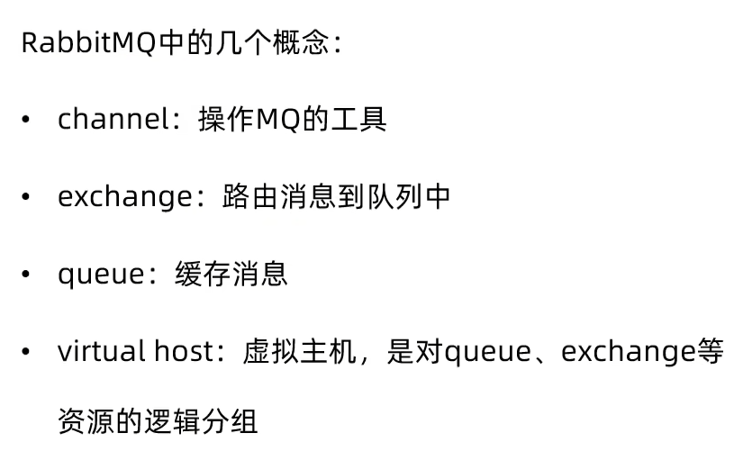


#### 相关面试题

##### 为什么使用MQ？MQ的优点

**简答**

- 异步处理 – 相比于传统的串行、并行方式，提高了系统吞吐量。

- 应用解耦 – 系统间通过消息通信，不用关心其他系统的处理。

- 流量削锋 – 可以通过消息队列长度控制请求量；可以缓解短时间内的高并发请求。

- 日志处理 – 解决大量日志传输。

- 消息通讯 – 消息队列一般都内置了高效的通信机制，因此也可以用在纯的消息通讯。比如实现点对点消息队列，或者聊天室等。

**详答**

主要是：解耦、异步、削峰。

**解耦**：A 系统发送数据到 BCD 三个系统，通过接口调用发送。如果 E 系统也要这个数据呢？那如果 C 系统现在不需要了呢？A 系统负责人几乎崩溃…A 系统跟其它各种乱七八糟的系统严重耦合，A 系统产生一条比较关键的数据，很多系统都需要 A 系统将这个数据发送过来。如果使用 MQ，A 系统产生一条数据，发送到 MQ 里面去，哪个系统需要数据自己去 MQ 里面消费。如果新系统需要数据，直接从 MQ 里消费即可；如果某个系统不需要这条数据了，就取消对 MQ 消息的消费即可。这样下来，A 系统压根儿不需要去考虑要给谁发送数据，不需要维护这个代码，也不需要考虑人家是否调用成功、失败超时等情况。

就是一个系统或者一个模块，调用了多个系统或者模块，互相之间的调用很复杂，维护起来很麻烦。但是其实这个调用是不需要直接同步调用接口的，如果用 MQ 给它异步化解耦。

**异步**：A 系统接收一个请求，需要在自己本地写库，还需要在 BCD 三个系统写库，自己本地写库要 3ms，BCD 三个系统分别写库要 300ms、450ms、200ms。最终请求总延时是 3 + 300 + 450 + 200 = 953ms，接近 1s，用户感觉搞个什么东西，慢死了慢死了。用户通过浏览器发起请求。如果使用 MQ，那么 A 系统连续发送 3 条消息到 MQ 队列中，假如耗时 5ms，A 系统从接受一个请求到返回响应给用户，总时长是 3 + 5 = 8ms。

**削峰**：减少高峰时期对服务器压力。

##### 消息队列有什么优缺点？RabbitMQ有什么优缺点？

优点上面已经说了，就是**在特殊场景下有其对应的好处**，**解耦**、**异步**、**削峰**。

缺点有以下几个：

**系统可用性降低**

本来系统运行好好的，现在你非要加入个消息队列进去，那消息队列挂了，你的系统不是呵呵了。因此，系统可用性会降低；

**系统复杂度提高**

加入了消息队列，要多考虑很多方面的问题，比如：一致性问题、如何保证消息不被重复消费、如何保证消息可靠性传输等。因此，需要考虑的东西更多，复杂性增大。

**一致性问题**

A 系统处理完了直接返回成功了，人都以为你这个请求就成功了；但是问题是，要是 BCD 三个系统那里，BD 两个系统写库成功了，结果 C 系统写库失败了，咋整？你这数据就不一致了。

所以消息队列实际是一种非常复杂的架构，你引入它有很多好处，但是也得针对它带来的坏处做各种额外的技术方案和架构来规避掉，做好之后，你会发现，妈呀，系统复杂度提升了一个数量级，也许是复杂了 10 倍。但是关键时刻，用，还是得用的。

##### 你们公司生产环境用的是什么消息中间件？

这个首先你可以说下你们公司选用的是什么消息中间件，比如用的是RabbitMQ，然后可以初步给一些你对不同MQ中间件技术的选型分析。

举个例子：比如说ActiveMQ是老牌的消息中间件，国内很多公司过去运用的还是非常广泛的，功能很强大。

但是问题在于没法确认ActiveMQ可以支撑互联网公司的高并发、高负载以及高吞吐的复杂场景，在国内互联网公司落地较少。而且使用较多的是一些传统企业，用ActiveMQ做异步调用和系统解耦。

然后你可以说说RabbitMQ，他的好处在于可以支撑高并发、高吞吐、性能很高，同时有非常完善便捷的后台管理界面可以使用。

另外，他还支持集群化、高可用部署架构、消息高可靠支持，功能较为完善。

而且经过调研，国内各大互联网公司落地大规模RabbitMQ集群支撑自身业务的case较多，国内各种中小型互联网公司使用RabbitMQ的实践也比较多。

除此之外，RabbitMQ的开源社区很活跃，较高频率的迭代版本，来修复发现的bug以及进行各种优化，因此综合考虑过后，公司采取了RabbitMQ。

但是RabbitMQ也有一点缺陷，就是他自身是基于erlang语言开发的，所以导致较为难以分析里面的源码，也较难进行深层次的源码定制和改造，毕竟需要较为扎实的erlang语言功底才可以。

然后可以聊聊RocketMQ，是阿里开源的，经过阿里的生产环境的超高并发、高吞吐的考验，性能卓越，同时还支持分布式事务等特殊场景。

而且RocketMQ是基于Java语言开发的，适合深入阅读源码，有需要可以站在源码层面解决线上生产问题，包括源码的二次开发和改造。

另外就是Kafka。Kafka提供的消息中间件的功能明显较少一些，相对上述几款MQ中间件要少很多。

但是Kafka的优势在于专为超高吞吐量的实时日志采集、实时数据同步、实时数据计算等场景来设计。

因此Kafka在大数据领域中配合实时计算技术（比如Spark Streaming、Storm、Flink）使用的较多。但是在传统的MQ中间件使用场景中较少采用。

##### Kafka、ActiveMQ、RabbitMQ、RocketMQ 有什么优缺点？

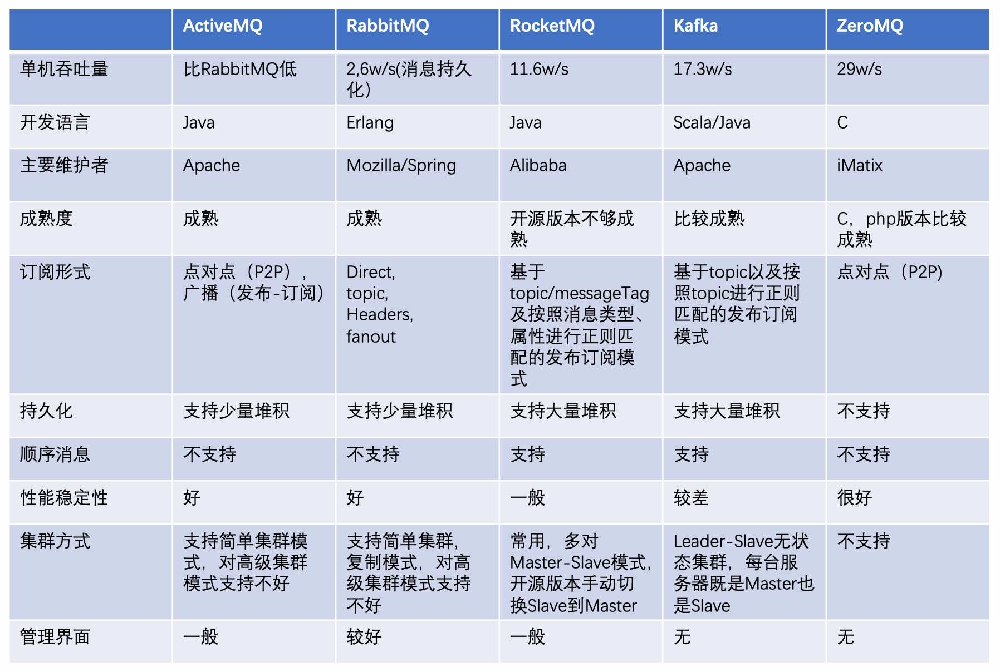

##### MQ 有哪些常见问题？如何解决这些问题？

MQ 的常见问题有：

1. 消息的顺序问题
2. 消息的重复问题

**消息的顺序问题**

消息有序指的是可以按照消息的发送顺序来消费。

假如生产者产生了 2 条消息：M1、M2，假定 M1 发送到 S1，M2 发送到 S2，如果要保证 M1 先于 M2 被消费，怎么做？

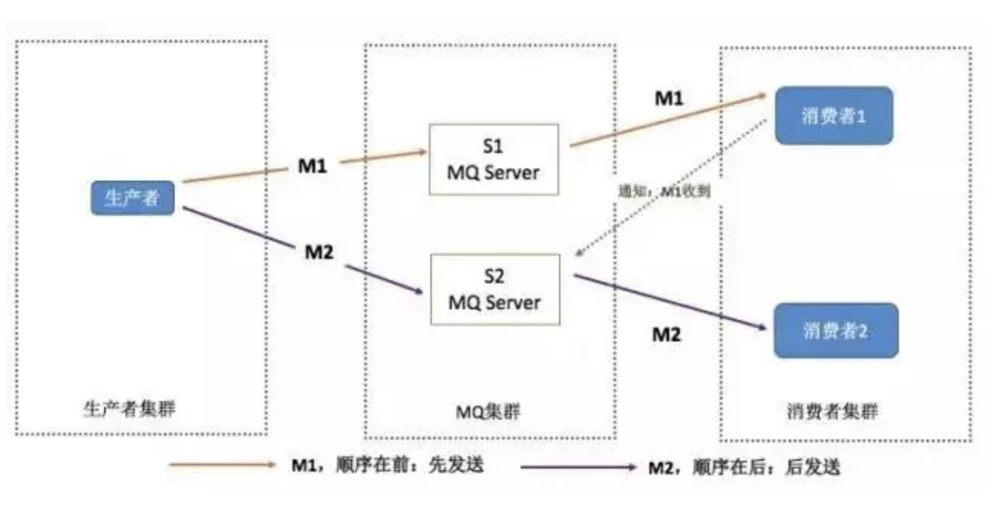

解决方案：

（1）保证生产者 – MQServer – 消费者是一对一对一的关系

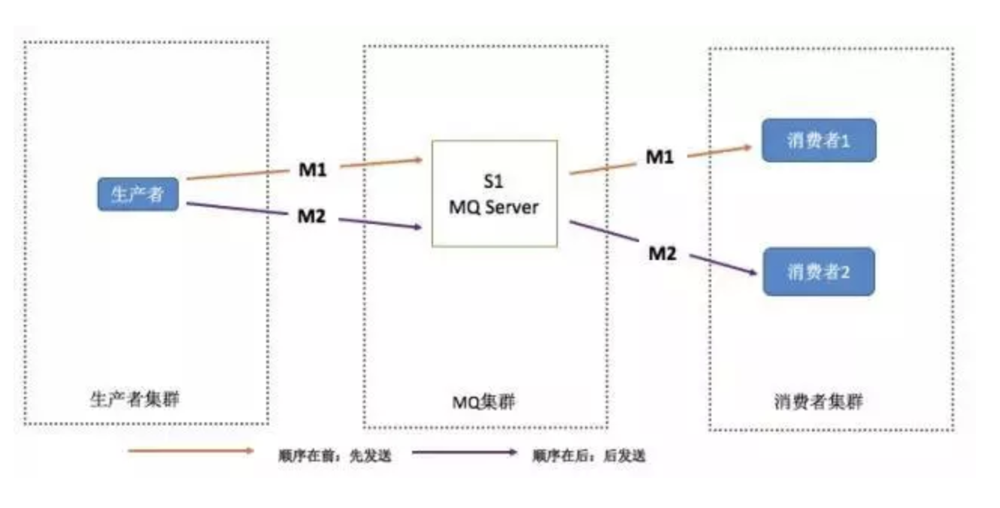

缺陷：

- 并行度就会成为消息系统的瓶颈（吞吐量不够）

- 更多的异常处理，比如：只要消费端出现问题，就会导致整个处理流程阻塞，我们不得不花费更多的精力来解决阻塞的问题。 （2）通过合理的设计或者将问题分解来规避。

- 不关注乱序的应用实际大量存在

- 队列无序并不意味着消息无序 所以从业务层面来保证消息的顺序而不仅仅是依赖于消息系统，是一种更合理的方式。

**消息的重复问题**

造成消息重复的根本原因是：网络不可达。

所以解决这个问题的办法就是绕过这个问题。那么问题就变成了：如果消费端收到两条一样的消息，应该怎样处理？

消费端处理消息的业务逻辑保持幂等性。只要保持幂等性，不管来多少条重复消息，最后处理的结果都一样。保证每条消息都有唯一编号且保证消息处理成功与去重表的日志同时出现。利用一张日志表来记录已经处理成功的消息的 ID，如果新到的消息 ID 已经在日志表中，那么就不再处理这条消息。

##### 什么是RabbitMQ？

RabbitMQ是一款开源的，Erlang编写的，基于AMQP协议的消息中间件

##### rabbitmq 的使用场景

（1）服务间异步通信

（2）顺序消费

（3）定时任务

（4）请求削峰

##### RabbitMQ基本概念

- Broker： 简单来说就是消息队列服务器实体

- Exchange： 消息交换机，它指定消息按什么规则，路由到哪个队列

- Queue： 消息队列载体，每个消息都会被投入到一个或多个队列

- Binding： 绑定，它的作用就是把exchange和queue按照路由规则绑定起来

- Routing Key： 路由关键字，exchange根据这个关键字进行消息投递

- VHost： vhost 可以理解为虚拟 broker ，即 mini-RabbitMQ server。其内部均含有独立的 queue、exchange 和 binding 等，但最最重要的是，其拥有独立的权限系统，可以做到 vhost 范围的用户控制。当然，从 RabbitMQ 的全局角度，vhost 可以作为不同权限隔离的手段（一个典型的例子就是不同的应用可以跑在不同的 vhost 中）。

- Producer： 消息生产者，就是投递消息的程序

- Consumer： 消息消费者，就是接受消息的程序

- Channel： 消息通道，在客户端的每个连接里，可建立多个channel，每个channel代表一个会话任务

由Exchange、Queue、RoutingKey三个才能决定一个从Exchange到Queue的唯一的线路。

##### RabbitMQ的工作模式

**一.simple模式（即最简单的收发模式）**

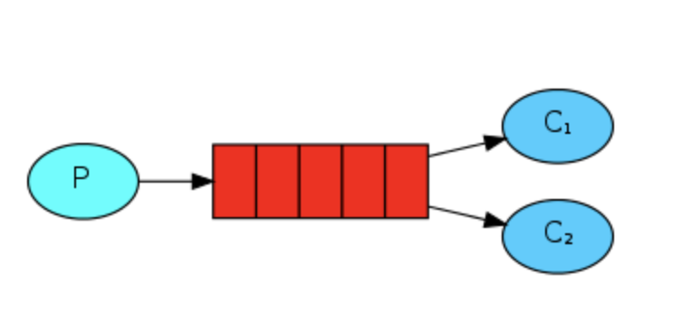

1.消息产生消息，将消息放入队列

2.消息的消费者(consumer) 监听 消息队列,如果队列中有消息,就消费掉,消息被拿走后,自动从队列中删除(隐患 消息可能没有被消费者正确处理,已经从队列中消失了,造成消息的丢失，这里可以设置成手动的ack,但如果设置成手动ack，处理完后要及时发送ack消息给队列，否则会造成内存溢出)。

**二.work工作模式(资源的竞争)**


1.消息产生者将消息放入队列消费者可以有多个,消费者1,消费者2同时监听同一个队列,消息被消费。C1 C2共同争抢当前的消息队列内容,谁先拿到谁负责消费消息(隐患：高并发情况下,默认会产生某一个消息被多个消费者共同使用,可以设置一个开关(syncronize) 保证一条消息只能被一个消费者使用)。

**三.publish/subscribe发布订阅(共享资源)**

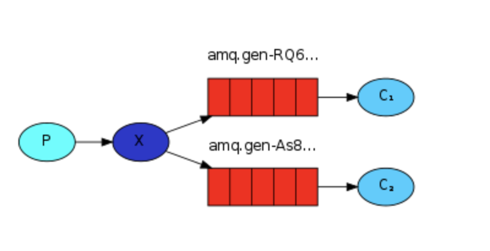

1、每个消费者监听自己的队列；

2、生产者将消息发给broker，由交换机将消息转发到绑定此交换机的每个队列，每个绑定交换机的队列都将接收到消息。

**四.routing路由模式**

1.消息生产者将消息发送给交换机按照路由判断,路由是字符串(info) 当前产生的消息携带路由字符(对象的方法),交换机根据路由的key,只能匹配上路由key对应的消息队列,对应的消费者才能消费消息;

2.根据业务功能定义路由字符串

3.从系统的代码逻辑中获取对应的功能字符串,将消息任务扔到对应的队列中。

4.业务场景:error 通知;EXCEPTION;错误通知的功能;传统意义的错误通知;客户通知;利用key路由,可以将程序中的错误封装成消息传入到消息队列中,开发者可以自定义消费者,实时接收错误;

**五.topic 主题模式(路由模式的一种)**

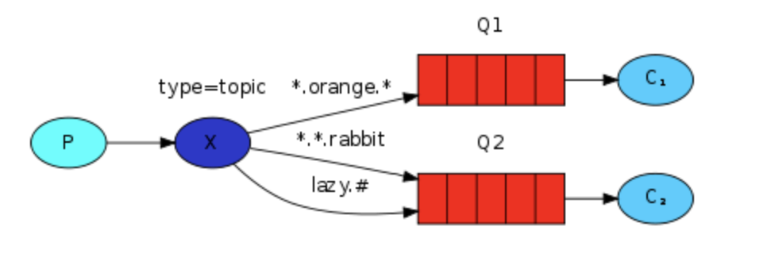

1.星号井号代表通配符

2.星号代表多个单词,井号代表一个单词

3.路由功能添加模糊匹配

4.消息产生者产生消息,把消息交给交换机

5.交换机根据key的规则模糊匹配到对应的队列,由队列的监听消费者接收消息消费

（在我的理解看来就是routing查询的一种模糊匹配，就类似sql的模糊查询方式）

##### 如何保证RabbitMQ消息的顺序性？

拆分多个 queue，每个 queue 一个 consumer，就是多一些 queue 而已，确实是麻烦点；或者就一个 queue 但是对应一个 consumer，然后这个 consumer 内部用内存队列做排队，然后分发给底层不同的 worker 来处理。

##### 消息如何分发？

若该队列至少有一个消费者订阅，消息将以循环（round-robin）的方式发送给消费者。每条消息只会分发给一个订阅的消费者（前提是消费者能够正常处理消息并进行确认）。通过路由可实现多消费的功能

##### 消息怎么路由？

消息提供方->路由->一至多个队列消息发布到交换器时，消息将拥有一个路由键（routing key），在消息创建时设定。通过队列路由键，可以把队列绑定到交换器上。消息到达交换器后，RabbitMQ 会将消息的路由键与队列的路由键进行匹配（针对不同的交换器有不同的路由规则）；

常用的交换器主要分为一下三种：

fanout：如果交换器收到消息，将会广播到所有绑定的队列上

direct：如果路由键完全匹配，消息就被投递到相应的队列

topic：可以使来自不同源头的消息能够到达同一个队列。 使用 topic 交换器时，可以使用通配符

##### 消息基于什么传输？

由于 TCP 连接的创建和销毁开销较大，且并发数受系统资源限制，会造成性能瓶颈。RabbitMQ 使用信道的方式来传输数据。信道是建立在真实的 TCP 连接内的虚拟连接，且每条 TCP 连接上的信道数量没有限制。

##### 如何保证消息不被重复消费？或者说，如何保证消息消费时的幂等性？

先说为什么会重复消费：正常情况下，消费者在消费消息的时候，消费完毕后，会发送一个确认消息给消息队列，消息队列就知道该消息被消费了，就会将该消息从消息队列中删除；

但是因为网络传输等等故障，确认信息没有传送到消息队列，导致消息队列不知道自己已经消费过该消息了，再次将消息分发给其他的消费者。

针对以上问题，一个解决思路是：保证消息的唯一性，就算是多次传输，不要让消息的多次消费带来影响；保证消息等幂性；

比如：在写入消息队列的数据做唯一标示，消费消息时，根据唯一标识判断是否消费过；

假设你有个系统，消费一条消息就往数据库里插入一条数据，要是你一个消息重复两次，你不就插入了两条，这数据不就错了？但是你要是消费到第二次的时候，自己判断一下是否已经消费过了，若是就直接扔了，这样不就保留了一条数据，从而保证了数据的正确性。

##### 如何确保消息正确地发送至 RabbitMQ？ 如何确保消息接收方消费了消息？

**发送方确认模式**

将信道设置成 confirm 模式（发送方确认模式），则所有在信道上发布的消息都会被指派一个唯一的 ID。

一旦消息被投递到目的队列后，或者消息被写入磁盘后（可持久化的消息），信道会发送一个确认给生产者（包含消息唯一 ID）。

如果 RabbitMQ 发生内部错误从而导致消息丢失，会发送一条 nack（notacknowledged，未确认）消息。

发送方确认模式是异步的，生产者应用程序在等待确认的同时，可以继续发送消息。当确认消息到达生产者应用程序，生产者应用程序的回调方法就会被触发来处理确认消息。

**接收方确认机制**

消费者接收每一条消息后都必须进行确认（消息接收和消息确认是两个不同操作）。只有消费者确认了消息，RabbitMQ 才能安全地把消息从队列中删除。

这里并没有用到超时机制，RabbitMQ 仅通过 Consumer 的连接中断来确认是否需要重新发送消息。也就是说，只要连接不中断，RabbitMQ 给了 Consumer 足够长的时间来处理消息。保证数据的最终一致性；

下面罗列几种特殊情况

- 如果消费者接收到消息，在确认之前断开了连接或取消订阅，RabbitMQ 会认为消息没有被分发，然后重新分发给下一个订阅的消费者。（可能存在消息重复消费的隐患，需要去重）
- 如果消费者接收到消息却没有确认消息，连接也未断开，则 RabbitMQ 认为该消费者繁忙，将不会给该消费者分发更多的消息。

##### 如何保证RabbitMQ消息的可靠传输？

消息不可靠的情况可能是消息丢失，劫持等原因；

丢失又分为：生产者丢失消息、消息列表丢失消息、消费者丢失消息；

**生产者丢失消息**：从生产者弄丢数据这个角度来看，RabbitMQ提供transaction和confirm模式来确保生产者不丢消息；

transaction机制就是说：发送消息前，开启事务（channel.txSelect()）,然后发送消息，如果发送过程中出现什么异常，事务就会回滚（channel.txRollback()）,如果发送成功则提交事务（channel.txCommit()）。然而，这种方式有个缺点：吞吐量下降；

confirm模式用的居多：一旦channel进入confirm模式，所有在该信道上发布的消息都将会被指派一个唯一的ID（从1开始），一旦消息被投递到所有匹配的队列之后；

rabbitMQ就会发送一个ACK给生产者（包含消息的唯一ID），这就使得生产者知道消息已经正确到达目的队列了；

如果rabbitMQ没能处理该消息，则会发送一个Nack消息给你，你可以进行重试操作。

**消息队列丢数据**：消息持久化。

处理消息队列丢数据的情况，一般是开启持久化磁盘的配置。

这个持久化配置可以和confirm机制配合使用，你可以在消息持久化磁盘后，再给生产者发送一个Ack信号。

这样，如果消息持久化磁盘之前，rabbitMQ阵亡了，那么生产者收不到Ack信号，生产者会自动重发。

那么如何持久化呢？

这里顺便说一下吧，其实也很容易，就下面两步

1. 将queue的持久化标识durable设置为true,则代表是一个持久的队列
2. 发送消息的时候将deliveryMode=2

这样设置以后，即使rabbitMQ挂了，重启后也能恢复数据

**消费者丢失消息**：消费者丢数据一般是因为采用了自动确认消息模式，改为手动确认消息即可！

消费者在收到消息之后，处理消息之前，会自动回复RabbitMQ已收到消息；

如果这时处理消息失败，就会丢失该消息；

解决方案：处理消息成功后，手动回复确认消息。

##### 为什么不应该对所有的 message 都使用持久化机制？

首先，必然导致性能的下降，因为写磁盘比写 RAM 慢的多，message 的吞吐量可能有 10 倍的差距。

其次，message 的持久化机制用在 RabbitMQ 的内置 cluster 方案时会出现“坑爹”问题。矛盾点在于，若 message 设置了 persistent 属性，但 queue 未设置 durable 属性，那么当该 queue 的 owner node 出现异常后，在未重建该 queue 前，发往该 queue 的 message 将被 blackholed ；若 message 设置了 persistent 属性，同时 queue 也设置了 durable 属性，那么当 queue 的 owner node 异常且无法重启的情况下，则该 queue 无法在其他 node 上重建，只能等待其 owner node 重启后，才能恢复该 queue 的使用，而在这段时间内发送给该 queue 的 message 将被 blackholed 。

所以，是否要对 message 进行持久化，需要综合考虑性能需要，以及可能遇到的问题。若想达到 100,000 条/秒以上的消息吞吐量（单 RabbitMQ 服务器），则要么使用其他的方式来确保 message 的可靠 delivery ，要么使用非常快速的存储系统以支持全持久化（例如使用 SSD）。另外一种处理原则是：仅对关键消息作持久化处理（根据业务重要程度），且应该保证关键消息的量不会导致性能瓶颈。

##### 如何保证高可用的？RabbitMQ 的集群

RabbitMQ 是比较有代表性的，因为是基于主从（非分布式）做高可用性的，我们就以 RabbitMQ 为例子讲解第一种 MQ 的高可用性怎么实现。RabbitMQ 有三种模式：单机模式、普通集群模式、镜像集群模式。

**单机模式**，就是 Demo 级别的，一般就是你本地启动了玩玩儿的?，没人生产用单机模式

**普通集群模式**，意思就是在多台机器上启动多个 RabbitMQ 实例，每个机器启动一个。你创建的 queue，只会放在一个 RabbitMQ 实例上，但是每个实例都同步 queue 的元数据（元数据可以认为是 queue 的一些配置信息，通过元数据，可以找到 queue 所在实例）。你消费的时候，实际上如果连接到了另外一个实例，那么那个实例会从 queue 所在实例上拉取数据过来。这方案主要是提高吞吐量的，就是说让集群中多个节点来服务某个 queue 的读写操作。

**镜像集群模式**：这种模式，才是所谓的 RabbitMQ 的高可用模式。跟普通集群模式不一样的是，在镜像集群模式下，你创建的 queue，无论元数据还是 queue 里的消息都会存在于多个实例上，就是说，每个 RabbitMQ 节点都有这个 queue 的一个完整镜像，包含 queue 的全部数据的意思。然后每次你写消息到 queue 的时候，都会自动把消息同步到多个实例的 queue 上。RabbitMQ 有很好的管理控制台，就是在后台新增一个策略，这个策略是镜像集群模式的策略，指定的时候是可以要求数据同步到所有节点的，也可以要求同步到指定数量的节点，再次创建 queue 的时候，应用这个策略，就会自动将数据同步到其他的节点上去了。这样的话，好处在于，你任何一个机器宕机了，没事儿，其它机器（节点）还包含了这个 queue 的完整数据，别的 consumer 都可以到其它节点上去消费数据。坏处在于，第一，这个性能开销也太大了吧，消息需要同步到所有机器上，导致网络带宽压力和消耗很重！RabbitMQ 一个 queue 的数据都是放在一个节点里的，镜像集群下，也是每个节点都放这个 queue 的完整数据。

##### 如何解决消息队列的延时以及过期失效问题？消息队列满了以后该怎么处理？有几百万消息持续积压几小时，说说怎么解决？

消息积压处理办法：临时紧急扩容：

先修复 consumer 的问题，确保其恢复消费速度，然后将现有 cnosumer 都停掉。

新建一个 topic，partition 是原来的 10 倍，临时建立好原先 10 倍的 queue 数量。

然后写一个临时的分发数据的 consumer 程序，这个程序部署上去消费积压的数据，消费之后不做耗时的处理，直接均匀轮询写入临时建立好的 10 倍数量的 queue。

接着临时征用 10 倍的机器来部署 consumer，每一批 consumer 消费一个临时 queue 的数据。这种做法相当于是临时将 queue 资源和 consumer 资源扩大 10 倍，以正常的 10 倍速度来消费数据。

等快速消费完积压数据之后，得恢复原先部署的架构，重新用原先的 consumer 机器来消费消息。

MQ中消息失效：假设你用的是 RabbitMQ，RabbtiMQ 是可以设置过期时间的，也就是 TTL。如果消息在 queue 中积压超过一定的时间就会被 RabbitMQ 给清理掉，这个数据就没了。那这就是第二个坑了。这就不是说数据会大量积压在 mq 里，而是大量的数据会直接搞丢。我们可以采取一个方案，就是批量重导，这个我们之前线上也有类似的场景干过。就是大量积压的时候，我们当时就直接丢弃数据了，然后等过了高峰期以后，比如大家一起喝咖啡熬夜到晚上12点以后，用户都睡觉了。这个时候我们就开始写程序，将丢失的那批数据，写个临时程序，一点一点的查出来，然后重新灌入 mq 里面去，把白天丢的数据给他补回来。也只能是这样了。假设 1 万个订单积压在 mq 里面，没有处理，其中 1000 个订单都丢了，你只能手动写程序把那 1000 个订单给查出来，手动发到 mq 里去再补一次。

mq消息队列块满了：如果消息积压在 mq 里，你很长时间都没有处理掉，此时导致 mq 都快写满了，咋办？这个还有别的办法吗？没有，谁让你第一个方案执行的太慢了，你临时写程序，接入数据来消费，消费一个丢弃一个，都不要了，快速消费掉所有的消息。然后走第二个方案，到了晚上再补数据吧。

##### 设计MQ思路

比如说这个消息队列系统，我们从以下几个角度来考虑一下：

首先这个 mq 得支持可伸缩性吧，就是需要的时候快速扩容，就可以增加吞吐量和容量，那怎么搞？设计个分布式的系统呗，参照一下 kafka 的设计理念，broker -> topic -> partition，每个 partition 放一个机器，就存一部分数据。如果现在资源不够了，简单啊，给 topic 增加 partition，然后做数据迁移，增加机器，不就可以存放更多数据，提供更高的吞吐量了？

其次你得考虑一下这个 mq 的数据要不要落地磁盘吧？那肯定要了，落磁盘才能保证别进程挂了数据就丢了。那落磁盘的时候怎么落啊？顺序写，这样就没有磁盘随机读写的寻址开销，磁盘顺序读写的性能是很高的，这就是 kafka 的思路。

其次你考虑一下你的 mq 的可用性啊？这个事儿，具体参考之前可用性那个环节讲解的 kafka 的高可用保障机制。多副本 -> leader & follower -> broker 挂了重新选举 leader 即可对外服务。

能不能支持数据 0 丢失啊？可以的，参考我们之前说的那个 kafka 数据零丢失方案。


---

---

## MySQL

#### 数据库隔离级别

> 脏读：在事务A中读取到了事务B中没有进行事务提交的修改数据。
>
> 不可重复读：事务A中的两次查询，查询结果不一致；主要指的是修改；第一次查询后事务B对刚才的数据进行了修改并提交了事务，然后事务A再次查询的时候查到的结果就不一致了。
>
> 幻读：自己的事务中两个连续的查找之间一个并发的修改事务修改了查询的数据集，导致这两个查询返回了不同的结果(注：不可重复读与幻读很相似，不可重复读的重点是修改，而幻读的重点在于新增或者删除)

* 读未提交：读未提交，指可以读到未提交的内容。因为这种隔离级别下查询是不会加锁的，所以可能会产生“脏读”、“不可重复读”、“幻读”。在实际开发中如无特殊情况基本是不会使用该隔离级别的。

* 读已提交：读提交，指只能读到已经提交了的内容。这是最常用的一种隔离级别也是Oracle和SQLServer的默认级别，该级别可以有效地避免脏读。(注意：除非显示加锁如共享锁、排他锁，否则查询是默认不加锁的。而区别于“读未提交”，“读提交”可避免脏读的原因是采用了 “快照读”)

* 可重复读（MySQL数据库innodb默认的级别）：可重复读，该级别可以有效的避免“不可重复读”，也是MySQL数据库innodb默认的级别。在这个级别下，普通的查询同样是使用的“快照读”，但是，和“读提交”不同的是，当事务启动时就不允许进行Update操作，而“不可重复读”是因为两次读取之间进行了数据的修改所导致的。因此“可重复读”能够有效的避免“不可重复读”，但却避免不了“幻读”，因为幻读是由于“插入或者删除操作”而产生的。

* 串行化：串行化是数据库最高的隔离级别，这种级别下事务串行化一个一个排队顺序执行，可避免脏读、不可重复读、幻读。安全性高相应的执行效率低，性能开销也最大，在实际开发中比较少用。

数据库读分为：一致非锁定读、锁定读，上面提到“快照读”也就是非锁定读。可简单理解为执行SELECT语句的时候会生成一个快照。

不同事务隔离级别下，快照读是存在区别的：

- READ COMMITTED 隔离级别下，事务中每次读取都会重新生成一个快照，所以每次快照都是最新的。因此事务中每次执行SELECT也可以看到其它已commit事务所作的更改，因为读取的是快照所以有效地避免了脏读的情况。而假设如果没有“快照读(一致非锁定读)”使用的是“锁定读”，那么当一个更新的事务没有提交时，另一个对更新数据进行查询的事务会因为无法查询而被阻塞，这种情况下并发能力及效率相对比较差。
- REPEATED READ 隔离级别下，快照会在事务中第一次SELECT语句执行时生成，只有在本事务中对数据进行更改Update才会更新快照，因此，只有第一次SELECT之前其它已提交事务所作的更改可以看到。

#### 索引

1. 数据结构是B+树。

   B+树特点：所有非叶子节点只存键和指针，叶子结点存键和值，并且叶子结点之间有链指针

   B树是所有节点都存键值，叶子结点之间无指针

2. 组合索引有最左前缀原则。mysql由最左的字段构建B+索引树，如果查询没有最左的字段则无法应用到索引。如果组合索引查询时全部用=则可以无序，优化器会按索引顺序执行。如果条件之中有范围查找则停止。比如abcd索引，a=1,b=1,c>3,d=1;则d索引没有使用到。

3. force index() 强制使用索引。如果一个表有多个索引。条件也用到了多个字索引字段，mysql优化器可能选取的并不是最优索引。可以手动强制使用某个索引。相对的就有ignore index()强制不适用某个索引，或某几个索引。

4. explain执行计划的type：

   system系统表>const常量连接>eq_ref唯一索引>ref非唯一索引>range索引范围查找>index索引全部扫描>all全表扫描

#### 一条sql的执行过程

1. 连接器，判断用户身份信息是否正确，是否有权限。
2. 根据用户上送的sql查询缓存，mysql缓存要求的是sql必须一模一样才会命中缓存，否则缓存查不到。mysql8开始移除了查询缓存
3. 解析和预处理，讲sql解析成抽象语法树(AST)，并做预处理，会检查所查询表是否存在，是否有语法错误
4. 优化器，会根据解析树生成多种优化后的执行计划，mysql会选择一种最优的执行。
5. 执行器，执行解析后的sql，获取结果，返回给客户端。


---

---

## Redis

> Redis(Remote Dictionary Server) 是一个使用 C 语言编写的，开源的（BSD许可）高性能非关系型（NoSQL）的键值对数据库。
>
> Redis 可以存储键和五种不同类型的值之间的映射。键的类型只能为字符串，值支持五种数据类型：字符串、列表、集合、散列表、有序集合。
>
> 与传统数据库不同的是 Redis 的数据是存在内存中的，所以读写速度非常快，因此 redis 被广泛应用于缓存方向，每秒可以处理超过 10万次读写操作，是已知性能最快的Key-Value DB。另外，Redis 也经常用来做分布式锁。除此之外，Redis 支持事务 、持久化、LUA脚本、LRU驱动事件、多种集群方案。

#### Redis数据类型

Redis主要有5种数据类型，包括String，List，Set，Zset，Hash，满足大部分的使用要求

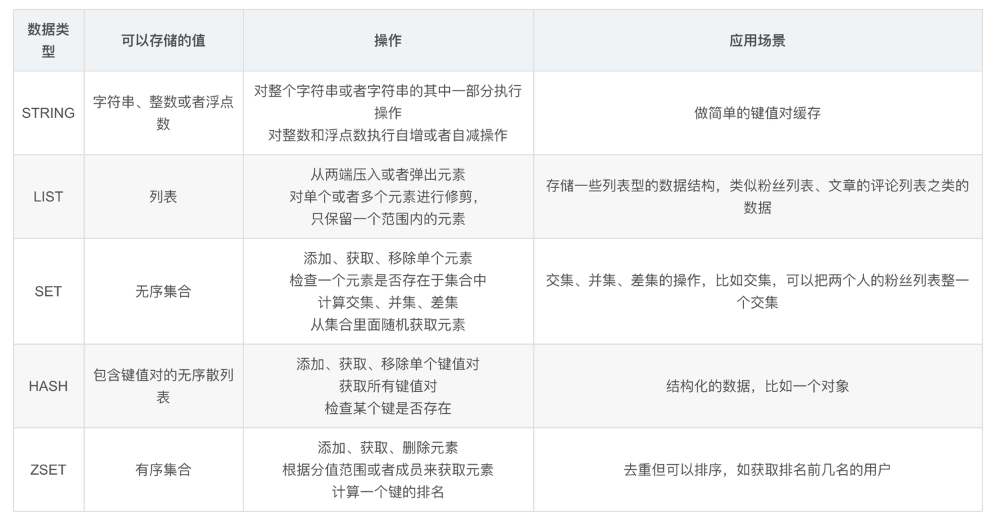

#### 持久化

Redis 提供两种持久化机制 RDB（默认） 和 AOF 机制:

RDB：是Redis DataBase缩写快照

RDB是Redis默认的持久化方式。按照一定的时间将内存的数据以快照的形式保存到硬盘中，对应产生的数据文件为dump.rdb。通过配置文件中的save参数来定义快照的周期。


优点：

- 只有一个文件 dump.rdb，方便持久化。

- 容灾性好，一个文件可以保存到安全的磁盘。

- 性能最大化，fork 子进程来完成写操作，让主进程继续处理命令，所以是 IO 最大化。使用单独子进程来进行持久化，主进程不会进行任何 IO 操作，保证了 redis 的高性能

- 相对于数据集大时，比 AOF 的启动效率更高。

缺点：

- 数据安全性低。RDB 是间隔一段时间进行持久化，如果持久化之间 redis 发生故障，会发生数据丢失。所以这种方式更适合数据要求不严谨的时候)
- AOF（Append-only file)持久化方式： 是指所有的命令行记录以 redis 命令请 求协议的格式完全持久化存储)保存为 aof 文件。

AOF持久化(即Append Only File持久化)，则是将Redis执行的每次写命令记录到单独的日志文件中，当重启Redis会重新将持久化的日志中文件恢复数据。

当两种方式同时开启时，数据恢复Redis会优先选择AOF恢复。

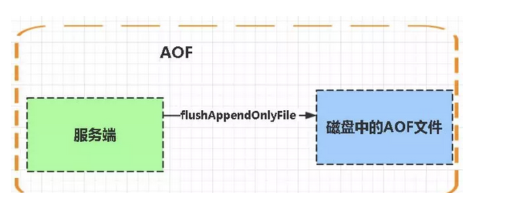

优点：

- 数据安全，aof 持久化可以配置 appendfsync 属性，有 always，每进行一次 命令操作就记录到 aof 文件中一次。
- 通过 append 模式写文件，即使中途服务器宕机，可以通过 redis-check-aof 工具解决数据一致性问题。
- AOF 机制的 rewrite 模式。AOF 文件没被 rewrite 之前（文件过大时会对命令 进行合并重写），可以删除其中的某些命令（比如误操作的 flushall）)

缺点：

- AOF 文件比 RDB 文件大，且恢复速度慢。
- 数据集大的时候，比 rdb 启动效率低。

优缺点是什么？

- AOF文件比RDB更新频率高，优先使用AOF还原数据。

- AOF比RDB更安全也更大

- RDB性能比AOF好

- 如果两个都配了优先加载AOF


#### 过期键的删除策略

##### Redis的过期键的删除策略

我们都知道，Redis是key-value数据库，我们可以设置Redis中缓存的key的过期时间。Redis的过期策略就是指当Redis中缓存的key过期了，Redis如何处理。

过期策略通常有以下三种：

- 定时过期：每个设置过期时间的key都需要创建一个定时器，到过期时间就会立即清除。该策略可以立即清除过期的数据，对内存很友好；但是会占用大量的CPU资源去处理过期的数据，从而影响缓存的响应时间和吞吐量。
- 惰性过期：只有当访问一个key时，才会判断该key是否已过期，过期则清除。该策略可以最大化地节省CPU资源，却对内存非常不友好。极端情况可能出现大量的过期key没有再次被访问，从而不会被清除，占用大量内存。
- 定期过期：每隔一定的时间，会扫描一定数量的数据库的expires字典中一定数量的key，并清除其中已过期的key。该策略是前两者的一个折中方案。通过调整定时扫描的时间间隔和每次扫描的限定耗时，可以在不同情况下使得CPU和内存资源达到最优的平衡效果。  
  (expires字典会保存所有设置了过期时间的key的过期时间数据，其中，key是指向键空间中的某个键的指针，value是该键的毫秒精度的UNIX时间戳表示的过期时间。键空间是指该Redis集群中保存的所有键。)

Redis中同时使用了惰性过期和定期过期两种过期策略。

##### Redis key的过期时间和永久有效分别怎么设置？

EXPIRE和PERSIST命令。

##### 我们知道通过expire来设置key 的过期时间，那么对过期的数据怎么处理呢?

除了缓存服务器自带的缓存失效策略之外（Redis默认的有6中策略可供选择），我们还可以根据具体的业务需求进行自定义的缓存淘汰，常见的策略有两种：

1. 定时去清理过期的缓存；
2. 当有用户请求过来时，再判断这个请求所用到的缓存是否过期，过期的话就去底层系统得到新数据并更新缓存。

两者各有优劣，第一种的缺点是维护大量缓存的key是比较麻烦的，第二种的缺点就是每次用户请求过来都要判断缓存失效，逻辑相对比较复杂！具体用哪种方案，大家可以根据自己的应用场景来权衡。

#### 内存相关

##### MySQL里有2000w数据，redis中只存20w的数据，如何保证redis中的数据都是热点数据

redis内存数据集大小上升到一定大小的时候，就会施行数据淘汰策略。

##### Redis的内存淘汰策略有哪些

Redis的内存淘汰策略是指在Redis的用于缓存的内存不足时，怎么处理需要新写入且需要申请额外空间的数据。

**全局的键空间选择性移除**

- noeviction：当内存不足以容纳新写入数据时，新写入操作会报错。
- allkeys-lru：当内存不足以容纳新写入数据时，在键空间中，移除最近最少使用的key。（这个是**最常用**的）
- allkeys-random：当内存不足以容纳新写入数据时，在键空间中，随机移除某个key。

**设置过期时间的键空间选择性移除**

- volatile-lru：当内存不足以容纳新写 入数据时，在设置了过期时间的键空间中，移除最近最少使用的key。
- volatile-random：当内存不足以容纳新写入数据时，在设置了过期时间的键空间中，随机移除某个key。
- volatile-ttl：当内存不足以容纳新写入数据时，在设置了过期时间的键空间中，有更早过期时间的key优先移除。

**总结**

Redis的内存淘汰策略的选取并不会影响过期的key的处理。内存淘汰策略用于处理内存不足时的需要申请额外空间的数据；过期策略用于处理过期的缓存数据。

##### Redis主要消耗什么物理资源？

内存。

##### Redis的内存用完了会发生什么？

如果达到设置的上限，Redis的写命令会返回错误信息（但是读命令还可以正常返回。）或者你可以配置内存淘汰机制，当Redis达到内存上限时会冲刷掉旧的内容。

##### Redis如何做内存优化？

可以好好利用Hash,list,sorted set,set等集合类型数据，因为通常情况下很多小的Key-Value可以用更紧凑的方式存放到一起。尽可能使用散列表（hashes），散列表（是说散列表里面存储的数少）使用的内存非常小，所以你应该尽可能的将你的数据模型抽象到一个散列表里面。比如你的web系统中有一个用户对象，不要为这个用户的名称，姓氏，邮箱，密码设置单独的key，而是应该把这个用户的所有信息存储到一张散列表里面

#### 线程模型

##### Redis线程模型

Redis基于Reactor模式开发了网络事件处理器，这个处理器被称为文件事件处理器（file event handler）。它的组成结构为4部分：多个套接字、IO多路复用程序、文件事件分派器、事件处理器。因为文件事件分派器队列的消费是单线程的，所以Redis才叫单线程模型。

- 文件事件处理器使用 I/O 多路复用（multiplexing）程序来同时监听多个套接字， 并根据套接字目前执行的任务来为套接字关联不同的事件处理器。
- 当被监听的套接字准备好执行连接应答（accept）、读取（read）、写入（write）、关闭（close）等操作时， 与操作相对应的文件事件就会产生， 这时文件事件处理器就会调用套接字之前关联好的事件处理器来处理这些事件。

虽然文件事件处理器以单线程方式运行， 但通过使用 I/O 多路复用程序来监听多个套接字， 文件事件处理器既实现了高性能的网络通信模型， 又可以很好地与 redis 服务器中其他同样以单线程方式运行的模块进行对接， 这保持了 Redis 内部单线程设计的简单性。

#### 事务

##### 什么是事务？

事务是一个单独的隔离操作：事务中的所有命令都会序列化、按顺序地执行。事务在执行的过程中，不会被其他客户端发送来的命令请求所打断。

事务是一个原子操作：事务中的命令要么全部被执行，要么全部都不执行。

##### Redis事务的概念

Redis 事务的本质是通过MULTI、EXEC、WATCH等一组命令的集合。事务支持一次执行多个命令，一个事务中所有命令都会被序列化。在事务执行过程，会按照顺序串行化执行队列中的命令，其他客户端提交的命令请求不会插入到事务执行命令序列中。

总结说：redis事务就是一次性、顺序性、排他性的执行一个队列中的一系列命令。

##### Redis事务的三个阶段

1. 事务开始 MULTI
2. 命令入队
3. 事务执行 EXEC

事务执行过程中，如果服务端收到有EXEC、DISCARD、WATCH、MULTI之外的请求，将会把请求放入队列中排队

##### Redis事务相关命令

Redis事务功能是通过MULTI、EXEC、DISCARD和WATCH 四个原语实现的

Redis会将一个事务中的所有命令序列化，然后按顺序执行。

1. **redis 不支持回滚**，“Redis 在事务失败时不进行回滚，而是继续执行余下的命令”， 所以 Redis 的内部可以保持简单且快速。

2. **如果在一个事务中的命令出现错误，那么所有的命令都不会执行**；

3. **如果在一个事务中出现运行错误，那么正确的命令会被执行**。

- WATCH 命令是一个乐观锁，可以为 Redis 事务提供 check-and-set （CAS）行为。 可以监控一个或多个键，一旦其中有一个键被修改（或删除），之后的事务就不会执行，监控一直持续到EXEC命令。

- MULTI命令用于开启一个事务，它总是返回OK。 MULTI执行之后，客户端可以继续向服务器发送任意多条命令，这些命令不会立即被执行，而是被放到一个队列中，当EXEC命令被调用时，所有队列中的命令才会被执行。

- EXEC：执行所有事务块内的命令。返回事务块内所有命令的返回值，按命令执行的先后顺序排列。 当操作被打断时，返回空值 nil 。

- 通过调用DISCARD，客户端可以清空事务队列，并放弃执行事务， 并且客户端会从事务状态中退出。

- UNWATCH命令可以取消watch对所有key的监控。

#### CAP理论概

一个分布式系统最多只能同时满足一致性（Consistency）、可用性（Availability）和分区容错性（Partition tolerance）这三项中的两项。

##### Redis事务支持隔离性吗

Redis 是单进程程序，并且它保证在执行事务时，不会对事务进行中断，事务可以运行直到执行完所有事务队列中的命令为止。因此，**Redis 的事务是总是带有隔离性的**。

##### Redis事务保证原子性吗，支持回滚吗

Redis中，单条命令是原子性执行的，但**事务不保证原子性，且没有回滚**。事务中任意命令执行失败，其余的命令仍会被执行。

##### Redis事务其他实现

- 基于Lua脚本，Redis可以保证脚本内的命令一次性、按顺序地执行，  
  其同时也不提供事务运行错误的回滚，执行过程中如果部分命令运行错误，剩下的命令还是会继续运行完
- 基于中间标记变量，通过另外的标记变量来标识事务是否执行完成，读取数据时先读取该标记变量判断是否事务执行完成。但这样会需要额外写代码实现，比较繁琐

#### 集群方案

##### Redis的集群：

**主从模式**：主从复制，读写分离，主机负责写，从机负责读（80%的业务是读），主机和从机的数据保证同步一致。最少一主二从。

**作用：**

1.数据冗余，实现数据热备份

2.故障恢复，当主节点出现故障时，从节点提供服务，实现快速的故障恢复

3.负载均衡，读写分离，从机负责大部分的写操作，减轻主机压力

4.实现高可用，避免一台服务器挂掉后，系统崩溃。

**主从+哨兵模式：**

哨兵至少需要3个以上的实例，才能保证自己的健壮性。

当主机挂了，哨兵会通过选举来确定下一个主机，如果从机挂了，还是能够保证高的用性。**但并不能保证数据的完整性**。

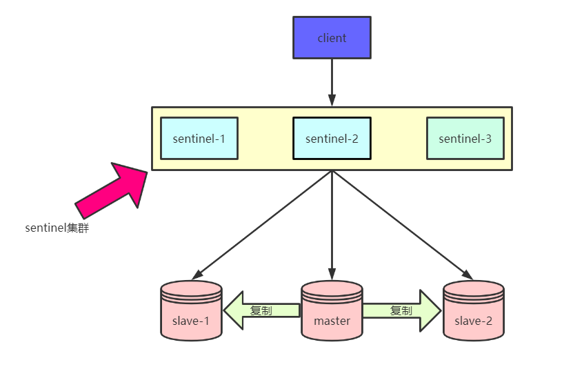

**哨兵的介绍**

sentinel，中文名是哨兵。哨兵是 redis 集群机构中非常重要的一个组件，主要有以下功能：

- 集群监控：负责监控 redis master 和 slave 进程是否正常工作。

- 消息通知：如果某个 redis 实例有故障，那么哨兵负责发送消息作为报警通知给管理员。

- 故障转移：如果 master node 挂掉了，会自动转移到 slave node 上。

- 配置中心：如果故障转移发生了，通知 client 客户端新的 master 地址。

**哨兵用于实现 redis 集群的高可用**，本身也是分布式的，作为一个哨兵集群去运行，互相协同工作。

- 故障转移时，判断一个 master node 是否宕机了，需要大部分的哨兵都同意才行，涉及到了分布式选举的问题。
- 即使部分哨兵节点挂掉了，哨兵集群还是能正常工作的，因为如果一个作为高可用机制重要组成部分的故障转移系统本身是单点的，那就很坑爹了。

**哨兵的核心知识**

- 哨兵至少需要 3 个实例，来保证自己的健壮性。
- 哨兵 + redis 主从的部署架构，是**不保证数据零丢失**的，只能保证 redis 集群的高可用性。
- 对于哨兵 + redis 主从这种复杂的部署架构，尽量在测试环境和生产环境，都进行充足的测试和演练。

**官方Redis Clister集群模式（服务器路由查询）：**

.png)

redis 集群模式的工作原理能说一下么？在集群模式下，redis 的 key 是如何寻址的？分布式寻址都有哪些算法？了解一致性 hash 算法吗？

**简介**

Redis Cluster是一种服务端Sharding技术，3.0版本开始正式提供。Redis Cluster并没有使用一致性hash，而是采用slot(槽)的概念，一共分成16384个槽。将请求发送到任意节点，接收到请求的节点会将查询请求发送到正确的节点上执行

**方案说明**

1. 通过哈希的方式，将数据分片，每个节点均分存储一定哈希槽(哈希值)区间的数据，默认分配了16384 个槽位

2. 每份数据分片会存储在多个互为主从的多节点上

3. 数据写入先写主节点，再同步到从节点(支持配置为阻塞同步)

4. 同一分片多个节点间的数据不保持一致性

5. 读取数据时，当客户端操作的key没有分配在该节点上时，redis会返回转向指令，指向正确的节点

6. 扩容时时需要需要把旧节点的数据迁移一部分到新节点

在 redis cluster 架构下，每个 redis 要放开两个端口号，比如一个是 6379，另外一个就是 加1w 的端口号，比如 16379。

16379 端口号是用来进行节点间通信的，也就是 cluster bus 的东西，cluster bus 的通信，用来进行故障检测、配置更新、故障转移授权。cluster bus 用了另外一种二进制的协议，`gossip`协议，用于节点间进行高效的数据交换，占用更少的网络带宽和处理时间。

**节点间的内部通信机制**

基本通信原理

集群元数据的维护有两种方式：集中式、Gossip 协议。redis cluster 节点间采用 gossip 协议进行通信。

**分布式寻址算法**

- hash 算法（大量缓存重建）
- 一致性 hash 算法（自动缓存迁移）+ 虚拟节点（自动负载均衡）
- redis cluster 的 hash slot 算法

**优点**

- 无中心架构，支持动态扩容，对业务透明

- 具备Sentinel的监控和自动Failover(故障转移)能力

- 客户端不需要连接集群所有节点，连接集群中任何一个可用节点即可

- 高性能，客户端直连redis服务，免去了proxy代理的损耗

**缺点**

- 运维也很复杂，数据迁移需要人工干预

- 只能使用0号数据库

- 不支持批量操作(pipeline管道操作)

- 分布式逻辑和存储模块耦合等

##### 基于客户端分配

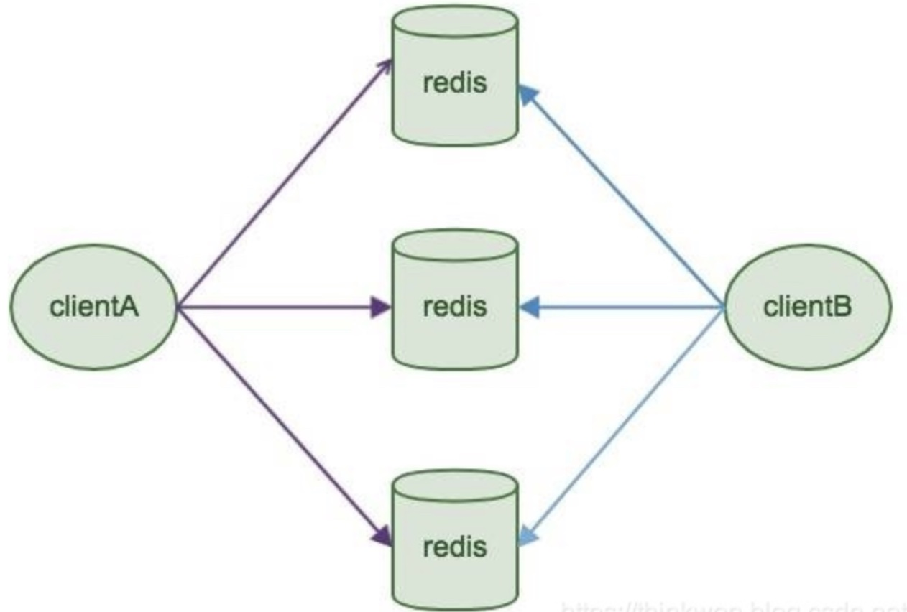

**简介**

Redis Sharding是Redis Cluster出来之前，业界普遍使用的多Redis实例集群方法。其主要思想是采用哈希算法将Redis数据的key进行散列，通过hash函数，特定的key会映射到特定的Redis节点上。Java redis客户端驱动jedis，支持Redis Sharding功能，即ShardedJedis以及结合缓存池的ShardedJedisPool

**优点**

优势在于非常简单，服务端的Redis实例彼此独立，相互无关联，每个Redis实例像单服务器一样运行，非常容易线性扩展，系统的灵活性很强

**缺点**

- 由于sharding处理放到客户端，规模进一步扩大时给运维带来挑战。
- 客户端sharding不支持动态增删节点。服务端Redis实例群拓扑结构有变化时，每个客户端都需要更新调整。连接不能共享，当应用规模增大时，资源浪费制约优化

##### 基于代理服务器分片

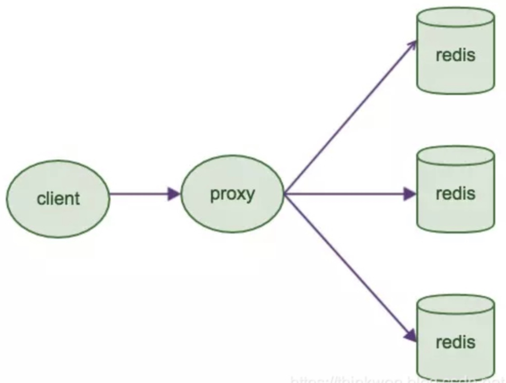

**简介**

客户端发送请求到一个代理组件，代理解析客户端的数据，并将请求转发至正确的节点，最后将结果回复给客户端

**特征**

- 透明接入，业务程序不用关心后端Redis实例，切换成本低
- Proxy 的逻辑和存储的逻辑是隔离的
- 代理层多了一次转发，性能有所损耗

**业界开源方案**

- Twtter开源的Twemproxy
- 豌豆荚开源的Codis

##### Redis 主从架构

单机的 redis，能够承载的 QPS 大概就在上万到几万不等。对于缓存来说，一般都是用来支撑**读高并发**的。因此架构做成主从(master-slave)架构，一主多从，主负责写，并且将数据复制到其它的 slave 节点，从节点负责读。所有的**读请求全部走从节点**。这样也可以很轻松实现水平扩容，**支撑读高并发**。

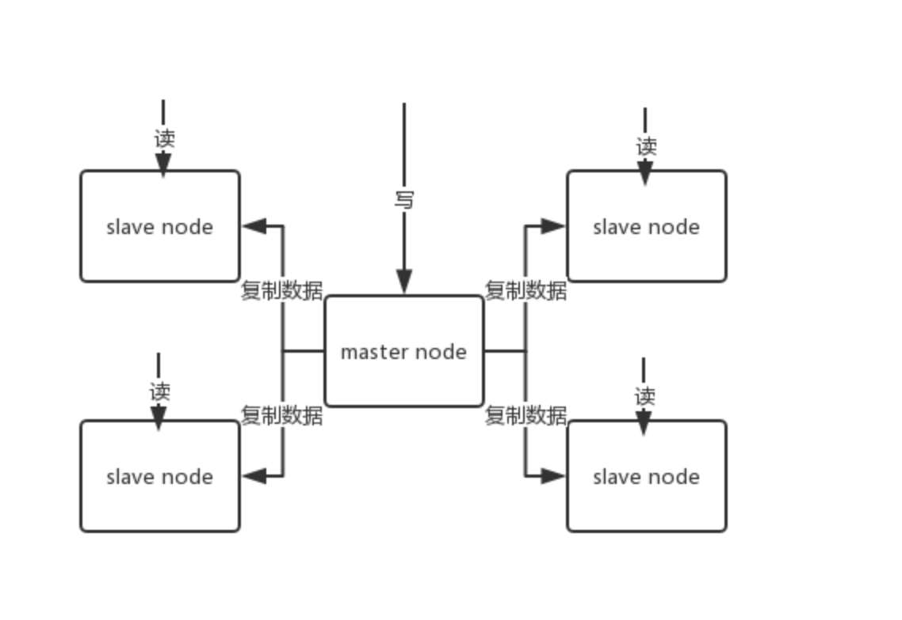

redis replication -> 主从架构 -> 读写分离 -> 水平扩容支撑读高并发

**redis replication 的核心机制**

- redis 采用**异步方式**复制数据到 slave 节点，不过 redis2.8 开始，slave node 会周期性地确认自己每次复制的数据量；

- 一个 master node 是可以配置多个 slave node 的；

- slave node 也可以连接其他的 slave node；

- slave node 做复制的时候，不会 block master node 的正常工作；

- slave node 在做复制的时候，也不会 block 对自己的查询操作，它会用旧的数据集来提供服务；但是复制完成的时候，需要删除旧数据集，加载新数据集，这个时候就会暂停对外服务了；

- slave node 主要用来进行横向扩容，做读写分离，扩容的 slave node 可以提高读的吞吐量。

注意，如果采用了主从架构，那么建议必须**开启** master node 的持久化，不建议用 slave node 作为 master node 的数据热备，因为那样的话，如果你关掉 master 的持久化，可能在 master 宕机重启的时候数据是空的，然后可能一经过复制， slave node 的数据也丢了。

另外，master 的各种备份方案，也需要做。万一本地的所有文件丢失了，从备份中挑选一份 rdb 去恢复 master，这样才能**确保启动的时候，是有数据的**，即使采用了后续讲解的高可用机制，slave node 可以自动接管 master node，但也可能 sentinel 还没检测到 master failure，master node 就自动重启了，还是可能导致上面所有的 slave node 数据被清空。

**redis 主从复制的核心原理**

当启动一个 slave node 的时候，它会发送一个`PSYNC`命令给 master node。

如果这是 slave node 初次连接到 master node，那么会触发一次`full resynchronization`全量复制。此时 master 会启动一个后台线程，开始生成一份`RDB`快照文件，

同时还会将从客户端 client 新收到的所有写命令缓存在内存中。`RDB`文件生成完毕后， master 会将这个`RDB`发送给 slave，slave 会先**写入本地磁盘，然后再从本地磁盘加载到内存**中，

接着 master 会将内存中缓存的写命令发送到 slave，slave 也会同步这些数据。

slave node 如果跟 master node 有网络故障，断开了连接，会自动重连，连接之后 master node 仅会复制给 slave 部分缺少的数据。

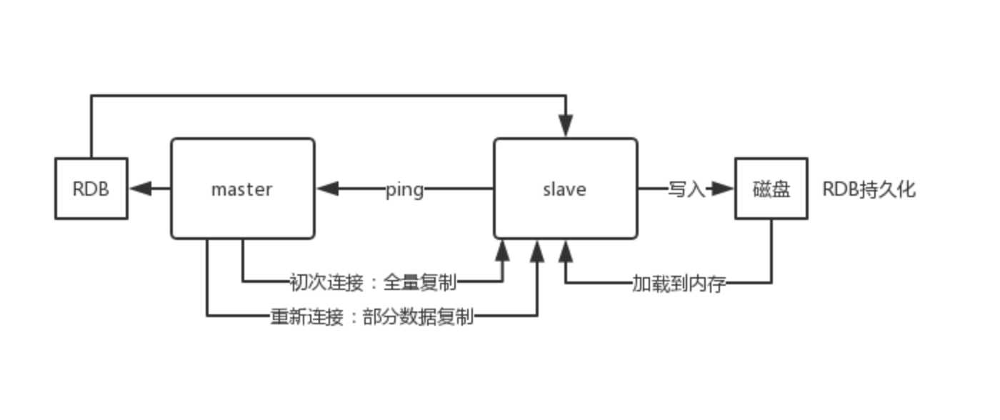

**过程原理**

1. 当从库和主库建立MS关系后，会向主数据库发送SYNC命令

2. 主库接收到SYNC命令后会开始在后台保存快照(RDB持久化过程)，并将期间接收到的写命令缓存起来

3. 当快照完成后，主Redis会将快照文件和所有缓存的写命令发送给从Redis

4. 从Redis接收到后，会载入快照文件并且执行收到的缓存的命令

5. 之后，主Redis每当接收到写命令时就会将命令发送从Redis，从而保证数据的一致

**缺点**

所有的slave节点数据的复制和同步都由master节点来处理，会照成master节点压力太大，使用主从从结构来解决

##### Redis集群的主从复制模型是怎样的？

为了使在部分节点失败或者大部分节点无法通信的情况下集群仍然可用，所以集群使用了主从复制模型，每个节点都会有N-1个复制品

##### 生产环境中的 redis 是怎么部署的？

redis cluster，10 台机器，5 台机器部署了 redis 主实例，另外 5 台机器部署了 redis 的从实例，每个主实例挂了一个从实例，5 个节点对外提供读写服务，每个节点的读写高峰qps可能可以达到每秒 5 万，5 台机器最多是 25 万读写请求/s。

机器是什么配置？32G 内存+ 8 核 CPU + 1T 磁盘，但是分配给 redis 进程的是10g内存，一般线上生产环境，redis 的内存尽量不要超过 10g，超过 10g 可能会有问题。

5 台机器对外提供读写，一共有 50g 内存。

因为每个主实例都挂了一个从实例，所以是高可用的，任何一个主实例宕机，都会自动故障迁移，redis 从实例会自动变成主实例继续提供读写服务。

你往内存里写的是什么数据？每条数据的大小是多少？商品数据，每条数据是 10kb。100 条数据是 1mb，10 万条数据是 1g。常驻内存的是 200 万条商品数据，占用内存是 20g，仅仅不到总内存的 50%。目前高峰期每秒就是 3500 左右的请求量。

其实大型的公司，会有基础架构的 team 负责缓存集群的运维。

##### 说说Redis哈希槽的概念？

Redis集群没有使用一致性hash,而是引入了哈希槽的概念，Redis集群有16384个哈希槽，每个key通过CRC16校验后对16384取模来决定放置哪个槽，集群的每个节点负责一部分hash槽。

##### Redis集群会有写操作丢失吗？为什么？

Redis并不能保证数据的强一致性，这意味这在实际中集群在特定的条件下可能会丢失写操作。

##### Redis集群之间是如何复制的？

异步复制

##### Redis集群最大节点个数是多少？

16384个

##### Redis集群如何选择数据库？

Redis集群目前无法做数据库选择，默认在0数据库。

#### 分区

##### Redis是单线程的，如何提高多核CPU的利用率？

可以在同一个服务器部署多个Redis的实例，并把他们当作不同的服务器来使用，在某些时候，无论如何一个服务器是不够的， 所以，如果你想使用多个CPU，你可以考虑一下分片（shard）。

##### 为什么要做Redis分区？

分区可以让Redis管理更大的内存，Redis将可以使用所有机器的内存。如果没有分区，你最多只能使用一台机器的内存。分区使Redis的计算能力通过简单地增加计算机得到成倍提升，Redis的网络带宽也会随着计算机和网卡的增加而成倍增长。

##### 你知道有哪些Redis分区实现方案？

- 客户端分区就是在客户端就已经决定数据会被存储到哪个redis节点或者从哪个redis节点读取。大多数客户端已经实现了客户端分区。
- 代理分区 意味着客户端将请求发送给代理，然后代理决定去哪个节点写数据或者读数据。代理根据分区规则决定请求哪些Redis实例，然后根据Redis的响应结果返回给客户端。redis和memcached的一种代理实现就是Twemproxy
- 查询路由(Query routing) 的意思是客户端随机地请求任意一个redis实例，然后由Redis将请求转发给正确的Redis节点。Redis Cluster实现了一种混合形式的查询路由，但并不是直接将请求从一个redis节点转发到另一个redis节点，而是在客户端的帮助下直接redirected到正确的redis节点。

##### Redis分区有什么缺点？

- 涉及多个key的操作通常不会被支持。例如你不能对两个集合求交集，因为他们可能被存储到不同的Redis实例（实际上这种情况也有办法，但是不能直接使用交集指令）。

- 同时操作多个key,则不能使用Redis事务.

- 分区使用的粒度是key，不能使用一个非常长的排序key存储一个数据集（The partitioning granularity is the key, so it is not possible to shard a dataset with a single huge key like a very big sorted set）

- 当使用分区的时候，数据处理会非常复杂，例如为了备份你必须从不同的Redis实例和主机同时收集RDB / AOF文件。

- 分区时动态扩容或缩容可能非常复杂。Redis集群在运行时增加或者删除Redis节点，能做到最大程度对用户透明地数据再平衡，但其他一些客户端分区或者代理分区方法则不支持这种特性。然而，有一种预分片的技术也可以较好的解决这个问题。

#### 分布式问题

##### Redis实现分布式锁

Redis为单进程单线程模式，采用队列模式将并发访问变成串行访问，且多客户端对Redis的连接并不存在竞争关系Redis中可以使用SETNX命令实现分布式锁。

当且仅当 key 不存在，将 key 的值设为 value。 若给定的 key 已经存在，则 SETNX 不做任何动作

SETNX 是『SET if Not eXists』(如果不存在，则 SET)的简写。

返回值：设置成功，返回 1 。设置失败，返回 0 。

```java
/**
 * @author wangyanqing
 * @date 2020/9/9
 * @description TODO redis实现的分布式锁
 */
public class LockRedis {
    private JedisPool jedisPool;

    public LockRedis(JedisPool jedisPool) {
        this.jedisPool = jedisPool;
    }

    /**
     * redis 上锁方法
     * @param lockKey 锁的key

     * @param acquireTimeout 在没有上锁之前,获取锁的超时时间

     * @param timeOut 上锁成功后,锁的超时时间

     * @return
     */
    public String lockWithTimeout(String lockKey, Long acquireTimeout, Long timeOut) {
        Jedis jedis = null;
        String retIdentifierValue = null;
        try {
            // 1.建立redis连接
            jedis = jedisPool.getResource();
            // 2.随机生成一个value
            String identifierValue = UUID.randomUUID().toString();
            // 3.定义锁的名称
            String lockName = "redis_lock" + lockKey;
            // 4.定义上锁成功之后,锁的超时时间
            int expireLock = (int) (timeOut / 1000);
            // 5.定义在没有获取锁之前,锁的超时时间
            Long endTime = System.currentTimeMillis() + acquireTimeout;
            while (System.currentTimeMillis() < endTime) {
                // 6.使用setnx方法设置锁值
                if (jedis.setnx(lockName, identifierValue) == 1) {
                    // 7.判断返回结果如果为1,则可以成功获取锁,并且设置锁的超时时间
                    jedis.expire(lockName, expireLock);
                    retIdentifierValue = identifierValue;
                    return retIdentifierValue;
                }
                // 8.否则情况下继续循环等待
            }

        } catch (Exception e) {
            e.printStackTrace();
        } finally {
            if (jedis != null) {
                jedis.close();
            }
        }
        return retIdentifierValue;
    }

    /**
     * 释放锁
     *
     * @return
     */
    public boolean releaseLock(String lockKey, String identifier) {

        Jedis conn = null;
        boolean flag = false;
        try {

            // 1.建立redis连接
            conn = jedisPool.getResource();
            // 2.定义锁的名称
            String lockName = "redis_lock" + lockKey;
            // 3.如果value与redis中一直直接删除，否则等待超时
            if (identifier.equals(conn.get(lockName))) {
                conn.del(lockName);
                System.out.println(identifier + "解锁成功......");
            }
        } catch (Exception e) {
            e.printStackTrace();
        } finally {
            if (conn != null) {
                conn.close();
            }
        }
        return flag;
    }
}
```

使用SETNX完成同步锁的流程及事项如下：

使用SETNX命令获取锁，若返回0（key已存在，锁已存在）则获取失败，反之获取成功

为了防止获取锁后程序出现异常，导致其他线程/进程调用SETNX命令总是返回0而进入死锁状态，需要为该key设置一个“合理”的过期时间

释放锁，使用DEL命令将锁数据删除

##### 如何解决 Redis 的并发竞争 Key 问题

所谓 Redis 的并发竞争 Key 的问题也就是多个系统同时对一个 key 进行操作，但是最后执行的顺序和我们期望的顺序不同，这样也就导致了结果的不同！

推荐一种方案：分布式锁（zookeeper 和 redis 都可以实现分布式锁）。（如果不存在 Redis 的并发竞争 Key 问题，不要使用分布式锁，这样会影响性能）

基于zookeeper临时有序节点可以实现的分布式锁。大致思想为：每个客户端对某个方法加锁时，在zookeeper上的与该方法对应的指定节点的目录下，生成一个唯一的瞬时有序节点。 判断是否获取锁的方式很简单，只需要判断有序节点中序号最小的一个。 当释放锁的时候，只需将这个瞬时节点删除即可。同时，其可以避免服务宕机导致的锁无法释放，而产生的死锁问题。完成业务流程后，删除对应的子节点释放锁。

在实践中，当然是从以可靠性为主。所以首推Zookeeper。

##### 分布式Redis是前期做还是后期规模上来了再做好？为什么？

既然Redis是如此的轻量（单实例只使用1M内存），为防止以后的扩容，最好的办法就是一开始就启动较多实例。即便你只有一台服务器，你也可以一开始就让Redis以分布式的方式运行，使用分区，在同一台服务器上启动多个实例。

一开始就多设置几个Redis实例，例如32或者64个实例，对大多数用户来说这操作起来可能比较麻烦，但是从长久来看做这点牺牲是值得的。

这样的话，当你的数据不断增长，需要更多的Redis服务器时，你需要做的就是仅仅将Redis实例从一台服务迁移到另外一台服务器而已（而不用考虑重新分区的问题）。一旦你添加了另一台服务器，你需要将你一半的Redis实例从第一台机器迁移到第二台机器。

##### 什么是 RedLock

Redis 官方站提出了一种权威的基于 Redis 实现分布式锁的方式名叫 *Redlock*，此种方式比原先的单节点的方法更安全。它可以保证以下特性：

1. 安全特性：互斥访问，即永远只有一个 client 能拿到锁
2. 避免死锁：最终 client 都可能拿到锁，不会出现死锁的情况，即使原本锁住某资源的 client crash 了或者出现了网络分区
3. 容错性：只要大部分 Redis 节点存活就可以正常提供服务

#### 缓存异常

##### 缓存雪崩

**缓存雪崩**是指缓存同一时间大面积的失效，所以，后面的请求都会落到数据库上，造成数据库短时间内承受大量请求而崩掉。

**解决方案**

1. 缓存数据的过期时间设置随机，防止同一时间大量数据过期现象发生。
2. 一般并发量不是特别多的时候，使用最多的解决方案是加锁排队。
3. 给每一个缓存数据增加相应的缓存标记，记录缓存的是否失效，如果缓存标记失效，则更新数据缓存。

##### 缓存穿透

**缓存穿透**是指缓存和数据库中都没有的数据，导致所有的请求都落到数据库上，造成数据库短时间内承受大量请求而崩掉。

**解决方案**

1. 接口层增加校验，如用户鉴权校验，id做基础校验，id<=0的直接拦截；
2. 从缓存取不到的数据，在数据库中也没有取到，这时也可以将key-value对写为key-null，缓存有效时间可以设置短点，如30秒（设置太长会导致正常情况也没法使用）。这样可以防止攻击用户反复用同一个id暴力攻击
3. 采用布隆过滤器，将所有可能存在的数据哈希到一个足够大的 bitmap 中，一个一定不存在的数据会被这个 bitmap 拦截掉，从而避免了对底层存储系统的查询压力

**附加**

对于空间的利用到达了一种极致，那就是Bitmap和布隆过滤器(Bloom Filter)。

Bitmap： 典型的就是哈希表

缺点是，Bitmap对于每个元素只能记录1bit信息，如果还想完成额外的功能，恐怕只能靠牺牲更多的空间、时间来完成了。

布隆过滤器（推荐）

就是引入了k(k>1)k(k>1)个相互独立的哈希函数，保证在给定的空间、误判率下，完成元素判重的过程。

它的优点是空间效率和查询时间都远远超过一般的算法，缺点是有一定的误识别率和删除困难。

Bloom-Filter算法的核心思想就是利用多个不同的Hash函数来解决“冲突”。

Hash存在一个冲突（碰撞）的问题，用同一个Hash得到的两个URL的值有可能相同。为了减少冲突，我们可以多引入几个Hash，如果通过其中的一个Hash值我们得出某元素不在集合中，那么该元素肯定不在集合中。只有在所有的Hash函数告诉我们该元素在集合中时，才能确定该元素存在于集合中。这便是Bloom-Filter的基本思想。

Bloom-Filter一般用于在大数据量的集合中判定某元素是否存在。

##### 缓存击穿

**缓存击穿**是指缓存中没有但数据库中有的数据（一般是缓存时间到期），这时由于并发用户特别多，同时读缓存没读到数据，又同时去数据库去取数据，引起数据库压力瞬间增大，造成过大压力。和缓存雪崩不同的是，缓存击穿指并发查同一条数据，缓存雪崩是不同数据都过期了，很多数据都查不到从而查数据库。

**解决方案**

1. 设置热点数据永远不过期。
2. 加互斥锁，互斥锁

##### 缓存预热

**缓存预热**就是系统上线后，将相关的缓存数据直接加载到缓存系统。这样就可以避免在用户请求的时候，先查询数据库，然后再将数据缓存的问题！用户直接查询事先被预热的缓存数据！

**解决方案**

1. 直接写个缓存刷新页面，上线时手工操作一下；
2. 数据量不大，可以在项目启动的时候自动进行加载；
3. 定时刷新缓存；

##### 缓存降级

当访问量剧增、服务出现问题（如响应时间慢或不响应）或非核心服务影响到核心流程的性能时，仍然需要保证服务还是可用的，即使是有损服务。系统可以根据一些关键数据进行自动降级，也可以配置开关实现人工降级。

**缓存降级**的最终目的是保证核心服务可用，即使是有损的。而且有些服务是无法降级的（如加入购物车、结算）。

在进行降级之前要对系统进行梳理，看看系统是不是可以丢卒保帅；从而梳理出哪些必须誓死保护，哪些可降级；比如可以参考日志级别设置预案：

1. 一般：比如有些服务偶尔因为网络抖动或者服务正在上线而超时，可以自动降级；

2. 警告：有些服务在一段时间内成功率有波动（如在95~100%之间），可以自动降级或人工降级，并发送告警；

3. 错误：比如可用率低于90%，或者数据库连接池被打爆了，或者访问量突然猛增到系统能承受的最大阀值，此时可以根据情况自动降级或者人工降级；

4. 严重错误：比如因为特殊原因数据错误了，此时需要紧急人工降级。

服务降级的目的，是为了防止Redis服务故障，导致数据库跟着一起发生雪崩问题。因此，对于不重要的缓存数据，可以采取服务降级策略，例如一个比较常见的做法就是，Redis出现问题，不去数据库查询，而是直接返回默认值给用户。

##### 热点数据和冷数据

热点数据，缓存才有价值

对于冷数据而言，大部分数据可能还没有再次访问到就已经被挤出内存，不仅占用内存，而且价值不大。频繁修改的数据，看情况考虑使用缓存

对于热点数据，比如我们的某IM产品，生日祝福模块，当天的寿星列表，缓存以后可能读取数十万次。再举个例子，某导航产品，我们将导航信息，缓存以后可能读取数百万次。

数据更新前至少读取两次，缓存才有意义。这个是最基本的策略，如果缓存还没有起作用就失效了，那就没有太大价值了。

那存不存在，修改频率很高，但是又不得不考虑缓存的场景呢？有！比如，这个读取接口对数据库的压力很大，但是又是热点数据，这个时候就需要考虑通过缓存手段，减少数据库的压力，比如我们的某助手产品的，点赞数，收藏数，分享数等是非常典型的热点数据，但是又不断变化，此时就需要将数据同步保存到Redis缓存，减少数据库压力。

##### 缓存热点key

缓存中的一个Key(比如一个促销商品)，在某个时间点过期的时候，恰好在这个时间点对这个Key有大量的并发请求过来，这些请求发现缓存过期一般都会从后端DB加载数据并回设到缓存，这个时候大并发的请求可能会瞬间把后端DB压垮。

**解决方案**

对缓存查询加锁，如果KEY不存在，就加锁，然后查DB入缓存，然后解锁；其他进程如果发现有锁就等待，然后等解锁后返回数据或者进入DB查询

#### 常用工具

##### Redis支持的Java客户端都有哪些？官方推荐用哪个？

Redisson、Jedis、lettuce等等，官方推荐使用Redisson。

##### Redis和Redisson有什么关系？

Redisson是一个高级的分布式协调Redis客服端，能帮助用户在分布式环境中轻松实现一些Java的对象 (Bloom filter, BitSet, Set, SetMultimap, ScoredSortedSet, SortedSet, Map, ConcurrentMap, List, ListMultimap, Queue, BlockingQueue, Deque, BlockingDeque, Semaphore, Lock, ReadWriteLock, AtomicLong, CountDownLatch, Publish / Subscribe, HyperLogLog)。

##### Jedis与Redisson对比有什么优缺点？

Jedis是Redis的Java实现的客户端，其API提供了比较全面的Redis命令的支持；Redisson实现了分布式和可扩展的Java数据结构，和Jedis相比，功能较为简单，不支持字符串操作，不支持排序、事务、管道、分区等Redis特性。Redisson的宗旨是促进使用者对Redis的关注分离，从而让使用者能够将精力更集中地放在处理业务逻辑上。

##### Redis LRU淘汰策略

常用 LRU:淘汰最近最久未使用的。

- noeviction: 不删除策略, 达到最大内存限制时, 如果需要更多内存, 直接返回错误信息。 大多数写命令都会导致占用更多的内存(有极少数会例外, 如 DEL )。
- allkeys-lru: 所有key通用; 优先删除最近最少使用(less recently used ,LRU) 的 key。
- volatile-lru: 只限于设置了 expire 的部分; 优先删除最近最少使用(less recently used ,LRU) 的 key。
- allkeys-random: 所有key通用; 随机删除一部分 key。
- volatile-random: 只限于设置了 expire 的部分; 随机删除一部分 key。
- volatile-ttl: 只限于设置了 expire 的部分; 优先删除剩余时间(time to live,TTL) 短的key。

j**ava可以用hashMap和双链表来实现LRU算法**，hashmap的key-value，通过key把value存储在LRU链表的槽中

1. save(key)，首先通过 hash 算法，在key space 找到 key，并且尝试把数据存储到LRU空间，如果LRU空间足够，则不需要淘汰旧的内容；如果缓存空间不足，会淘汰掉 tail 指向的内容，并更新队头，存储后返回使用槽下标，更新key space 的value。
2. get(key)，通过 hash 找到 key，然后通过 value 找到 LRU空间对应的槽，更新LRU指向关系。 **Redis 的LRU实现**

如果按照HashMap和双向链表实现，需要额外的存储存放 next 和 prev 指针，牺牲比较大的存储空间，显然是不划算的。所以Redis采用了一个近似的做法，就是随机取出若干个key，然后按照访问时间排序后，淘汰掉最不经常使用的。

#### SpringBoot集成redis：

SpringBoot底层集成redis使用的是**SpringData redis**，SpringData redis底层使用的是**Lettuce**，而不是Jedis

**Lettuce和Jedis的区别：**

Lettuce和Jedis都是redis的**client**，都可以用来连接Redis Server

Jedis在实现上是直接连接的Redis Server，如果在多线程环境下是**非线程安全**的。每个线程都去拿自己的Jedis实例，当连接数量增多时，资源消耗梯式增大，连接成本高。

Lettuce的连接是**基于Netty**的，Netty是一个多线程、时间驱动I/O的框架，连接实例可以在多个线程间共享，当多线程使用同一连接实例时，是**线程安全**的。所以一个多线程应用可以使用同一个连接实例，而不用担心并发线程的数量。如果一个连接实例不够，还可以按情况增加连接实例的数量。

通过异步的方式，可以让我们充分的利用系统资源，而不用浪费线程等待网络或者I/O。所以SpringData底层集成的是Lettuce。


#### 相关面试题

##### 1. Redis有哪些优缺点

优点

- 读写性能优异， Redis能读的速度是110000次/s，写的速度是81000次/s。

- 支持数据持久化，支持AOF和RDB两种持久化方式。

- 支持事务，Redis的所有操作都是原子性的，同时Redis还支持对几个操作合并后的原子性执行。

- 数据结构丰富，除了支持string类型的value外还支持hash、set、zset、list等数据结构。

- 支持主从复制，主机会自动将数据同步到从机，可以进行读写分离。

缺点

- 数据库容量受到物理内存的限制，不能用作海量数据的高性能读写，因此Redis适合的场景主要局限在较小数据量的高性能操作和运算上。

- Redis 不具备自动容错和恢复功能，主机从机的宕机都会导致前端部分读写请求失败，需要等待机器重启或者手动切换前端的IP才能恢复。

- 主机宕机，宕机前有部分数据未能及时同步到从机，切换IP后还会引入数据不一致的问题，降低了系统的可用性。

- Redis 较难支持在线扩容，在集群容量达到上限时在线扩容会变得很复杂。为避免这一问题，运维人员在系统上线时必须确保有足够的空间，这对资源造成了很大的浪费。

##### 2. 如何选择合适的持久化方式

- 一般来说， 如果想达到足以媲美PostgreSQL的数据安全性，你应该同时使用两种持久化功能。在这种情况下，当 Redis 重启的时候会优先载入AOF文件来恢复原始的数据，因为在通常情况下AOF文件保存的数据集要比RDB文件保存的数据集要完整。

- 如果你非常关心你的数据， 但仍然可以承受数分钟以内的数据丢失，那么你可以只使用RDB持久化。

- 有很多用户都只使用AOF持久化，但并不推荐这种方式，因为定时生成RDB快照（snapshot）非常便于进行数据库备份， 并且 RDB 恢复数据集的速度也要比AOF恢复的速度要快，除此之外，使用RDB还可以避免AOF程序的bug。

- 如果你只希望你的数据在服务器运行的时候存在，你也可以不使用任何持久化方式。

##### 3. Redis持久化数据和缓存怎么做扩容？

- 如果Redis被当做缓存使用，使用一致性哈希实现动态扩容缩容。
- 如果Redis被当做一个持久化存储使用，必须使用固定的keys-to-nodes映射关系，节点的数量一旦确定不能变化。否则的话(即Redis节点需要动态变化的情况），必须使用可以在运行时进行数据再平衡的一套系统，而当前只有Redis集群可以做到这样。

1. 缓存穿透：缓存中没有该数据，每次查询都会穿过缓存直接查DB，影响DB性能；解决办法：DB返回空也进行缓存，设置较短的失效时间，这样可以减少对DB的访问，利用布隆过滤器，见可能失效数据存到一个大的bitmap里，每次查询把无用数据过滤掉。
2. 缓存击穿：当缓存中某个key值刚好失效的同时，大量请求进来访问该key，这些请求会直接到DB，导致DB崩溃；解决办法：使用互斥锁或设置key永远不过期（异步查数据库更新）
3. 缓存雪崩：多个key在同一时间过期，导致大量访问直接到DB，DB负载过大；解决方法：是指不同的失效时间，或设置相同失效时间后面跟一个随机值（1-5分钟），把失效时间分散开
4. 缓存击穿是一个key失效后大量访问请求该key；缓存雪崩是多个key在同一时间失效，大量访问请求不同key都请求到DB。

##### 4. 为什么要用 Redis /为什么要用缓存

主要从“高性能”和“高并发”这两点来看待这个问题。

**高性能：**

假如用户第一次访问数据库中的某些数据。这个过程会比较慢，因为是从硬盘上读取的。将该用户访问的数据存在数缓存中，这样下一次再访问这些数据的时候就可以直接从缓存中获取了。操作缓存就是直接操作内存，所以速度相当快。如果数据库中的对应数据改变的之后，同步改变缓存中相应的数据即可！

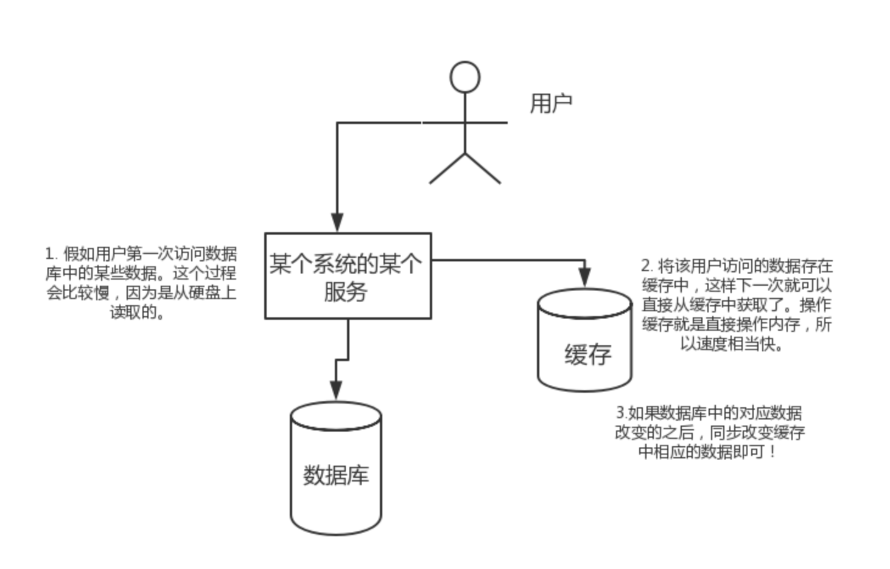

**高并发：**

直接操作缓存能够承受的请求是远远大于直接访问数据库的，所以我们可以考虑把数据库中的部分数据转移到缓存中去，这样用户的一部分请求会直接到缓存这里而不用经过数据库。

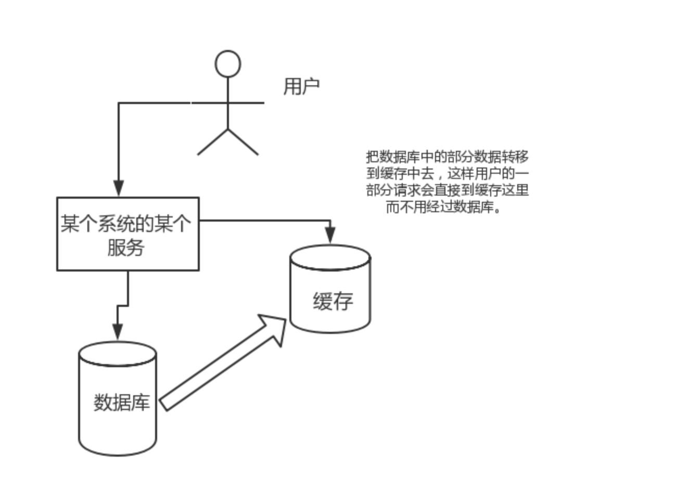

##### 5. 为什么要用 Redis 而不用 map/guava 做缓存?

缓存分为本地缓存和分布式缓存。以 Java 为例，使用自带的 map 或者 guava 实现的是本地缓存，最主要的特点是轻量以及快速，生命周期随着 jvm 的销毁而结束，并且在多实例的情况下，每个实例都需要各自保存一份缓存，缓存不具有一致性。

使用 redis 或 memcached 之类的称为分布式缓存，在多实例的情况下，各实例共用一份缓存数据，缓存具有一致性。缺点是需要保持 redis 或 memcached服务的高可用，整个程序架构上较为复杂。

##### 6. Redis为什么这么快

1. 完全基于内存，绝大部分请求是纯粹的内存操作，非常快速。数据存在内存中，类似于 HashMap，HashMap 的优势就是查找和操作的时间复杂度都是O(1)；

2. 数据结构简单，对数据操作也简单，Redis 中的数据结构是专门进行设计的；

3. 采用单线程，避免了不必要的上下文切换和竞争条件，也不存在多进程或者多线程导致的切换而消耗 CPU，不用去考虑各种锁的问题，不存在加锁释放锁操作，没有因为可能出现死锁而导致的性能消耗；

4. 使用多路 I/O 复用模型，非阻塞 IO；

5. 使用底层模型不同，它们之间底层实现方式以及与客户端之间通信的应用协议不一样，Redis 直接自己构建了 VM 机制 ，因为一般的系统调用系统函数的话，会浪费一定的时间去移动和请求；

##### Redis的应用场景

**总结一**

* 计数器

可以对 String 进行自增自减运算，从而实现计数器功能。Redis 这种内存型数据库的读写性能非常高，很适合存储频繁读写的计数量。

* 缓存

将热点数据放到内存中，设置内存的最大使用量以及淘汰策略来保证缓存的命中率。

* 会话缓存

可以使用 Redis 来统一存储多台应用服务器的会话信息。当应用服务器不再存储用户的会话信息，也就不再具有状态，一个用户可以请求任意一个应用服务器，从而更容易实现高可用性以及可伸缩性。

* 全页缓存（FPC）

除基本的会话token之外，Redis还提供很简便的FPC平台。以Magento为例，Magento提供一个插件来使用Redis作为全页缓存后端。此外，对WordPress的用户来说，Pantheon有一个非常好的插件 wp-redis，这个插件能帮助你以最快速度加载你曾浏览过的页面。

* 查找表

例如 DNS 记录就很适合使用 Redis 进行存储。查找表和缓存类似，也是利用了 Redis 快速的查找特性。但是查找表的内容不能失效，而缓存的内容可以失效，因为缓存不作为可靠的数据来源。

* 消息队列(发布/订阅功能)

List 是一个双向链表，可以通过 lpush 和 rpop 写入和读取消息。不过最好使用 Kafka、RabbitMQ 等消息中间件。

* 分布式锁实现

在分布式场景下，无法使用单机环境下的锁来对多个节点上的进程进行同步。可以使用 Redis 自带的 SETNX 命令实现分布式锁，除此之外，还可以使用官方提供的 RedLock 分布式锁实现。

* 其它

Set 可以实现交集、并集等操作，从而实现共同好友等功能。ZSet 可以实现有序性操作，从而实现排行榜等功能。

**总结二**

Redis相比其他缓存，有一个非常大的优势，就是支持多种数据类型。

数据类型说明string字符串，最简单的k-v存储hashhash格式，value为field和value，适合ID-Detail这样的场景。list简单的list，顺序列表，支持首位或者末尾插入数据set无序list，查找速度快，适合交集、并集、差集处理sorted set有序的set

其实，通过上面的数据类型的特性，基本就能想到合适的应用场景了。

string——适合最简单的k-v存储，类似于memcached的存储结构，短信验证码，配置信息等，就用这种类型来存储。

hash——一般key为ID或者唯一标示，value对应的就是详情了。如商品详情，个人信息详情，新闻详情等。

list——因为list是有序的，比较适合存储一些有序且数据相对固定的数据。如省市区表、字典表等。因为list是有序的，适合根据写入的时间来排序，如：最新的***，消息队列等。

set——可以简单的理解为ID-List的模式，如微博中一个人有哪些好友，set最牛的地方在于，可以对两个set提供交集、并集、差集操作。例如：查找两个人共同的好友等。

Sorted Set——是set的增强版本，增加了一个score参数，自动会根据score的值进行排序。比较适合类似于top 10等不根据插入的时间来排序的数据。

如上所述，虽然Redis不像关系数据库那么复杂的数据结构，但是，也能适合很多场景，比一般的缓存数据结构要多。了解每种数据结构适合的业务场景，不仅有利于提升开发效率，也能有效利用Redis的性能。

##### 7. Redis与Memcached的区别

两者都是非关系型内存键值数据库，现在公司一般都是用 Redis 来实现缓存，而且 Redis 自身也越来越强大了！Redis 与 Memcached 主要有以下不同：

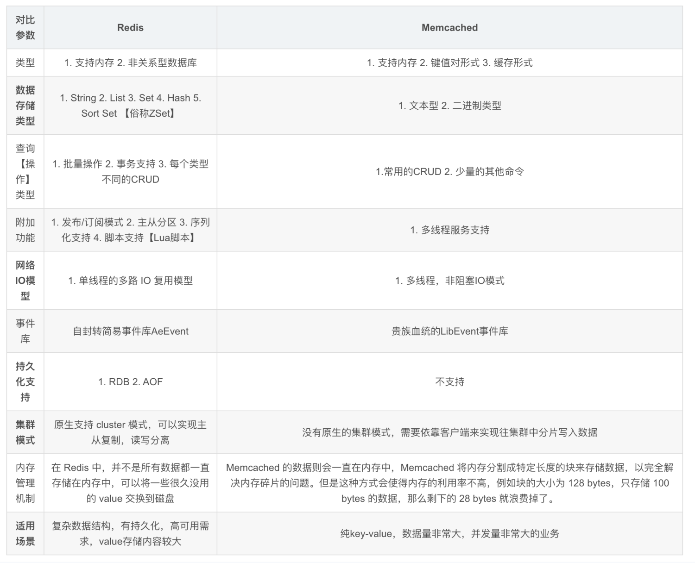

(1) memcached所有的值均是简单的字符串，redis作为其替代者，支持更为丰富的数据类型

(2) redis的速度比memcached快很多

(1) memcached所有的值均是简单的字符串，redis作为其替代者，支持更为丰富的数据类型

(2) redis的速度比memcached快很多

(3) redis可以持久化其数据

##### 8. 如何保证缓存与数据库双写时的数据一致性？

你只要用缓存，就可能会涉及到缓存与数据库双存储双写，你只要是双写，就一定会有数据一致性的问题，那么你如何解决一致性问题？

一般来说，就是如果你的系统不是严格要求缓存+数据库必须一致性的话，缓存可以稍微的跟数据库偶尔有不一致的情况，最好不要做这个方案，读请求和写请求串行化，串到一个内存队列里去，这样就可以保证一定不会出现不一致的情况

串行化之后，就会导致系统的吞吐量会大幅度的降低，用比正常情况下多几倍的机器去支撑线上的一个请求。

还有一种方式就是可能会暂时产生不一致的情况，但是发生的几率特别小，就是**先更新数据库，然后再删除缓存。**

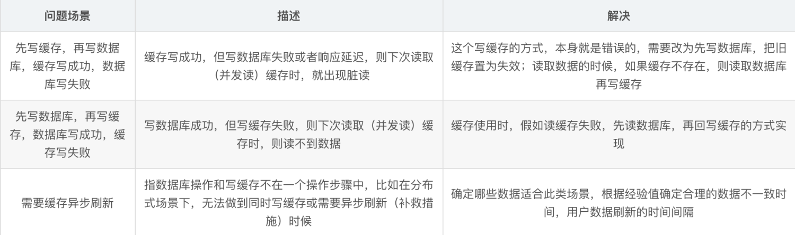

##### 9. Redis常见性能问题和解决方案？

1. Master最好不要做任何持久化工作，包括内存快照和AOF日志文件，特别是不要启用内存快照做持久化。

2. 如果数据比较关键，某个Slave开启AOF备份数据，策略为每秒同步一次。

3. 为了主从复制的速度和连接的稳定性，Slave和Master最好在同一个局域网内。

4. 尽量避免在压力较大的主库上增加从库

5. Master调用BGREWRITEAOF重写AOF文件，AOF在重写的时候会占大量的CPU和内存资源，导致服务load过高，出现短暂服务暂停现象。

6. 为了Master的稳定性，主从复制不要用图状结构，用单向链表结构更稳定，即主从关系为：Master<–Slave1<–Slave2<–Slave3…，这样的结构也方便解决单点故障问题，实现Slave对Master的替换，也即，如果Master挂了，可以立马启用Slave1做Master，其他不变。

##### 10. Redis官方为什么不提供Windows版本？

因为目前Linux版本已经相当稳定，而且用户量很大，无需开发windows版本，反而会带来兼容性等问题。

##### 11. 一个字符串类型的值能存储最大容量是多少？

512M

##### 12. Redis如何做大量数据插入？

Redis2.6开始redis-cli支持一种新的被称之为pipe mode的新模式用于执行大量数据插入工作。

##### 13. 假如Redis里面有1亿个key，其中有10w个key是以某个固定的已知的前缀开头的，如果将它们全部找出来？

使用keys指令可以扫出指定模式的key列表。

对方接着追问：如果这个redis正在给线上的业务提供服务，那使用keys指令会有什么问题？

这个时候你要回答redis关键的一个特性：redis的单线程的。keys指令会导致线程阻塞一段时间，线上服务会停顿，直到指令执行完毕，服务才能恢复。这个时候可以使用scan指令，scan指令可以无阻塞的提取出指定模式的key列表，但是会有一定的重复概率，在客户端做一次去重就可以了，但是整体所花费的时间会比直接用keys指令长。

##### 14. 使用Redis做过异步队列吗，是如何实现的

使用list类型保存数据信息，rpush生产消息，lpop消费消息，当lpop没有消息时，可以sleep一段时间，然后再检查有没有信息，如果不想sleep的话，可以使用blpop, 在没有信息的时候，会一直阻塞，直到信息的到来。redis可以通过pub/sub主题订阅模式实现一个生产者，多个消费者，当然也存在一定的缺点，当消费者下线时，生产的消息会丢失。

##### 15. Redis如何实现延时队列

使用sortedset，使用时间戳做score, 消息内容作为key,调用zadd来生产消息，消费者使用zrangbyscore获取n秒之前的数据做轮询处理。

##### 16. Redis回收进程如何工作的？

1. 一个客户端运行了新的命令，添加了新的数据。

2. Redis检查内存使用情况，如果大于maxmemory的限制， 则根据设定好的策略进行回收。

3. 一个新的命令被执行，等等。

4. 所以我们不断地穿越内存限制的边界，通过不断达到边界然后不断地回收回到边界以下。

如果一个命令的结果导致大量内存被使用（例如很大的集合的交集保存到一个新的键），不用多久内存限制就会被这个内存使用量超越。


## elasticsearch

>Elasticsearch 是一个分布式、高扩展、高实时的搜索与[数据分析](https://baike.baidu.com/item/数据分析/6577123)引擎。它能很方便的使大量数据具有搜索、分析和探索的能力。充分利用Elasticsearch的水平伸缩性，能使数据在生产环境变得更有价值。
>
>Elasticsearch是与名为Logstash的数据收集和日志解析引擎以及名为Kibana的分析和可视化平台一起开发的。这三个产品被设计成一个集成解决方案，称为“Elastic Stack”（以前称为“ELK stack”）。

#### Docker安装启动es

```shell
# 创建网络
docker network create es-net
# 拉取镜像 
docker pull elasticsearch
# 启动
docker run -d \  # 后台运行
  --name es \  # 服务名
  -e "ES_JAVA_OPTS=-Xms512m -Xmx512m" \  #环境变量，配置jvm堆内存大小，默认为1G
  -e "discovery.type=single-node" \   # 单点启动，不使用集群
  -v es-data:/usr/share/elasticsearch/data\  #数据卷挂载目录
  -v es-plugins:/usr/share/elasticsearch/plugins \ # 数据卷挂载插件
  --privileged \  # 
  --network es-net \ #加入网络
  -p 9200:9200 \  #暴露端口 9200 http协议端口
  -p 9300:9300 \   # 
  elasticsearch
# -----------------
  docker run -d --name es -e "ES_JAVA_OPTS=-Xms512m -Xmx512m" -e "discovery.type=single-node"   -v es-data:/usr/share/elasticsearch/data   -v es-plugins:/usr/share/elasticsearch/plugins   --privileged --network  es-net   -p 9200:9200   -p 9300:9300   elasticsearch

```

#### 安装kibana


#### 安装ik分词器


---

---

## 设计模式

>设计模式六大原则：
>
>1. 开闭原则（Open Closed Principle，OCP）对扩展开放，对修改关闭
>2. 单一职责原则（Single Responsibility Principle, SRP）一个类只负责一个功能领域中的相应职责
>3. 里氏代换原则（Liskov Substitution Principle，LSP）所有引用基类的地方必须能透明地使用其子类的对象
>4. 依赖倒转原则（Dependency Inversion Principle，DIP）依赖于抽象，不能依赖于具体实现
>5. 接口隔离原则（Interface Segregation Principle，ISP）类之间的依赖关系应该建立在最小的接口上
>6. 合成/聚合复用原则（Composite/Aggregate Reuse Principle，CARP）尽量使用合成/聚合，而不是通过继承达到复用的目的
>7. 最少知识原则（Least Knowledge Principle，LKP）或者迪米特法则（Law of  Demeter，LOD）一个软件实体应当尽可能少的与其他实体发生相互作用

#### 适配器模式


#### 门面模式

要求一个子系统的外部与其内部的通信必须通过一个统一的对象进行。门面模式提供一个高层次的接口，使得子系统更易于使用。

优点：高内聚，松耦合。安全，不通过门面上提供的方法，休想访问模块内部。

门面模式是个很好的模式，很符合面向接口编程，遵守了依赖倒置原则、迪米特法则等，当然，有些书说违背了开-闭原则，我个人认为，门面模式并不妨碍拓展，只要把基类抽取好，新功能只需要继承或依赖与基类即可。


---

---

## Java

#### String

jdk1.8及以前版本底层是char数组，9以后改为byte数组，目的是节省内存，由2个字节变为1个字节。但涉及汉子和一些1个字节无法存储的字符还是会选用UTF-16用2个字节，由一个布尔变量coder控制。

char[] 或 byte[] 由final修饰，为不可变，线程安全。

#### 集合

##### HashMap

* HashMap的数据结构

  jdk1.7  数组+链表

  jdk1.8  数组+链表/红黑树

* 什么时候链表转为红黑树？

  链表转换为红黑树的最终目的，是为了解决在map中元素过多，hash冲突较大，而导致的读写效率降低的问题。

  可以看到在treeifyBin中并不是简单地将链表转换为红黑树，而是先判断table的长度是否大于等于64，如果小于64，就通过扩容的方式来解决，避免红黑树结构化

  ```java
  final void treeifyBin(Node<K,V>[] tab, int hash) {
          int n, index; Node<K,V> e;
          //首先tab的长度是否小于64,
          if (tab == null || (n = tab.length) < MIN_TREEIFY_CAPACITY)
          //小于64则进行扩容
              resize();
          else if ((e = tab[index = (n - 1) & hash]) != null) {
              //否则才将列表转换为红黑树
              TreeNode<K,V> hd = null, tl = null;
              do {
                  TreeNode<K,V> p = replacementTreeNode(e, null);
                  if (tl == null)
                      hd = p;
                  else {
                      p.prev = tl;
                      tl.next = p;
                  }
                  tl = p;
              } while ((e = e.next) != null);
              if ((tab[index] = hd) != null)
                  hd.treeify(tab);
          }
      }
  ```

* jdk1.8头插法改尾插法

  解决了环形链表的问题，但是还是会存在并发下元素丢失的问题。

#### 多线程

##### 线程的状态

* NEW-新建的线程，尚未执行

* RUNNABLE-运行中的线程。正在执行run()方法的java代码

* BLOCKED-运行中的线程，因为某种操作被阻塞而被挂起

* WAITING-运行中的线程，因为某种操作在等待中

* TIMED_WAITING-运行中的线程，因为执行sleep()方法正在即时等待

* TERMINAL-线程已终止，run()方法执行完毕

##### 线程终止的原因有

* 正常终止：run()方法执行到return语句返回

* 意外终止：run()方法中捕获到异常

* 强制终止：调用stop()方法终止线程，不推荐

##### 中断线程

* 调用.interrupt()方法中断线程

* 设置标志位，通过改变标志结束线程。public volatile boolean running = true;

##### 守护线程

守护线程是指为其他线程服务的线程。在JVM中，所有非守护线程都执行完毕后，无论有没有守护线程，虚拟机都会自动退出。因此，JVM退出时，不必关心守护线程是否已结束。如何创建守护线程呢？方法和普通线程一样，只是在调用`start()`方法前，调用`setDaemon(true)`把该线程标记为守护线程。在守护线程中，编写代码要注意：守护线程不能持有任何需要关闭的资源，例如打开文件等，因为虚拟机退出时，守护线程没有任何机会来关闭文件，这会导致数据丢失。


---

---

## Other

### Linux

##### 系统相关

```shell
ps -ef | grep xxx   # 查看进程
ps -aux | grep xxx  # -aux显示所有装填
kill -9 xxx  # 强制终止进程

top # 显示系统中各个进程的资源占用状况，可以看是否有 CPU 占用过大的进程

find ~ -name "需要查找的文件名" # 查找文件
```

##### 查看日志

```shell
less xxx # 只读查看，功能强大，防止误编辑
more xxx # 只能往下查看，不能放回之前察看的内容
cat xxx  # 查看整个文件，不友好的显示方式
vim xxx  # 与less功能操作基本一致，就是可以边查看边编辑文件
tail -f xxx.log #循环读取xxx.log文件，动态查看日志，生产不常用，生产一般动态查看异常
```

##### Linux写自定义脚本命令启动nacos

/usr/bin目录下新建nacos-start

```shell
1. 新建文件 sudo vim nacos-start
2. 编辑文件输入脚本内容，如下
#!/bin/bash
sudo /bin/bash /usr/local/nacos/bin/shutdown.sh
sudo /bin/bash /usr/local/nacos/bin/startup.sh -m standalone
3. 保存退出修改权限
chmod 775 nacos-start
```

##### 工作中的环境问题

DEV Development 研发环境
SIT System Integrate Test 系统集成测试环境（内测）
UAT User Acceptance Test 用户验收测试环境
PET Performance Evaluation Test 性能评估测试环境（压测）
SIM Simulation 高仿真环境
PRD/PROD Production 正式/生产环境

小米：dev->staging->prod


### Git

##### git commit -a 和 git commit -m 区别

git commit -a 是对已经跟踪，是对已经跟踪的文件变更修改进行提交；新增的文件没有执行过git add，直接执行git commit -a是不会提交到仓库的。

git commit -m 是对git add过得文件进行提交，修改文件后没执行git add直接执行git commit -m是不会提交任何内容的。

##### git revert和git reset

git revert -n [commit-id] 撤销commit-id那次的提交

git reset HEAD^是回滚到上一个版本

git reset [commit-id]是回滚到commit-id那次的提交，之后的提交都被移除

### Tomcat

##### 修改tomcat缺省端口：修改Controller标签下的port

```xml
<Connector port="8080" protocol="HTTP/1.1"
               connectionTimeout="20000"
               redirectPort="8443" />
```

##### tomcat的目录结构

- /bin：存放用于启动和暂停Tomcat的脚本
- /conf：存放Tomcat的配置文件
- /lib：存放Tomcat服务器需要的各种jar包
- /logs：存放Tomcat的日志文件
- /temp：Tomcat运行时用于存放临时文件
- /webapps：web应用的发布目录
- /work：Tomcat把有jsp生成Servlet防御此目录下

##### tomcat优化：

1. 改Tomcat最大线程连接数：需要修改conf/server.xml文件，修改里面的配置文件：maxThreads=”150”//Tomcat使用线程来处理接收的每个请求。这个值表示Tomcat可创建的最大的线程数。默认值200。可以根据机器的时期性能和内存大小调整，一般可以在400-500。最大可以在800左右。

##### tomcat 有哪几种Connector 运行模式(优化)

1. **BIO：同步并阻塞** 一个线程处理一个请求。缺点：并发量高时，线程数较多，浪费资源。Tomcat7或以下，在Linux系统中默认使用这种方式。 **配制项**：protocol=”HTTP/1.1”

2. **NIO：同步非阻塞IO** 利用Java的异步IO处理，可以通过少量的线程处理大量的请求，可以复用同一个线程处理多个connection(多路复用)。Tomcat8在Linux系统中默认使用这种方式。Tomcat7必须修改Connector配置来启动。 **配制项**：protocol=“org.apache.coyote.http11.Http11NioProtocol” **备注**：我们常用的Jetty，Mina，ZooKeeper等都是基于java nio实现.

3. **APR**：即Apache Portable Runtime，从操作系统层面解决io阻塞问题。 **AIO方式**，**异步非阻塞IO**(Java NIO2又叫AIO) 主要与NIO的区别主要是操作系统的底层区别.可以做个比喻:比作快递，NIO就是网购后要自己到官网查下快递是否已经到了(可能是多次)，然后自己去取快递；AIO就是快递员送货上门了(不用关注快递进度)。**配制项**：protocol=”org.apache.coyote.http11.Http11AprProtocol” **备注**：需在本地服务器安装APR库。Tomcat7或Tomcat8在Win7或以上的系统中启动默认使用这种方式。Linux如果安装了apr和native，Tomcat直接启动就支持apr。

##### tomcat容器是如何创建servlet类实例？用到了什么原理？

1. 当容器启动时，会读取在webapps目录下所有的web应用中的web.xml文件，然后对 **xml文件进行解析，并读取servlet注册信息**。然后，将每个应用中注册的servlet类都进行加载，并通过 **反射的方式实例化**。（有时候也是在第一次请求时实例化）
2. 在servlet注册时加上1如果为正数，则在一开始就实例化，如果不写或为负数，则第一次请求实例化。

##### Tomcat顶层架构

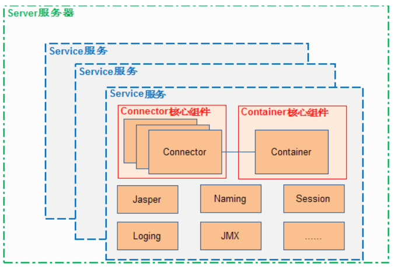

+ Tomcat中最顶层的容器是Server，代表着整个服务器，从上图中可以看出，一个Server可以包含至少一个Service，即可以包含多个Service，用于具体提供服务。

+ Service主要包含两个部分：Connector和Container。从上图中可以看出 Tomcat 的心脏就是这两个组件，他们的作用如下：

  - Connector用于处理连接相关的事情，并提供Socket与Request请求和Response响应相关的转化;
  - Container用于封装和管理Servlet，以及具体处理Request请求；

+ 一个Tomcat中只有一个Server，一个Server可以包含多个Service，一个Service只有一个Container，但是可以有多个Connectors，这是因为一个服务可以有多个连接，如同时提供Http和Https链接，也可以提供向相同协议不同端口的连接，示意图如下（Engine、Host、Context下面会说到）：

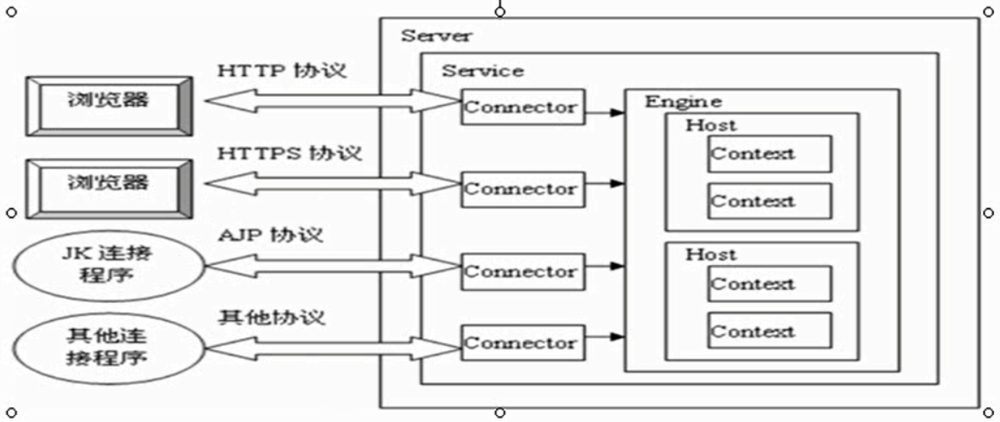

##### Tomcat顶层架构小结：

1. Tomcat中只有一个Server，一个Server可以有多个Service，一个Service可以有多个Connector和一个Container；

2. Server掌管着整个Tomcat的生死大权；

3. Service 是对外提供服务的；

4. Connector用于接受请求并将请求封装成Request和Response来具体处理；

5. Container用于封装和管理Servlet，以及具体处理request请求；

   知道了整个Tomcat顶层的分层架构和各个组件之间的关系以及作用，对于绝大多数的开发人员来说Server和Service对我们来说确实很远，而我们开发中绝大部分进行配置的内容是属于Connector和Container的，所以接下来介绍一下Connector和Container。

##### Connector和Container的微妙关系

由上述内容我们大致可以知道一个请求发送到Tomcat之后，首先经过Service然后会交给我们的Connector，Connector用于接收请求并将接收的请求封装为Request和Response来具体处理，Request和Response封装完之后再交由Container进行处理，Container处理完请求之后再返回给Connector，最后在由Connector通过Socket将处理的结果返回给客户端，这样整个请求的就处理完了！

Connector最底层使用的是Socket来进行连接的，Request和Response是按照HTTP协议来封装的，所以Connector同时需要实现TCP/IP协议和HTTP协议！

Tomcat既然需要处理请求，那么肯定需要先接收到这个请求，接收请求这个东西我们首先就需要看一下Connector！

Connector架构分析

Connector用于接受请求并将请求封装成Request和Response，然后交给Container进行处理，Container处理完之后在交给Connector返回给客户端。

因此，我们可以把Connector分为四个方面进行理解：

1. Connector如何接受请求的？

2. 如何将请求封装成Request和Response的？

3. 封装完之后的Request和Response如何交给Container进行处理的？

4. Container处理完之后如何交给Connector并返回给客户端的？

首先看一下Connector的结构图（图B），如下所示：

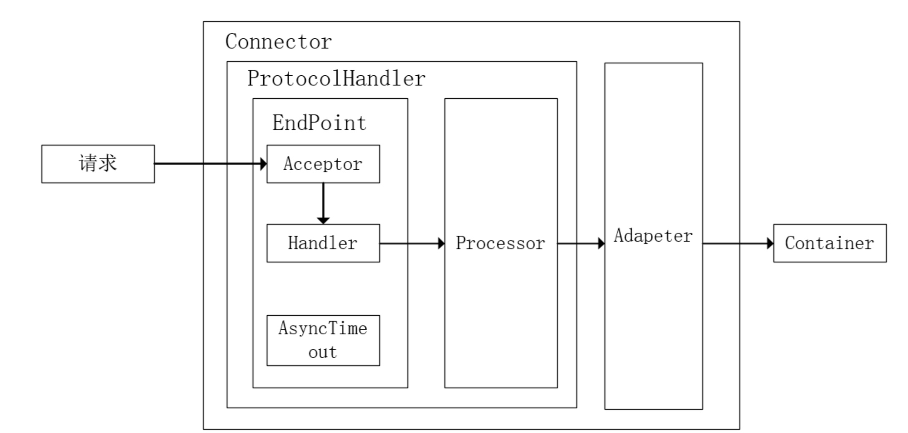

Connector就是使用ProtocolHandler来处理请求的，不同的ProtocolHandler代表不同的连接类型，比如：Http11Protocol使用的是普通Socket来连接的，Http11NioProtocol使用的是NioSocket来连接的。

其中ProtocolHandler由包含了三个部件：Endpoint、Processor、Adapter。

1. Endpoint用来处理底层Socket的网络连接，Processor用于将Endpoint接收到的Socket封装成Request，Adapter用于将Request交给Container进行具体的处理。
2. Endpoint由于是处理底层的Socket网络连接，因此Endpoint是用来实现TCP/IP协议的，而Processor用来实现HTTP协议的，Adapter将请求适配到Servlet容器进行具体的处理。
3. Endpoint的抽象实现AbstractEndpoint里面定义的Acceptor和AsyncTimeout两个内部类和一个Handler接口。Acceptor用于监听请求，AsyncTimeout用于检查异步Request的超时，Handler用于处理接收到的Socket，在内部调用Processor进行处理。

至此，我们应该很轻松的回答1，2，3的问题了，但是4还是不知道，那么我们就来看一下Container是如何进行处理的以及处理完之后是如何将处理完的结果返回给Connector的？

##### Container架构分析

Container用于封装和管理Servlet，以及具体处理Request请求，在Container内部包含了4个子容器，结构图如下（图C）

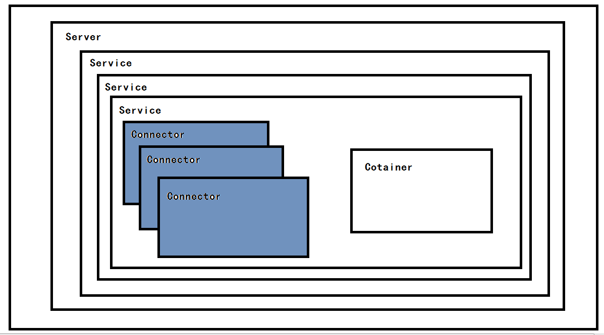4个子容器的作用分别是：

1. Engine：引擎，用来管理多个站点，一个Service最多只能有一个Engine；

2. Host：代表一个站点，也可以叫虚拟主机，通过配置Host就可以添加站点；

3. Context：代表一个应用程序，对应着平时开发的一套程序，或者一个WEB-INF目录以及下面的web.xml文件；

4. Wrapper：每一Wrapper封装着一个Servlet；

下面找一个Tomcat的文件目录对照一下，如下图所示：

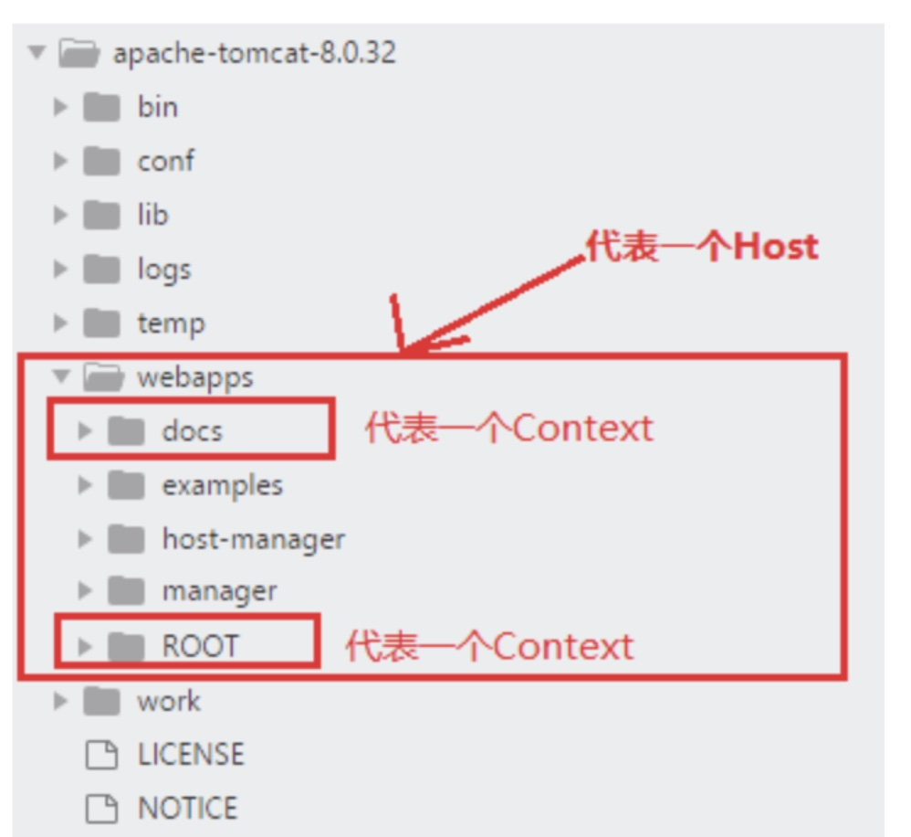

Context和Host的区别是Context表示一个应用，我们的Tomcat中默认的配置下webapps下的每一个文件夹目录都是一个Context，其中ROOT目录中存放着主应用，其他目录存放着子应用，而整个webapps就是一个Host站点。

我们访问应用Context的时候，如果是ROOT下的则直接使用域名就可以访问，例如：www.baidu.com，如果是Host（webapps）下的其他应用，则可以使用www.baidu.com/docs进行访问，当然默认指定的根应用（ROOT）是可以进行设定的，只不过Host站点下默认的主应用是ROOT目录下的。

看到这里我们知道Container是什么，但是还是不知道Container是如何进行请求处理的以及处理完之后是如何将处理完的结果返回给Connector的？别急！下边就开始探讨一下Container是如何进行处理的！

##### Container如何处理请求的

Container处理请求是使用Pipeline-Valve管道来处理的！（Valve是阀门之意）

Pipeline-Valve是**责任链模式**，责任链模式是指在一个请求处理的过程中有很多处理者依次对请求进行处理，每个处理者负责做自己相应的处理，处理完之后将处理后的结果返回，再让下一个处理者继续处理。

但是！Pipeline-Valve使用的责任链模式和普通的责任链模式有些不同！区别主要有以下两点：

- 每个Pipeline都有特定的Valve，而且是在管道的最后一个执行，这个Valve叫做BaseValve，BaseValve是不可删除的；
- 在上层容器的管道的BaseValve中会调用下层容器的管道。

我们知道Container包含四个子容器，而这四个子容器对应的BaseValve分别在：StandardEngineValve、StandardHostValve、StandardContextValve、StandardWrapperValve。

Pipeline的处理流程图如下（图D）：

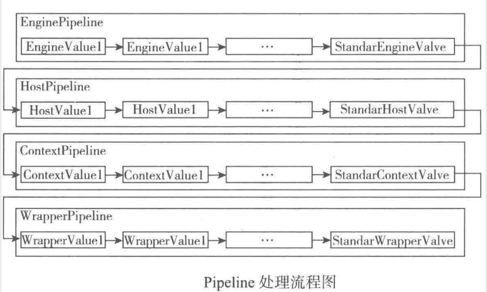

- Connector在接收到请求后会首先调用最顶层容器的Pipeline来处理，这里的最顶层容器的Pipeline就是EnginePipeline（Engine的管道）；

- 在Engine的管道中依次会执行EngineValve1、EngineValve2等等，最后会执行StandardEngineValve，在StandardEngineValve中会调用Host管道，然后再依次执行Host的HostValve1、HostValve2等，最后在执行StandardHostValve，然后再依次调用Context的管道和Wrapper的管道，最后执行到StandardWrapperValve。

- 当执行到StandardWrapperValve的时候，会在StandardWrapperValve中创建FilterChain，并调用其doFilter方法来处理请求，这个FilterChain包含着我们配置的与请求相匹配的Filter和Servlet，其doFilter方法会依次调用所有的Filter的doFilter方法和Servlet的service方法，这样请求就得到了处理！

- 当所有的Pipeline-Valve都执行完之后，并且处理完了具体的请求，这个时候就可以将返回的结果交给Connector了，Connector在通过Socket的方式将结果返回给客户端。


